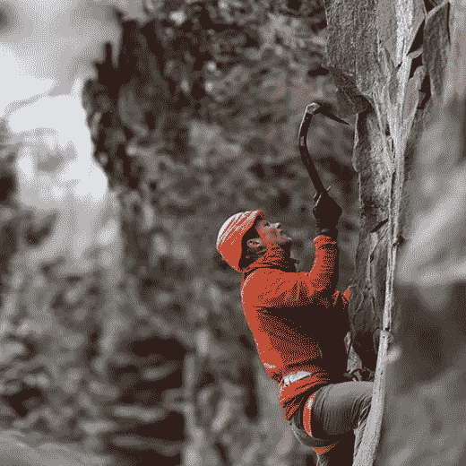
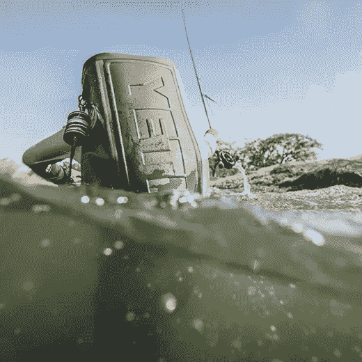

# 从 0 到 5 亿:雪人的教训

> 原文：<https://medium.com/swlh/0-to-500-million-lessons-from-yeti-1ab42a7ccbcb>

在过去的一周里，我至少在四辆车上看到了雪人的贴纸。在此之前的所有岁月里，我从未见过其他更酷品牌的汽车上贴有零标签。冷却器很酷，但谁能想到这样一个功能性产品会成为一个吸引人们在汽车上贴标签的品牌？在不到 10 年的时间里，在一个陈旧、停滞不前的类别中，Yeti 的销售额从零增长到近 5 亿美元，这是一个非凡的成功故事，是那些成功人士的真正功劳。

可以肯定的是， [Yeti](http://yeti.com/) 产品比大多数其他产品保持低温的时间要长得多……毕竟这是冷却器类别中的一个重要性能属性。它们足够强壮，可以抵挡住 T2 熊的攻击。然而，雪人的产品有其他的属性，从外面看可能不是那么有利。对于使用冷却器的消费者来说，便携性通常是一个有意义的好处。Yeti 的尺寸通常是类似尺寸的竞争对手冷却器的五倍重。它们的零售价是现有市场的 5 到 10 倍。

Yeti 最近的增长轨迹令人惊讶:从 2013 年的 9000 万美元销售额到 2015 年的近 5 亿美元。他们创造的品牌亲和力促进了雪人品牌的帽子、衬衫和配饰的销售。你上一次看到有人买更酷的品牌衬衫是什么时候？他们还在其他方面开辟了新天地。冷却器仅仅因为里面的东西而被偷的日子已经一去不复返了。雪人冷却器已被证明是一个严重的诱饵[小偷](https://www.wsj.com/articles/yeti-coolers-are-hot-no-really-people-are-stealing-them-1472653433)。

诚然，我钦佩他们的品牌，喜欢他们的背景故事。创始人瑞安·塞德斯和罗伊·塞德斯在一个喜欢户外运动的德克萨斯州家庭中长大。他们的父亲做鱼竿密封剂生意。大学毕业后，兄弟俩开始了自己的渔业产品生意。罗伊专注于制造铝制渔船，他的设计允许放置冷却器。作为一个大而平坦的地方，冷却器可以是一个很好的站立平台，以便更好地观看水面。兄弟俩觉得市场上的普通冷却器无法胜任这项任务。在一次贸易展上，他们发现一家泰国公司拥有重型冷却器设计，并准备在美国销售该产品。最终，他们不得不适应和设计自己的。更多关于他们的故事[在这里](http://www.inc.com/magazine/201602/bill-saporito/yeti-coolers-founders-roy-ryan-seiders.html)。

在 Yeti 进入时，较冷的类别由历史悠久的品牌主导，如 [Igloo](https://www.igloocoolers.com/) 和 [Coleman](http://www.coleman.com/coleman-coolersandwaterjugs/) 以及其他广泛分布的多类别品牌，如 [Rubbermaid](http://www.rubbermaid.com/en-US/coolers) 和 [Suncast](https://www.suncast.com/) 以及廉价的聚苯乙烯泡沫塑料版本。他们都有两个共同点:广泛的可用性和低廉的价格。看到这些特点，并决定开发一种完全不同且昂贵得多的产品，这是相当大胆的。话说回来，通过差异化竞争几乎总是比试图用类似的产品和定价来智胜根深蒂固的低价竞争好得多。

既然 Yeti 已经完成了，我们可能不会急于在同一领域复制他们的成功。事后看来，从 Yeti 的故事中学到的经验教训可以转移到其他类别和行业。

1.  ***从一款出色的产品开始，为消费者带来明显卓越的性能优势*** 。此外，这些好处必须对你的目标消费者有意义……在他们眼里，而不是你自己的眼里。如果你对你的产品的 10 秒钟推销是“我们的产品就像 X 品牌一样，只是更好”，那么你就是在喝你自己的 Kool-Aid。正如著名营销专家马克·里森喜欢说的那样，“如果你在这个行业，你的观点并不重要。你不再是消费者，也不再代表他们。”相反，你应该寻找这样的产品，它允许你说“我们的产品提供了这种优势，解决了竞争对手未能满足的需求，我们从测试中得知消费者愿意为此付费。”当然，个人经历可以帮助建立洞察力，但重要的是内部人士通过与目标消费者交谈来验证他们的观点。
2.  ***绘制市场地图，定义目前使用竞争或类似产品的消费细分市场，确定你的目标消费者*** 。这些都是大家熟悉的，基本的营销步骤吧？以我的经验来看，我遇到过许多企业没有花时间去充分了解他们自己的市场。典型的一连串理由几乎总是出现:他们很忙，他们已经知道市场，他们没有钱，做那份工作不会改变任何事情。在我看来，这种提前的时间是必不可少的，因为它可以确保对你的市场有一个共同的理解，对目标市场有一致的看法，以及对你决定追求的战略有一个清晰的认识。在 Yeti 的案例中，他们可以很容易地看到典型的 20 美元冰屋冷却器的市场:几乎每个人，每个地方。大市场？是的。对 Yeti 有用？不。他们的产品概念来自于发现一个现存的和未被满足的需求:人们可以站立的耐用的冷却器。然后他们去寻找与他们的产品最相关的特定细分市场。
3.  ***找到自己的定位，从那里开始*** 。首先瞄准兴趣最大、需求最大的消费者群体。那么，如果推出一款性能与竞争对手相差甚远、价格也高得多的产品，你会怎么做呢？好吧，如果你是雪人兄弟，你会去追那个狂热分子。人们真的，真的需要一个有这样性能的产品，并且很有可能愿意为此付费。Yeti 发现，长期以来，其他钓鱼爱好者也同样需要酷的东西。他们进军利基市场，并取得了几项成就:

*   更易获得的消费者和客户群中的可测试性。
*   销售、营销和供应链方面的集中资源。
*   在其细分市场中实现口碑推荐。
*   创造了消费者福音传播者，他们相信产品，谈论产品，并将产品带到其他细分市场。

***4。一旦你的产品在你的领域站稳脚跟，就从那里开始*** 。[在之前的一篇博客文章中，我写了大猩猩胶水](http://www.bottlerocketadvisors.com/bottle-rocket-blog/2016/8/15/gorilla-marketing-10-lessons-from-the-amazing-success-of-gorilla-glue)以及他们在利基市场上的成功。首先从消费者角度考虑，然后是分销渠道。喜欢钓鱼的消费者也倾向于在其他户外活动中得分较高，如打猎、露营和越野。正因如此，Yeti 从捕鱼业开始，使得该产品及其口碑传播到了其他领域。在利基市场上的成功可以让你建立起一个消费者基础，同时也证明了在为他们服务的渠道上的成功。当你寻求扩大规模时，先前的成功对潜在的分销商、零售商和投资者来说是个好兆头。Yeti 能够从 Bass Pro 和 Cabela's 等捕鱼/狩猎零售商扩大分销，并跨越专业零售，将新产品引入受欢迎的市场，甚至在需要时吸引大量投资。

***5。寻找品牌桥梁，巩固长期增长*** 。成功带来竞争和模仿，而竞争和模仿带来价格压力。雪人现在正面临着这三个问题。Igloo 推出了自己的重型系列，Bass Pro 等零售商拥有自己的商店品牌，甚至他们的杯子产品也面临着来自 Stanley 等长期参与者和 Hydro-Flask 等新创新者的竞争。在这个阶段，典型的选择通常是通过渠道、国家扩大分销，或者向上或向下发展产品线。Yeti 选择了一条创新路线，在他们最初的冷却器尺寸和杯子和软边冷却器的新条目上。

随着 Yeti 为今年广受期待的首次公开募股做准备，观察投资者的反应将会很有趣。他们过去的成功会引起极大的关注。不过，投资者的兴趣在于展望未来，并试图评估该公司如何保持增长。Yeti 可能会很好地重温使他们成功的道路:寻找产品差距，并从利基市场建立。不管怎样，Yeti 的成功为其他行业的企业提供了一个有用的蓝图。

*原帖:* [*沙皮狗德拉蒙德博客*](http://bulldogdrummond.com/blog/0-to-500-million-lessons-from-yeti) *。*

*多读自* [*迈克尔*](http://bulldogdrummond.com/blog/author/michael-irwin#filters) *。*

## 这个故事发表在 [The Startup](https://medium.com/swlh) 上，这是 Medium 最大的创业刊物，有 295，232+人关注。

## 订阅接收[我们的头条新闻](http://growthsupply.com/the-startup-newsletter/)。

