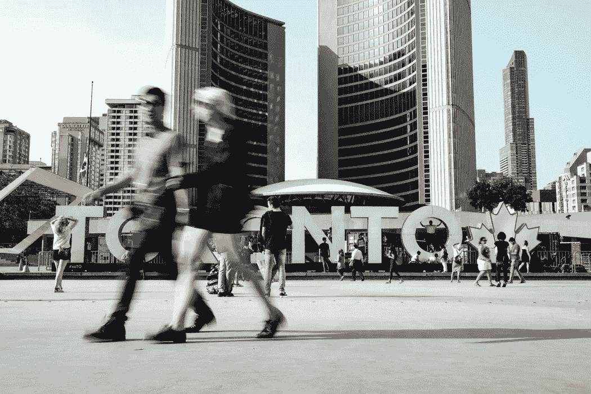

# 2018 年 1 月 8 日:神秘领域最大的故事

> 原文：<https://medium.com/swlh/01-08-2018-biggest-stories-in-the-cryptosphere-d3e22dfcba69>

通过 BlockEx

**1。SBI 计划推出衍生品平台**

SBI 控股公司旗下的 SBI 加密投资公司。[投资了美国数字市场开发商 Clear Markets](https://asia.nikkei.com/Spotlight/Bitcoin-evolution/Derivatives-platform-to-hedge-cryptocurrency-risk-planned-by-SBI) ，因为它想为机构投资者创建一个加密衍生品交易平台。该公司持有 12%的股份，尽管价格没有透露，但许多人认为它价值 10 亿日元(894 万美元)。鉴于加密货币的高价格波动性，该平台将有助于对冲风险和促进交易。此外，今年早些时候，SBI 还投资了加拿大 Lancium Technologies，这是一家为加密矿工提供风力发电的公司。此举将帮助“比特币现金开采”金融服务公司降低成本。

**2。专注于加密的银行银河数码在股票市场上市**

尽管比特币价格下跌，但前高盛(Goldman Sachs)宏观交易员迈克尔·诺沃格拉茨(Michael Novogratz [将银河数码引入公开交易](https://www.cnbc.com/2018/08/01/novogratzs-crypto-bank-makes-stock-market-debut-despite-bitcoin-bear-.html?__source=facebook%7Ccrypto+)。加拿大监管机构将上市推迟了大约 8 个月，但专注于加密货币的商业银行今天在加拿大证券交易所上市。尽管市场状况不佳，诺沃格拉茨坚持自己的决定，并表示他不后悔此时上市。该公司于去年 11 月成立。为了让他的公司在 TSX 风险交易所上市，Novogratz 购买了加拿大加密初创企业 Coin Capital。然后，它实施了反向收购，与加拿大空壳公司 Bradmer Pharmaceuticals 合并。它将以银河数码控股有限公司的名义进行交易。

**3。赞比亚政府与零售商 Overstock 签署合作协议**

赞比亚政府与互联网零售商 Overstock 签署了一份谅解备忘录。后者通过新闻发布会宣布了这一合作关系。Overstock 的子公司 Medici Land Governance (MLG)将使用诸如[区块链的技术来收集和记录有关土地所有权的信息](https://cointelegraph.com/news/overstock-subsidiary-partners-with-zambian-govt-on-blockchain-land-registry)。公民将能够“使他们的财产合法化，并进入金融界”。这也将使他们能够获得私人和公共服务，同时政府将能够收税。筹集的资金将用于经济扩张和创新。这个想法是建立一个区块链土地登记处。

> 这是由 [BlockEx](http://bit.ly/BlockEx_) 为您带来的新闻综述。

> 要想在你的邮箱里收到我们的每日新闻综述，请在这里注册:[*http://bit.ly/BlockExNewsAndUpdates*](http://bit.ly/BlockExNewsAndUpdates)

## 这个故事发表在 [The Startup](https://medium.com/swlh) 上，这是 Medium 最大的企业家出版物，拥有 355，974+人。

## 在此订阅接收[我们的头条新闻](http://growthsupply.com/the-startup-newsletter/)。

