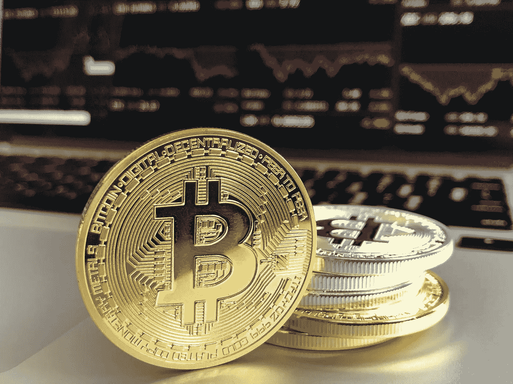

# 2018 年 3 月 5 日:神秘领域最大的故事

> 原文：<https://medium.com/swlh/03-05-2018-biggest-stories-in-the-cryptosphere-4e25f89235b6>

通过 BlockEx

**1。高盛将推出比特币交易操作**

金融界最大的公司之一，高盛，准备[推出比特币交易业务](https://www.nytimes.com/2018/05/02/technology/bitcoin-goldman-sachs.html)。这将是华尔街银行推出的第一款产品。该行自有资金将用于与客户进行与比特币价格挂钩的合约交易。一旦它能够获得监管许可，并找到管理相关风险的正确方法，高盛甚至有可能开始买卖比特币。参与该项目的董事总经理拉纳·亚雷德(Rana Yared)指出了这项技术的概念是如何演变的。该银行甚至会考虑交易比特币的想法，这一事实证明了时代已经发生了变化。

**2。摩根大通正在进行区块链项目的概念验证**

JP 摩根的商业银行目前正在为区块链支持的债务交易系统开发概念验证(PoC)。摩根大通的一名代表证实了该项目。有问题的银团债务交易平台将在内部使用。从商业银行开始，如果成功的话，将扩展到其他子银行。尽管仍是一个概念，但计划是在 7 月 30 日前完成概念验证，然后在今年 12 月实施该平台。然而，这并不是该公司第一次涉足区块链。事实上，我们之前[报道过](https://hackernoon.com/20-04-2018-biggest-stories-in-the-cryptosphere-e90c8b9c5e95)摩根大通与加拿大银行以及其他大公司合作，尝试在区块链发行金融工具。

**3。伯克利推进“令牌化债券”计划**

二月份，我们报道了伯克利发行象征性债券筹集资金的计划。由副市长本·巴特利特领导的项目。这座加州城市现在正在[推进它的项目](https://www.bloomberg.com/news/articles/2018-05-02/blockchain-municipal-bond-plan-inches-forward-with-berkeley-vote)。如果成功，它将是第一个在这一领域采用区块链技术的城市。周二，市议会通过了一项投票，要求城市经理提供一个潜在的试点项目。然而，一些成员表示需要更多的信息。象征性债券将允许该市以低于 5000 美元的传统最低价格发行债券。迷你债券及其交易将通过分布式分类账技术进行登记。

**4。Statnett 表示，缺乏了解区块链的工程师阻碍了能源行业的革命**

挪威国有 stem 电网运营商 [Statnett 认为，通过提高效率，区块链技术可以彻底改变能源行业](https://uk.reuters.com/article/us-norway-statnett-blockchain/blockchain-savvy-engineers-needed-to-revolutionize-energy-sector-statnett-idUKKBN1I415S)。然而，缺乏了解区块链的工程师阻碍了这一进程。这家挪威公司甚至在 2019 年资助了一个教授职位。研发总监 Sonja Berlijn 在接受路透社采访时讨论了这个话题。消费者将能够在区块链安全地进行交易。该技术与人工智能(AI)一起，可以帮助控制价格飙升，因为电力的日常消耗和分配将变得更加有效。这就是为什么意大利艾尼路、德国 E.ON 和瑞典 Vattenfall 等公用事业提供商正在研究这项技术。British Centrica 今年甚至启动了一项市场试验。

> 本新闻综合报道由 [BlockEx](http://bit.ly/BlockEx_) 为您带来。

> *要想在你的邮箱里收到我们的每日新闻综述，请在这里注册:*[*http://bit.ly/BlockExNewsRoundup-Updates*](http://bit.ly/BlockExNewsRoundup-Updates)

## 这个故事发表在 [The Startup](https://medium.com/swlh) 上，这是 Medium 最大的创业刊物，拥有 321，672+人关注。

## 在这里订阅接收[我们的头条新闻](http://growthsupply.com/the-startup-newsletter/)。

