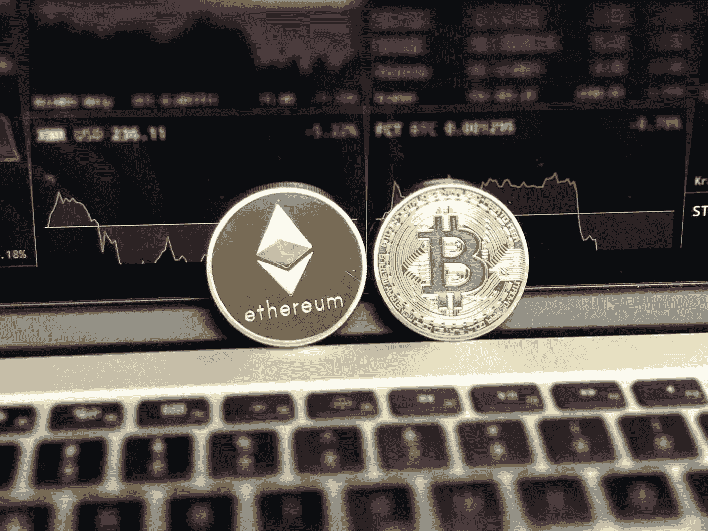

# 2018 年 3 月 7 日:神秘领域最大的故事

> 原文：<https://medium.com/swlh/03-07-2018-biggest-stories-in-the-cryptosphere-ba2b3efe9005>

**1。日本监管机构将改变加密法规的法律基础**

日本金融监管机构金融服务厅已经考虑到[改变加密法规所依据的法律基础的可能性](https://cointelegraph.com/news/japanese-financial-services-agency-to-change-crypto-exchange-regulations)。法律基础将从《支付服务法》转向《金融工具和交易法》(FIEA)。这将加强对客户的保护，因为他们的资金和证券必须与公司资产分开管理。此外，加密货币目前与电子货币归为一类。然而，如果发生变化，它们将被视为金融产品。这一变化还将有助于推出加密衍生品，包括交易所交易基金(ETF)。

**2。百慕大整顿银行法以吸引金融科技公司，区块链被纳入**

我们之前[报道过](https://hackernoon.com/22-03-2018-biggest-stories-in-the-cryptosphere-c5fc484fc1e1)百慕大政府计划建立一套友好的规章制度。据总理兼财政部长大卫·伯特称，在这一决定的背后，有一种使该国成为市场领导者的愿望。现在，台湾准备修改其银行法，以创建一种新型银行，满足金融科技和区块链公司的需求。与当地银行进行了磋商，以评估潜在需求和所涉及的障碍。伯特希望确保银行的犹豫不会损害政府的计划，因为银行已经在其他司法管辖区引发了问题。这一决定是在 ICO 法案和数字资产商业法案通过的消息传出后做出的。

**3。在菲律宾，加密业务正在超越传统公司**

四月份，我们[报道了](https://blog.goodaudience.com/26-04-2018-biggest-stories-in-the-cryptosphere-7ccdc8cc9b6d)政府将允许 10 家区块链和虚拟货币公司在指定的经济领域开展业务。卡加延经济区管理局(CEZA)建立了监管框架，还将提供税收优惠。CEZA 的卡加延经济特区和位于该国北部的自由港经济区，现在[将发放 25 张加密货币兑换许可证](https://finance.yahoo.com/news/philippines-issue-25-cryptocurrency-exchange-114143338.html)。但为了避免骗子的存在，需要严格的验证过程。该国央行 Bangko Sentral 并不认可虚拟货币，而是专注于对其进行监管。该国也是最早承认密码部门的国家之一。这种开放的方式或许可以解释为什么今年[的密码交易所和公司在受欢迎程度和活跃程度方面一直胜过传统的金融公司](https://www.ccn.com/philippines-bitcoin-exchanges-outperform-traditional-finance-platforms/)。

**4。瑞士楚格市成功进行区块链投票试验**

瑞士城市楚格举行了该国第一次区块链市政投票。由于 2017 年 11 月首次设立的开斋节制度，公民能够投票。他们只需要下载一个应用程序，然后按照注册流程进行注册。然而，符合试验条件的 240 人中只有 72 人参加了试验。投票过程分布在区块链的多台电脑上。审判于 6 月 25 日星期一开始，于昨晚结束。通信负责人 Dieter Müller 称该项目是成功的。为了确保投票的保密性和选民的隐私，现在将进行各种测试。另一个重要的方面是结果是“可验证的、不可改变的和可理解的”。

> 这是由 BlockEx 为您带来的新闻综述。

> *要想在你的邮箱里收到我们的每日新闻综述，请在这里注册:*[*http://bit.ly/BlockExNewsAndUpdates*](http://bit.ly/BlockExNewsAndUpdates)

## 这篇文章发表在《创业公司》杂志上，这是 Medium 最大的创业刊物，有 340，876 人关注。

## 订阅接收[我们的头条](http://growthsupply.com/the-startup-newsletter/)。

