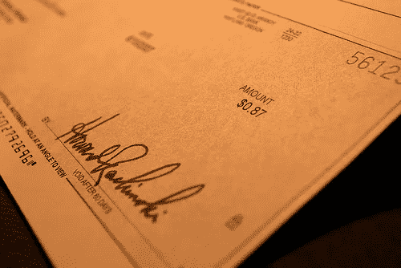
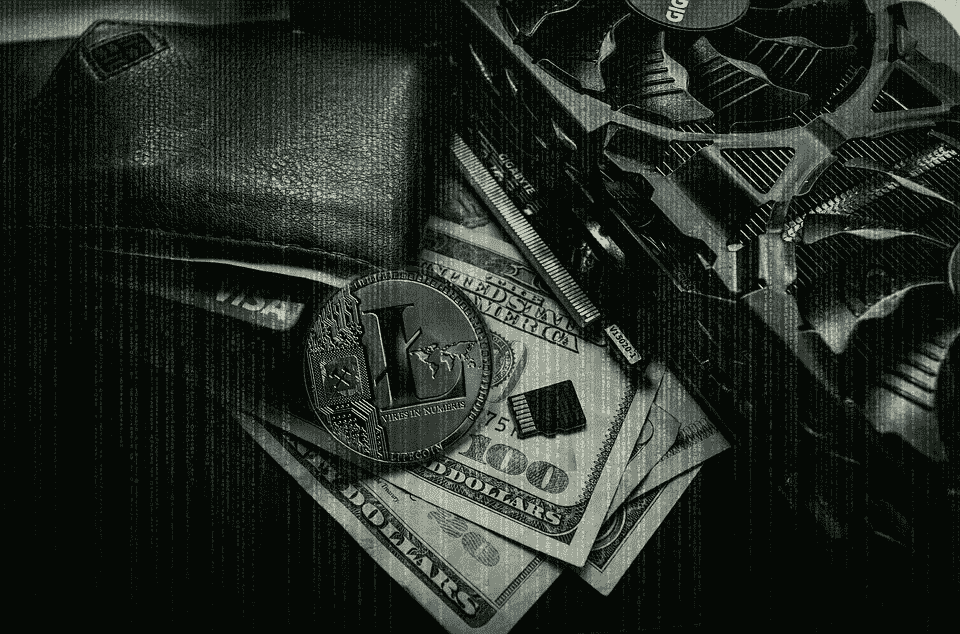

# 2018 年 5 月 6 日:神秘领域最大的故事

> 原文：<https://medium.com/swlh/05-06-2018-biggest-stories-in-the-cryptosphere-d2caa4796483>

通过 BlockEx

**1。中国创建支票数字化区块链系统**

中国人民银行，中国的中央银行，创建了[，一个基于区块链的系统，将国有公司签发的支票](https://www.coindesk.com/china-has-built-a-blockchain-system-that-could-replace-paper-checks/?utm_content=buffer0ac23&utm_medium=social&utm_source=twitter.com&utm_campaign=buffer)数字化。数字货币研究实验室副主任狄刚透露，借助智能合约技术，数字支票在区块链平台上发行。这一成果是在一年的研发之后取得的。这个想法是为了解决支票欺诈的问题，特别是考虑到中介机构可以充当银行并签发支票。然而，这并不是第一家采用区块链技术打击欺诈的银行。事实上，我们之前[报道过](https://hackernoon.com/23-04-2018-biggest-stories-in-the-cryptosphere-by-blockex-952cdea9ea97)阿联酋主要银行迪拜国家银行(NBD)将区块链整合到其支票发行系统中。

**2。转基因揭示矿机**

我们之前[报道过](https://hackernoon.com/24-05-2018-biggest-stories-in-the-cryptosphere-bc621cd76bd0)日本巨头 GMO 宣布推出一款采矿机，这将是同类产品中唯一的一款，B2。这家科技公司现在已经发布了产品。该机器是日本开发的第一台机器，也是第一台采用 7 纳米半导体芯片的机器。这使得该产品优于目前市场上的产品。GMO 希望推翻比特大陆作为该行业主要参与者的地位。B2 的零售价约为 1999 美元，也将是该公司进一步发展自己的比特币挖矿业务战略的一部分，该业务于去年首次成立。

**3。欧盟区块链合作伙伴加入丹麦**

欧盟区块链伙伴关系已经邀请了丹麦。22 个欧盟成员国为泛欧盟地区推广相同的标准和解决方案。正如我们之前[报道的](https://hackernoon.com/11-04-2018-biggest-stories-in-the-cryptosphere-b4abf1d390e7)，在 2018 年 4 月由欧盟委员会主办的数字日期间，参与国结成了伙伴关系，以促进和推动区块链技术的发展。丹麦工业、商业和金融事务大臣 Brian Mikkelsen 也表示，该国将使用区块链技术在当地船舶登记册中记录船舶。区块链在商业部门的就业也在考虑之中。

**4。SEC 任命其第一位加密高级顾问**

美国证券交易委员会[宣布](https://www.sec.gov/news/press-release/2018-102)任命 Valerie A. Szczepanik 为数字资产和创新高级顾问。最近设立的这一角色涉及在 SEC 部门和办公室内协调 SEC 在这些新兴技术(包括 ico 和加密货币)上采用的规则。这位新的高级顾问于 1994 年加入 SEC，由于她这些年的工作，她被认为是正确的选择。此外，还注意到她在处理这些新兴技术时如何承认证券法的影响。

> 本新闻综合报道由 [BlockEx](http://bit.ly/BlockEx_) 为您带来。

> *要想在你的邮箱里收到我们的每日新闻综述，请在这里注册:*[*http://bit.ly/BlockExNewsAndUpdates*](http://bit.ly/BlockExNewsAndUpdates)

## 这个故事发表在 [The Startup](https://medium.com/swlh) 上，这是 Medium 最大的创业刊物，拥有 332，253+人关注。

## 在这里订阅接收[我们的头条新闻](http://growthsupply.com/the-startup-newsletter/)。

