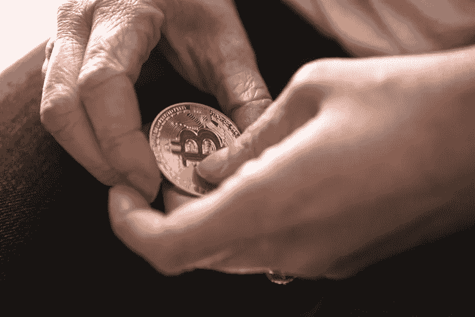

# 2018 年 7 月 6 日:神秘领域最大的故事

> 原文：<https://medium.com/swlh/07-06-2018-biggest-stories-in-the-cryptosphere-9eed2eae83d6>

通过 BlockEx

**1。泰国央行行长讨论可能的央行数字货币**

泰国央行泰国银行(BoT)正在[考虑](https://l.facebook.com/l.php?u=https%3A%2F%2Fbit.ly%2F2M5fxvJ&h=ATPeFJx090EMdwCe8aX-INRCNPuY-lvoIc-2erJqdr5tVhZ6t7mDQjtRJACNL7G50J5hlS8daoQ-M2SG3Umu8-kYZSBrHQbtuKJf1gHxMePL&s=1)将区块链技术整合到其银行间清算和结算系统中。这位中央银行行长在新加坡的一次活动中发表了 T4 演讲。在会谈中，他讨论了银行在各个行业雇用区块链的计划。央行拥有的数字货币是这一战略的一部分。该银行希望通过使用区块链技术来减少交易和验证的时间和成本。测试阶段将使他们能够在开始正式使用中央银行数字货币(CBDC)之前，评估该技术能够帮助实现什么。

**2。瑞士有了第一家向加密企业提供账户的银行**

伦茨堡抵押银行是第一家向加密公司提供商业账户的瑞士银行。首席执行官 Marianne Wildi 表示，她做出这一决定是因为她渴望跟上新兴技术的发展，并在金融科技行业内建立合作伙伴关系。Wildi 接着说，在发起倡议之前，已经采取了正确的预防措施。此外，瑞士金融市场监管局(FINMA)将在与加密企业建立业务关系之前听取简报。

**3。SAP 推出区块链即服务平台**

软件巨头 SAP[发布了](https://www.coindesk.com/software-giant-sap-launches-blockchain-as-a-service-platform/)区块链即服务平台。[云平台](https://news.sap.com/sapphire-now-sap-intelligent-enterprise-products-choice/)将帮助公司在区块链开发应用程序。将创建一个框架，公司将能够在区块链系统之上创建业务应用程序。Linux 基金会的 Hyperledger Fabric 就是一个很好的例子。该项目通过与 SAP 区块链联合创新计划中的 65 家公司的联合努力进行了测试。该巨头还[宣布](https://discover.sap.com/sap-blockchain-consortium/en-us/index.html)基于其[企业区块链调查](https://news.sap.com/blockchain-a-study-rooted-in-reality/)的反馈，成立了 SAP 行业区块链联盟。

**4。金钱 20/20:中央银行正在关注加密和区块链**

[在 6 月 4 日至 6 日举行的货币 20/20 会议](https://cointelegraph.com/news/money20-20-review-central-banks-closely-monitoring-crypto-and-blockchain)上，加密货币和区块链是讨论的话题。该活动的目的是让不同行业讨论如何最好地协调金融和技术。金融科技领域的各种实体都出席了会议。英格兰银行、加拿大银行、立陶宛银行和瑞士国家银行共同组成了“加密货币，中央(银行)问题”小组。尽管意见不一，但如此有影响力的银行讨论这样的话题表明央行不再能够忽视它们，特别是考虑到越来越多的银行决定将这些技术集成到他们的系统中。

> 这是由 BlockEx 为您带来的新闻综述。

> *要想在你的邮箱里收到我们的每日新闻综述，请在这里注册:*[*http://bit.ly/BlockExNewsAndUpdates*](http://bit.ly/BlockExNewsAndUpdates)

## 这篇文章发表在 [The Startup](https://medium.com/swlh) 上，这是 Medium 最大的创业刊物，有 332，253+人关注。

## 在这里订阅接收[我们的头条新闻](http://growthsupply.com/the-startup-newsletter/)。

