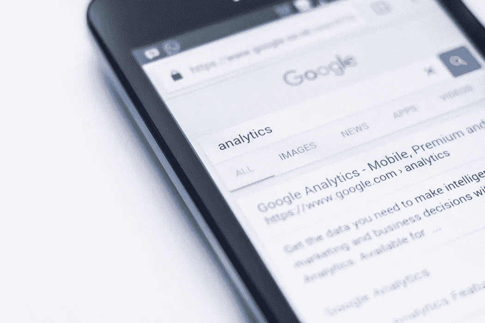

# 2018 年 9 月 7 日:神秘领域最大的故事

> 原文：<https://medium.com/swlh/09-07-2018-biggest-stories-in-the-cryptosphere-ac1a78ea412e>

通过 BlockEx

**1。沃尔玛最新区块链专利公布**

我们之前[报道过](https://hackernoon.com/02-03-2018-biggest-stories-in-the-cryptosphere-44af92292aaa)沃尔玛申请[专利](http://appft.uspto.gov/netacgi/nph-Parser?Sect1=PTO2&Sect2=HITOFF&u=%2Fnetahtml%2FPTO%2Fsearch-adv.html&r=1&p=1&f=G&l=50&d=PG01&S1=20180061162.PGNR.&OS=dn/20180061162&RS=DN/20180061162)以改善其“智能包装”交付跟踪系统。跨国公司提交的众多区块链申请之一。一份新的专利文件现已[公布](https://www.coindesk.com/walmart-looks-to-blockchain-for-better-package-tracking/)。这项名为“交付预约设备和方法”的专利致力于在交付不成功的情况下管理包裹预约。这个想法是创建一个交付储物柜系统，它将被放置在如一个人的位置或交通枢纽的地方。一旦可用，收件人就可以签收和领取包裹。项目中采用的分类账将是开放的，因此，在一定程度上，其他人可以公开访问。

**2。两家加密交易所获得菲律宾中央银行的认证**

早在 4 月份，菲律宾政府宣布将允许数量有限的区块链和虚拟货币公司在指定的经济区开展业务。该项目是在卡加延经济区管理局(CEZA)的参与下进行的。据报道，又有两家加密交易所获得了菲律宾中央银行(BSP)的认可，使总数达到 5 家。副省长 Chuchi G. Fonacier 通过公开声明发布了这条消息。虚拟货币菲律宾公司和 ETranss 这两个交易所现在被允许进行菲律宾比索和虚拟数字货币之间的交易。

**3。ICBS 申请另一项区块链专利**

四月份，我们[报道了](https://hackernoon.com/30-04-2018-biggest-stories-in-the-cryptosphere-251f07930e73)按资产计最大的银行中国工商银行(ICBC)[为区块链数字证书验证系统申请专利](https://hackernoon.com/30-04-2018-biggest-stories-in-the-cryptosphere-251f07930e73)。中国工商银行的另一项专利现已公布。[文件](https://www.scribd.com/document/383489720/ICBC-patent#from_embed?campaign=SkimbitLtd&ad_group=100652X1574425X89335243b599815f85d3f85fbe36f526&keyword=660149026&source=hp_affiliate&medium=affiliate)描述了一个金融资产交换的系统。该平台基于一个分布式网络，该网络由代表参与机构的若干节点组成。智能合约在交易请求的情况下被触发。然后，其他节点将根据所提供的信息验证交易。一旦达到节点验证方面的预定阈值，事务就完成了。该银行希望通过这一系统减少中间商，提高金融资产的流动性水平。

**4。谷歌联合创始人谢尔盖·布林是以太坊矿工**

我们之前[报道过](https://hackernoon.com/23-03-2018-biggest-stories-in-the-cryptosphere-e2cdd7acd640)谷歌对加密广告的禁令。当时人们注意到，尽管该公司在区块链开展项目，但还是做出了这一决定。现在，联合创始人谢尔盖[布林透露](https://www.ccn.com/billionaire-google-co-founder-sergey-brin-is-an-ethereum-miner/)他是以太坊矿工。他和他 10 岁的儿子一起做的一项活动。在摩洛哥举行的区块链峰会上，他在一个关于新兴技术的小组讨论会上透露了这个消息。在讨论中，布林还分享了他对[零知识证明](https://venturebeat.com/2017/12/16/what-zero-knowledge-proofs-will-do-for-blockchain/)的想法，“一种能够在不实际揭示知识的情况下证明某些东西的密码学原理”。闪电实验室的联合创始人兼首席执行官伊丽莎白·斯塔克和麻省理工学院媒体实验室的数字货币倡议主任 Neha Narula 也参加了讨论。

> 这是由 BlockEx 为您带来的新闻综述。

> 要在您的邮箱中收到我们的每日新闻综述，请在此注册:[*【http://bit.ly/BlockExNewsAndUpdates】*](http://bit.ly/BlockExNewsAndUpdates)

## 这篇文章发表在 [The Startup](https://medium.com/swlh) 上，这是 Medium 最大的创业刊物，有 343，876 人关注。

## 订阅接收[我们的头条新闻](http://growthsupply.com/the-startup-newsletter/)。

