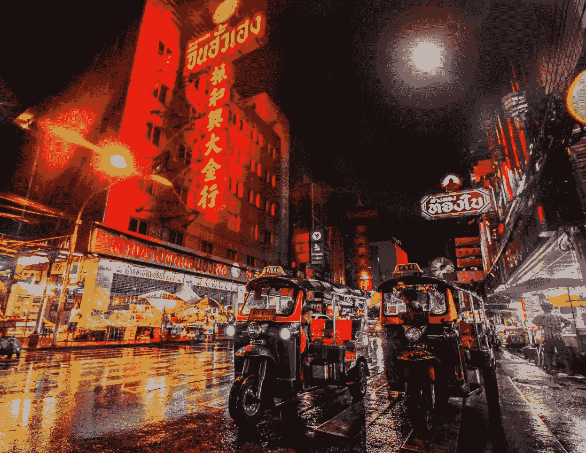
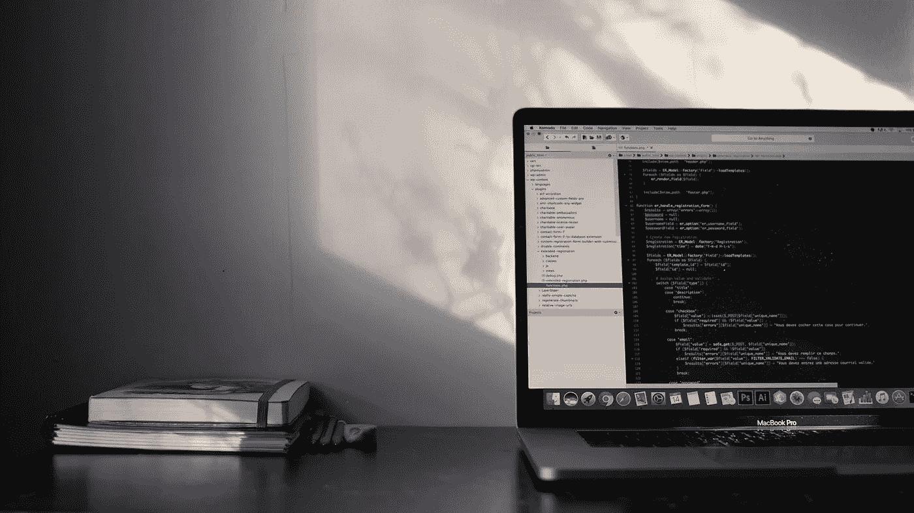
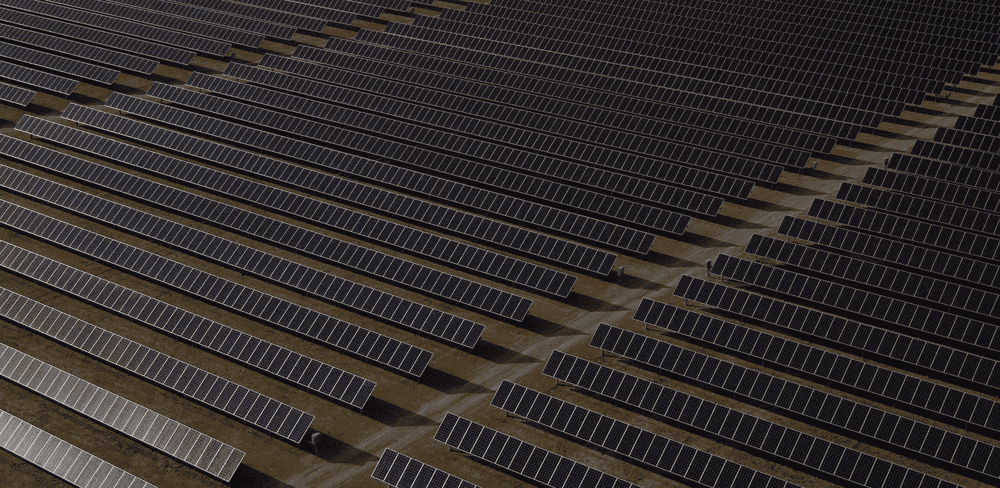

# 2018 年 9 月 8 日:神秘领域最大的故事

> 原文：<https://medium.com/swlh/09-08-2018-biggest-stories-in-the-cryptosphere-6f7f3e304380>

通过 BlockEx

**1。泰国证券交易委员会透露对加密许可证的兴趣增加**

我们之前[报道过](/@BlockEx/12-03-2018-biggest-stories-in-the-cryptosphere-9891b9814014)泰国在国家证券交易委员会(SEC)的帮助下规范加密市场。它是由这样一种观点决定的，即独立机构有正确的知识来就该问题作出决定。美国证券交易委员会[透露](https://www.bangkokpost.com/business/finance/1518310/)这一举措导致有兴趣获得许可的 ICO 项目数量激增。他们现在已经 50 岁了。然而，秘书长 Rapee Sucharitakul 表示，是否所有潜在的申请人都能获得签证仍然未知。此外，五个感兴趣的 ICO 门户网站中有三个已经向 SEC 提交了申请。同时有 20 家公司申请了“数字资产交易所”的许可证。这些申请被送到市场监管机构，然后由市场监管机构转发给财政部。

**2。巴克莱发起区块链编码员竞赛**

主要银行巴克莱发起了一项名为 DerivHack 的竞赛。区块链编码者将有望找到改造当前全球衍生品市场的方法。参与者将被要求“应用 ISDA 的公共域模型(CDM)，一套流程和数据标准，使用他们选择的分布式账本技术(DLT)平台，有效地对衍生品合约的交易后处理进行建模。”该活动将于下月底在伦敦和纽约之间举行。它由国际互换和衍生品协会(ISDA)、德勤和汤森路透赞助。

**3。澳大利亚首个太阳能地下采矿**

澳大利亚第一个可再生能源驱动的数据中心目前正由当地数据中心运营商 DC 二号和加密公司 D Coin 开发。这两家公司与 Hadouken Pty 达成协议，Hadouken Pty 的作用是为该项目提供电力和财产，该项目将位于西澳大利亚州，靠近 Hadouken 的太阳能发电场。DC 二号希望为其客户提供足够的电力，从而在全球范围内具有竞争力。它还希望增加当地对基础电力的需求。然而，有趣的是，该中心将有特定的托管区，专门用于支持加密货币挖掘和比特币挖掘。这意味着澳大利亚可能拥有首个太阳能加密货币采矿场。

> 这是由 [BlockEx](http://bit.ly/BlockEx_) 为您带来的新闻综述。

> 【http://bit.ly/BlockExNewsAndUpdates】[*要想在你的邮箱里收到我们的每日新闻综述，请在这里注册*](http://bit.ly/BlockExNewsAndUpdates)

## 这篇文章发表在 [The Startup](https://medium.com/swlh) 上，这是 Medium 最大的创业刊物，拥有 356，974+人关注。

## 在此订阅接收[我们的头条新闻](http://growthsupply.com/the-startup-newsletter/)。

