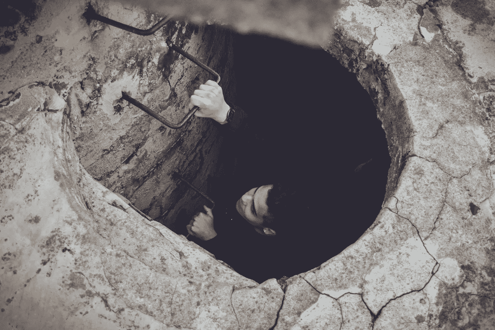

# 大多数人没有意识到成功企业家的一个特点

> 原文：<https://medium.com/swlh/1-characteristic-most-people-dont-realize-successful-entrepreneurs-have-5d9df6f7524>

## 无知。

成功对于逆向工程来说是一件有趣的事情。成功没有单一的公式可循。

也就是说，我对我认识的几乎每一个成功人士都做了一个观察:他们的成功之路通常始于错误的自信或纯粹的无知，以追求过于雄心勃勃的目标。

因此，他们面临的任何障碍要么显得无关紧要，要么似乎不存在。他们全身心投入，相信一些更深层次的直觉。

# 很多企业家在开始的时候被认为是幼稚的，过分热情的，甚至愚蠢的。

从很多方面来说，企业家都是。对我来说，情况确实如此。

在创办我的公司之前，我 22 岁，目光炯炯，是世界上最大的快餐连锁店之一的市场分析师。我和非常聪明的人一起工作，有很高的收入，甚至在工作几个月内就得到了提升。生活很美好。

就在我第一次升职几周后，我给了老板两周的通知。她认为我疯了。

*“你为什么要离开？你收到另一家公司的录用通知了吗？”*

我说不行。

*“嗯，你要回学校吗？”*

没有。

我提醒她，我很感激有机会和她一起工作；感谢她对我的信任，感谢她给了我机会和责任，尽管我几乎没有工作经验。她是我的导师，我觉得我欠她一个解释。

但我努力向她解释我的决定。

# 事实是我不知道我要做什么。

我没有计划。我喜欢我的工作，但我想放弃好的去追求伟大。我不知道该如何解释。

我的晋升迫使我思考我的未来。这通向哪里？更多的钱？一个花哨的标题？我会在职业生涯结束时回顾过去并有任何遗憾吗？最重要的是，我会对世界产生积极的影响吗？

也许吧——但我想确定这一点。于是我离开了公司去开创自己的命运，开始了我的创业之旅。

很多和我亲近的人嘲笑我的决定，说我太天真了。我是典型的千禧一代。我失去理智了。

但我希望能够回顾我的生活，而不仅仅是我的职业生涯，并确保我度过的时间是有意义的:改善人类状况，推动社会向前发展。

我相信我可以建立一家公司，让我创造一些东西，从根本上改变我们的生活方式。即使我在这样做的时候扮演了一个*微观*的角色，我知道我不能带着这个目标输掉比赛。

即使这意味着我会破产。即使这需要一生。或者更糟，即使我错了。

# 但至少我有了目标。

这让我觉得自己战无不胜。

当我开始我的公司时，我从我周围的人那里收到的最大的批评之一是我不知道我不知道的事情。

我还没有打够几局。我承受的损失还不够多。我尝试和失败的次数还不够多，不足以称自己“有经验”——然而，我还在摇摆不定。

我没什么可失去的。很多人认为这是一件坏事。

# 事实上，它成了我最大的财富。

我确信我们在有生之年取得的技术进步将是我们这一代人最重要的贡献。它将超越人类的定义，比迄今为止人类历史上的任何一个时期都要大。我想成为其中的一员。

但问题是，我不会编程，也没有在技术领域工作过。但是以我的行为科学背景，我可以用设计作为进入科技行业的通行证。因此，在没有任何设计师经验的情况下，我决定创办一家设计公司。

此时，少数不认为我辞职是疯了的人现在确信我疯了。

最初的实验变成了巨额个人债务，损害了与朋友和家人的关系，恶化了健康状况。但是没有一天我不感到完全满足。每一天，我都在朝着用我所能创造的东西改善他人生活的目标前进。

正因为如此，我坚持不懈地工作，不是因为我特别自律，而是因为我完全不知道正常工作量的极限是什么样的。我太天真了，不知道什么是健康的工作生活平衡。但是我已经打破了工作和生活之间的界限，所以我也不会在意。

最终，在拼命工作之后，我突然意识到我的目标是多么不切实际。我开始意识到我被警告过的巨大挑战。我质疑自己是否有勇气追求如此崇高的愿景。

我做了正确的决定吗？

# 这是大多数人对成功之路不了解的一件事。

我太傻了，没有意识到我所做的事情太愚蠢了。我被幻觉和自己的无知蒙蔽了双眼。但是几年后，当我意识到这一点的时候，已经太晚了:我已经获得了多个财富 500 强的客户，我可以雇佣我崇拜的设计师，我的公司被认为是世界上[最好的 UX 公司之一。](https://www.prnewswire.com/news-releases/clutch-announces-top-user-experience-agencies-of-2017-300493543.html)

大多数人认为，在采取行动之前，你应该想好所有的事情。

大多数人认为你应该承担适当的风险。

大多数人认为你应该有一个合理的商业计划。

但事实并非如此。创业奖励天真、过分热情和愚蠢的人。

你必须**无知**。否则，你会太聪明而不敢开始。

*本文原载于* [*Inc 杂志*](https://www.inc.com/yazin-akkawi/the-one-thing-most-people-dont-understand-about-becoming-a-successful-entrepreneur.html) *。*

## 这篇文章发表在 [The Startup](https://medium.com/swlh) 上，这是 Medium 最大的创业刊物，有 315，028 人关注。

## 在这里订阅接收[我们的头条新闻](http://growthsupply.com/the-startup-newsletter/)。

