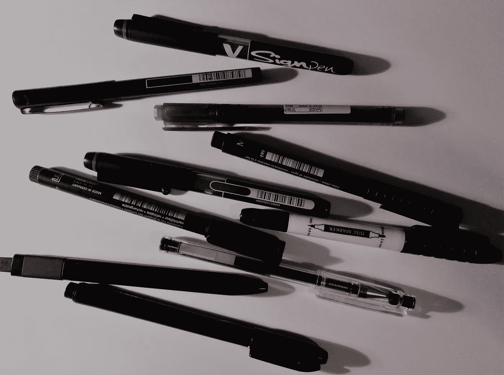
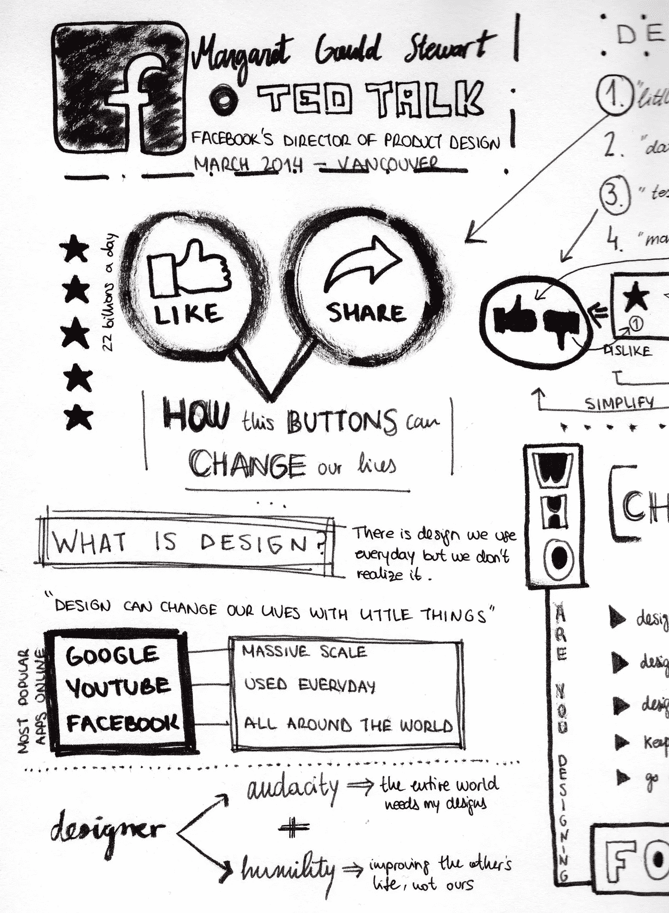
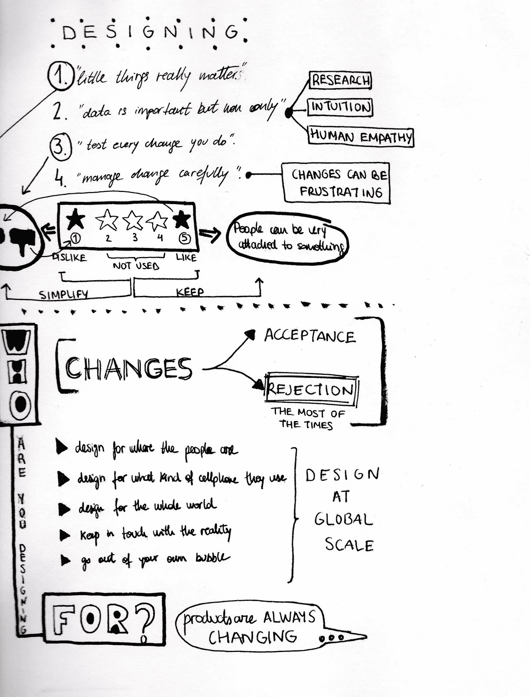
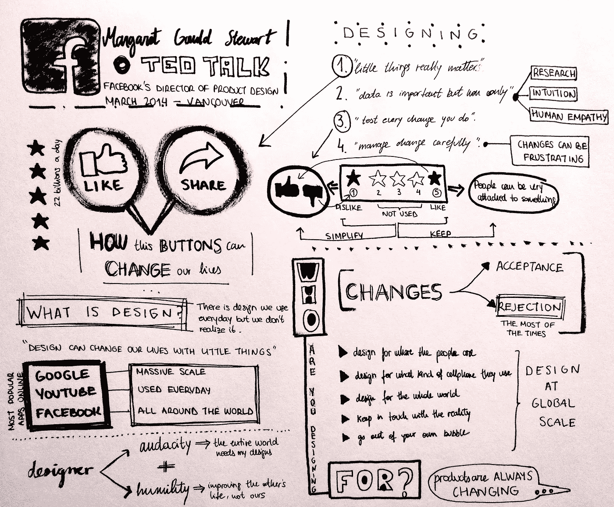

# 1 准备工作:“视觉笔记”

> 原文：<https://medium.com/swlh/1-pre-work-visual-note-taking-38b1f27f7ef4>

在 Ironhack 的准备工作的第一个练习中，我们必须练习“视觉笔记”技术。方法是在会议中以可视化的方式(画草图)实时记笔记，关注大的想法。这种技术让你的大脑理解你听到的想法，而你的手将这些想法转化为视觉笔记。

我们可以参考 Mike Rohde 的“Sketchnote Handbook ”,在那里你可以找到很多拥有良好的视觉笔记体验的技巧，比如:

*   在参加会议之前进行研究，找出谁是演讲者，他们在谈论什么，并用所有这些信息创建一个标题。
*   早点到，找到灯光下靠近前排的最佳座位。
*   带上你的智能手机、笔和笔记本等材料来参加会议。
*   使用不同的版式、图表和绘图。
*   分隔线可以帮助你区分不同的想法。
*   手写简短的描述。
*   设计箭头、项目符号、图标或容器来突出想法。
*   拍摄或扫描你的草图，并在你的社交媒体上分享。

这是我第一次像这样使用素描，但我已经习惯了用类似的方式画画。在建筑学院，我通常在讲座或研讨会上获得灵感，画些小东西，写下最重要的话，以便以后对它的一切有个概念。

我只在听“Ted 演讲”的时候做过一次设计，但是我不得不多次停止播放视频来进行设计。我认为你需要大量练习来使它变得更容易。我可以重新组织这个设计来看到更多的层次，但是在我看来，你可以很容易地理解这个演讲最重要的观点，第一个设计更接近于我在一个真正的 Ted 演讲中通过一点点练习所能做出的设计。

我认为这是一个非常有趣的技巧，它可以帮助你理解谈话的意思，因为你可以在享受绘画和写作的同时集中注意力。看到你认为你对不同的事情有不同的想法是很有趣的，但是最终你会看到所有的事情是如何一起工作的。

## 这个故事发表在 [The Startup](https://medium.com/swlh) 上，这是 Medium 最大的创业刊物，有 293，189+人关注。

## 订阅接收[我们的头条](http://growthsupply.com/the-startup-newsletter/)。

