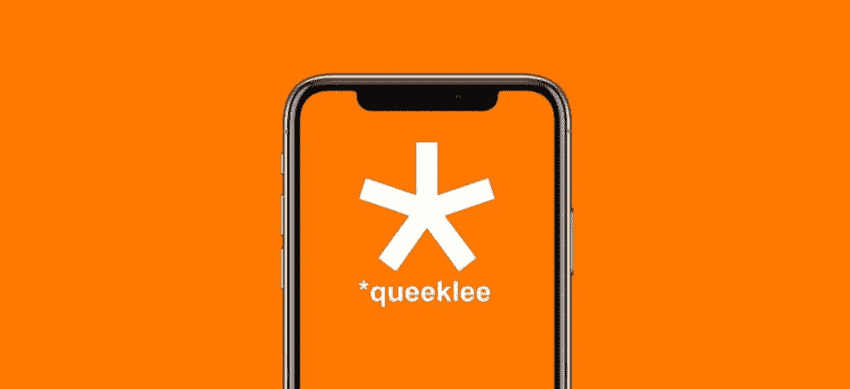

# Queeklee 应用程序上的 1 秒视频

> 原文：<https://medium.com/swlh/1-second-videos-on-the-queeklee-app-f3891f68147e>

## 启动一个新的应用程序很有挑战性，但肯定很有趣！

[Queeklee](https://itunes.apple.com/us/app/queeklee/id1435791152) 是一款新的苹果手机应用，用于 1 秒钟的视频循环和投票。没有大惊小怪，没有过滤器，没有新闻提要，没有政治……只是在一瞬间探索你周围世界的快速乐趣。

令人惊讶的是，在 1 秒钟内发生了这么多事情！

 [## 下载 Queeklee

### *queeklee 是对时间的实验，而不是图像和视频。有了*queeklee，您可以创建和共享 1…

itunes.apple.com](https://itunes.apple.com/us/app/queeklee/id1435791152) 

这个想法被认为是我在沃顿商学院的创业顶点项目。挑战不是想出一个主意，而是将它付诸实践，运用我所学的知识，并围绕它制定一个可行且可持续的商业计划。

一个巨大的挑战也是开发 [*queeklee](https://medium.com/u/9f7cd79054d1?source=post_page-----f3891f68147e--------------------------------) 因为我不是一个程序员，也不是一个软件工程师。经过尝试和失误——以及与专家合作的失败尝试——我决定与一位在我的家乡欧洲的 iOS 开发者合作。考虑到我的局限性，他帮助我理解了代码可以做什么和不可以做什么，还帮助我理解了我们如何简化流程，以实现一个测试版，我们可以根据需要进行测试和调整。

对我来说，创建应用程序的过程变得非常个人化，从设计 Queeklee 的前端到理解后端的局限性和复杂性。在这个过程中，看到应用程序成形，屏幕出现在我的苹果手机上，对我来说是如此迷人和有趣。

我仍然记得第一次 Queeklee 图标和应用程序的第一个交互版本下载到我的手机上。Queeklee 的图标就在我的屏幕上，我可以点击它，并在应用程序中四处点击。

从那时起，发生了很多事情:崩溃、变化、重新设计、新代码、实现和简化的新想法。

现在该测试版已经在应用商店上市，看到 Queeklee 的早期用户测试和试验该应用程序就更有趣了。

我们的用户发布的许多 1 秒视频非常有趣。我也很感激我收到的所有反馈，这些反馈让奎格利变得更好、更有魅力。

这是一条学习曲线，对我来说，奎格利仍然是一个实验。但这是一个非常激动人心的时刻！

## 这个故事发表在《T4 创业》杂志上，这是 Medium 最大的创业刊物，有超过 373，685 人关注。

## 订阅以接收[我们这里的头条新闻](http://growthsupply.com/the-startup-newsletter/)。

