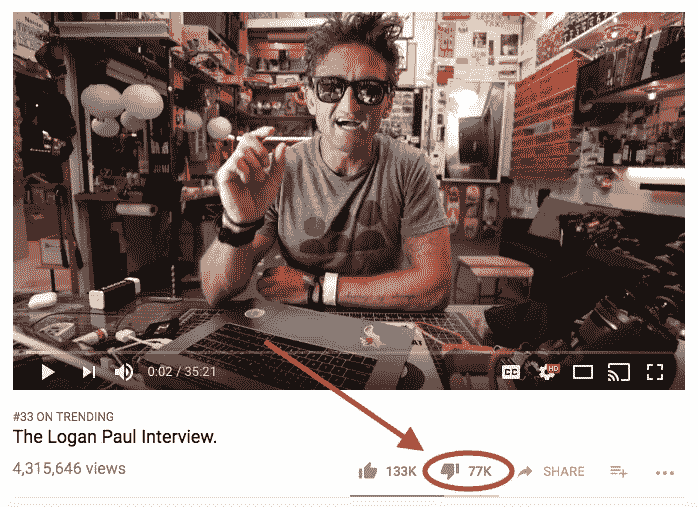

# 作为博客写手，你需要习惯的一件可怕的事情

> 原文：<https://medium.com/swlh/1-terrible-thing-you-need-to-get-used-to-as-a-blogger-275a6c3f87e0>

Photo by [Nik Shuliahin](https://unsplash.com/@tjump?utm_source=medium&utm_medium=referral) on [Unsplash](https://unsplash.com?utm_source=medium&utm_medium=referral)

> “嗯，我不会按照你教的…因为这是不道德的。”

哦伙计。那封邮件触发了我。我也度过了美妙的一天。

我刚刚收到一封电子邮件，有人告诉我，嗯，45 分钟前。老实说，这让我很难过。在周日晚上 7 点坐在你面前写下这些已经够难过了。

最近我收到了更多这样的评论。

> 那种有人直接扇我嘴巴，质疑我的整个角色，因为我试图教他们如何写标题。

疯狂的是我让成年男人对我这么做。

同情派对到此为止..如果你想为了乐趣、名声或财富而在网上写作，就继续阅读吧。

我想让你不要掉进一个大陷阱。

# 有些人会杀了你

有些人跳过“嗯，我不同意这个”，直接说“你是不道德的，不诚实的，骗子，欺骗了成千上万的人，你他妈的是个没用的混蛋。”

是真的。我亲眼见过。

> 注释，而不是 sh*tstack。

我一会儿会教你如何处理这个，但是现在，只要记住这个..

> 如果你在网上写东西，或者试图以任何方式帮助别人，人们总是会质疑你的动机。尤其是如果你偶尔从中获利的话。

对一些人来说，唐纳德·特朗普是他们百分之百信任的领导人。对其他人来说，他实际上是在和弗拉基米尔·普京睡觉。

> 事实上，我敢打赌有一小部分人合理地认为他和你的副总裁上床了。

动机总会被质疑。

尽管不了解你，他们还是会对你做出笼统的评价。

> 你猜怎么着？谈论我的人几乎不了解我。

但歌颂我的人也是如此。

我承认我喜欢听一个胜过另一个，但是在一天结束的时候，我总是记得这个..

> 只有你自己知道你的动机。只有你自己知道你的真实性格。如果有人说的话伤害了你，但与你的性格不符，那就让它见鬼去吧。

把它放在那里。如果有必要，关闭你的笔记本电脑。这就引出了我的下一个观点..

# 这很痛，但你的反应无关紧要

> 当你是一个在线作家时，在评论中辩论你会失去一切。

尤其是如果你有 [20，000 名追随者](https://findingtom.com/how-to-write-viral-blog-posts-medium/)。

> 人们会认为你的回应是软弱的表现，而发表评论的人会觉得自己赢了，因为他们设法让一些——在他们看来——“大人物”回应了他们。

你一出版他们就赢了。

如果你有 10k 个粉丝或者 0。

# 这是你自找的

> 你第一次自大到发表文字的那一天。

你敢于相信你的作品有价值的那一天。

> 如果你从来不在网上写博客，没人会在评论中关注你。

所以承认吧。

很好，现在我们来谈谈你是如何领先于其他 99.9%的人的。

# 大多数人像 5 岁小孩一样接受批评

没有人想告诉我们我们错了，因为他们不想伤害我们的感情。

> 所以我们生活的大部分时间都没有任何真正的冲突。

然后有一天我们说“哎呀，写博客这件事听起来真有趣。也许我应该试试。”

那我们有。

> 然后大约有 8 个帖子我们在评论中看到一些混蛋，他们基本上告诉我们我们是撒旦的后代。

然后我们蜷缩成一团，剩下的一周就全毁了。

但这也有好处..

# 作为一个博客写手，你学会了如何更好地接受批评

我不需要详细说明，但我会的。

> 作为一个博客作者，你一次又一次地承受批评。你的想法不断被检验。

在现实世界中，我们很大程度上与和我们一样的人交往——因此我们的想法从来不会被曲解。

在网上，这一切都成了过眼云烟。

> 准备好被羞辱，被咀嚼，然后被吐出来。

# 这是一线希望

> 最近，凯西·奈斯塔特在他的 Youtube 频道上采访了罗根·保罗。我爱凯西，我爱这个采访，但这不是绝大多数观众的感受。

这个视频获得了 77000 个不喜欢。考虑到他有 133，000 张赞成票，这是一个不真实的不喜欢的数量。

人们在评论中为他而来。

不太好。

> 同样的事情发生在我的男人加里·维纳查克身上。很多人都被他拒之门外，因为他们认为他傲慢、虚伪，通常只是一个大嗓门的笨蛋。

但绝大多数人发誓说，他单枪匹马帮助他们创办了百万美元的企业，还清了学生债务，甚至阻止了他们自杀。

你会相信谁？

> 他是一个可怕的，傲慢的，虚伪的家伙，他制作垃圾内容只是为了自己的利益，或者他是什么？

这是底线..

> 有些人将永远看不到这种景象。钩子。线。下沉球。有些人在阅读你的内容时会错过很多，而你对此无能为力。

你不能让他们看到你其实不是一个诚实的人。

接受他们是“堕落者”之一，然后继续前进。

> 在这场比赛中你会把人惹毛的。甚至在你唯一的动机是传播快乐和幸福的文章上。你还是会惹毛别人。

请理解:

1.  它让你变得更好。
2.  其实在博客里挺正常的。
3.  只有你自己知道你的真实性格。

然后继续滚动。

> 想在媒体上赚点外快吗？本周我将主持一些免费培训，名为“**如何在 Medium 上每月额外挣 900 美元**”[在此获得免费座位](https://events.genndi.com/register/169105139238473045/da2e6c5a01)！

## 这篇文章发表在 [The Startup](https://medium.com/swlh) 上，这是 Medium 最大的创业刊物，有+397，714 人关注。

## 订阅接收[我们的头条](http://growthsupply.com/the-startup-newsletter/)。

