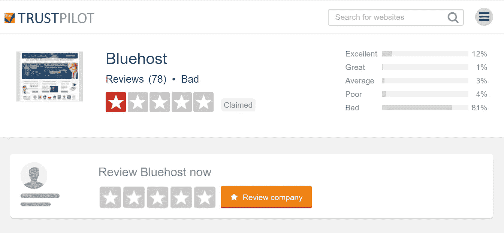
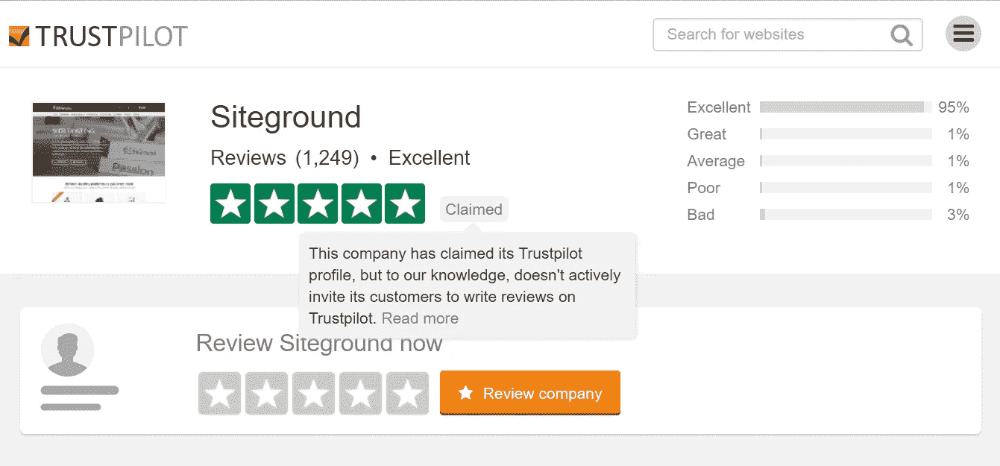
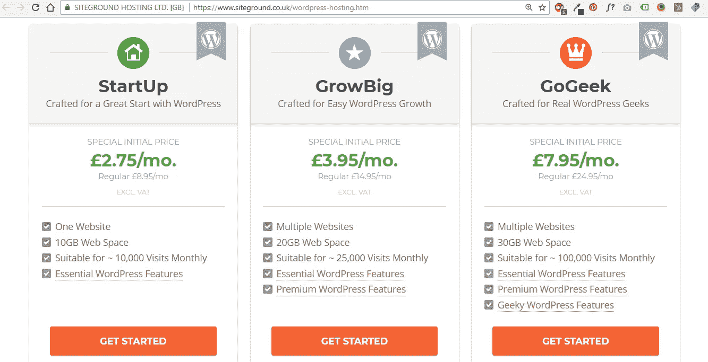
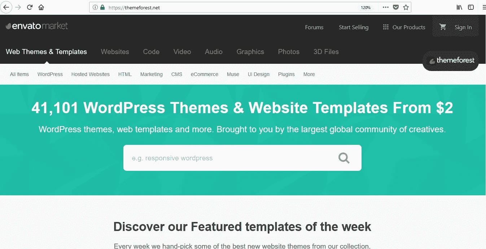

# 1.建立自己的网站需要什么？— 30 天的中等

> 原文：<https://medium.com/swlh/1-what-do-you-need-to-build-your-own-website-30-days-of-medium-1ed1ad4e505c>

30 Days Of Medium

欢迎来到 **30 天中级**的**天第 1** 。

**30 天** **媒介**是一个 **30 天的挑战**，我将在 30 天内每天写一篇**新媒介文章**，以提高我的写作水平，并在这个奇妙的媒介上建立我的读者群。

你可以在这里阅读其他条目:

## [0。30 天的培养基](/swlh/30-days-of-medium-c7ab34953c6c)

## [1。建立自己的网站需要什么？— 30 天中值](/swlh/1-what-do-you-need-to-build-your-own-website-30-days-of-medium-1ed1ad4e505c)

## [2。如何找到你热爱的事业——30 天的媒介](/swlh/2-how-to-find-a-business-you-love-30-days-of-medium-cb7a4a702d1b)

## [3。如何建立自己的网站—媒体 30 天](/swlh/3-how-to-build-your-own-website-30-days-of-medium-587f994672ec)

## [4。如何衡量你网站的表现——媒体 30 天](/swlh/4-how-to-measure-your-websites-performance-30-days-of-medium-75e650969695)

## [5。如何通过回答他们的问题获得更多的客户——30 天介质](/swlh/5-how-to-get-more-customers-by-answering-their-questions-30-days-of-medium-b462d237533e)

## [6。成功的商业网站备忘单——媒体 30 天](/swlh/6-the-successful-business-website-cheat-sheet-30-days-of-medium-42f89eb43e67)

## [7。如何衡量成功——30 天介质](/swlh/7-how-to-measure-success-30-days-of-medium-3da43f4b4a44)

## 8。了解在线销售漏斗— 30 天媒介

## [9。什么是流量，为什么流量很重要？— 30 天介质](/swlh/9-what-is-traffic-and-why-is-it-important-30-days-of-medium-a4e981119008)

## [10。什么是 Google URL Builder，为什么要使用它？— 30 天介质](/swlh/10-what-is-google-url-builder-and-why-should-you-use-it-30-days-of-medium-402eb778e394)

## [11。通过自动化您的社交媒体日程，让您的流量翻倍——30 天中等](/swlh/11-double-your-traffic-by-automating-your-social-media-schedule-30-days-of-medium-ac9aa74f7927)

## [12。如何辨别什么好卖— 30 天介质](/swlh/12-how-to-tell-what-sells-30-days-of-medium-ba3291d029d2)

## 13。我如何在 6，500% — 30 天的培养基中培养我的培养基

## [14。你如何看待事情很重要——30 天中期](/swlh/14-how-you-look-at-things-matters-30-days-of-medium-f641b9733b90)

## [15。如何向小型企业销售服务— 30 天介质](/swlh/15-how-to-sell-services-to-small-businesses-30-days-of-medium-d6604c63b3b7)

## 16。如何通过有效的提案赢得更多交易— 30 天的媒介

## [17。如何在 10 分钟内建立一个网上商店——30 天的媒介](/swlh/17-how-to-setup-an-online-store-in-10-minutes-30-days-of-medium-a4f955e9b493)

## [18。如何在任何地方工作— 30 天介质](/swlh/18-how-to-work-from-anywhere-30-days-of-medium-1c9cfa2d662f)

## [19。为什么你的网站会破坏你的销售——30 天媒体](/swlh/19-is-your-website-sabotaging-your-sales-30-days-of-medium-f63bdbdb350)

## [20。你的流量从哪里来？— 30 天中值](/swlh/20-where-does-your-traffic-come-from-30-days-of-medium-a9b2d2c088bb)

## [21。如何真正识别倦怠——30 天中等水平](/swlh/21-how-to-actually-recognise-burnout-30-days-of-medium-7972a7a7a89e)

## [22。如何修改你的时间表并完成两倍的工作——30 天中等时间](/swlh/how-to-hack-your-schedule-and-get-twice-as-much-done-30-days-of-medium-441a509dc9be)

## 23。不要复制你的竞争对手——30 天的媒介

## 24。如何 SEO 优化一篇博文——30 天的媒介

## 25。独一无二或者被遗忘——30 天媒介

## 26。跟着感觉走——30 天中等水平

## 27。人们不支付平均 30 天的中等费用

## [二十八。如何做关键词研究— 30 天介质](/swlh/28-how-to-do-keyword-research-30-days-of-medium-5fd0fc0f5523)

## [29。为什么帕累托原则是世界上最大的诀窍——30 天中期](/swlh/29-why-the-pareto-principle-is-the-worlds-biggest-hack-30-days-of-medium-1c225f5c8aa1)

## 三十岁。你的内容比你的电话更有利可图——30 天的媒介

希望这能成功，如果不能，我相信这不会是我最后一次接受写作挑战。

# 建立自己的网站需要什么？

我会让这篇帖子**简短而爽快**，并向你展示**建立**自己的**网站**需要什么。

这篇文章是写给任何考虑**创业**、**经营企业**、**自由职业者**或**副业**的人的。

# 域名

域名是你在互联网上的虚拟地址，你需要一个域名作为你网站的互联网之家。

例如，我们的域名是—[squareinternet.co](http://squareinternet.co)

## 我在哪里买域名？

大多数人推 Bluehost，因为他们的奖励会员计划。**不要用 Bluehost。原因如下。**

我不认为仅仅为了快速获利而推动一个糟糕的供应商是正确的。为什么不推一个**伟大的供应者**去做一个**诚实的巴克**呢？

也就是我推荐你从 [**网站**](https://www.siteground.com/index.htm?afcode=6f49dbd215404378e8aa207db253a943) **获得域名和主机，他们绝对牛逼。**

我每天都使用 **Siteground** ，他们的平台很棒，他们的客户支持也很棒。你最不想要的就是你的域名和你控制之外的主机(由于一个糟糕的主机提供商)。

# 主办；主持

在你购买了一个域名后，你需要将它连接到一个**主机计划。**

如果你的域名是你在互联网上的‘虚拟地址’，那么主机就是你的**‘网站存储单元’**。

你的托管计划**存储你的网站**并允许它**提供给世界各地的访问者**。以及为你提供管理网站后端的工具。

同样，如果你有一个小网站，除了**之外，没有理由使用其他网站。他们提供最好的**性价比**，最好的**客户支持**，并且有**专门的 WordPress 托管计划，起价为每月 2.75/4.00 美元****

****

**Siteground WordPress hosting plans**

# **CMS**

**一旦你有了域名和主机，你需要为你的网站决定**内容管理系统。****

**CMS 领域有三个主要参与者。**

**Joomla & Drupal。**

**[**WordPress**](https://wordpress.com/?aff=6349) 是**最容易使用，最实惠，最可扩展的。****

**关于为什么 WordPress 是你网站最好的内容管理系统的详细概述，请阅读我的文章——为什么 WordPress 是在 上建立你的商业或创业网站的最好平台**

**我也在我的博客上写了一篇关于如何使用 WordPress 的详细文章。**

# **一个主题**

**假设你做出了明智的决定，选择了 **WordPress，**你将需要一个 WordPress 主题来使用页面生成器构建你的网站**

**你可以在排名第一的主题市场查看和购买大量各种形状和大小的主题。**

****

**Themeforest marketplace**

## **哪个主题？**

**为了省去你的**跑腿工作，**以下是我们推荐的主题:**

1.  **[Divi](http://www.elegantthemes.com/affiliates/idevaffiliate.php?id=47225)——市场上最受欢迎的**主题之一**，拥有非常易于使用的**页面生成器和数量惊人的**功能和内容。成本仅 29 美元的 Divi 是一个很好的入门主题。**
2.  **[Avada](https://themeforest.net/item/avada-responsive-multipurpose-theme/2833226?ref=SquareInternet)—**有史以来最畅销的主题**，拥有**五星级**客户满意度，超过 **40 万客户**和 **240 个预制**网站**设计**，毫不奇怪 **Avada** 的价格比**贵一点**60 美元。**
3.  **X 主题——另一个**受欢迎的主题**，拥有大量的用户。29 美元。**

# **耐心**

**罗马不是一天建成的这两个网站都不怎么样。**

**如果你不能立即掌握你的主题或它使用的页面生成器，不要失去耐心。这需要时间。**

**如果你能每天提高 1%的技能和网站，在 100 天内，你的网站将会是你开始时的两倍。**

**有大量的**伟大的、免费的内容**可以帮助你一路走来。**

**我们的网站已经经历了至少 5 种不同的变化，在我们选定一种我们喜欢的风格和布局之前。它每天都在继续发展和改进。**

# **额外资源**

**更多关于**建立**和**发展**你的 WordPress 网站的阅读，请查看我们创建的其他有用的指南和视频:**

**[如何建立网站——终极指南](https://squareinternet.co/how-to-build-a-website-ultimate-guide/)**

**[如何使用 WordPress](https://www.squareinternet.co/how-to-use-wordpress/)**

**[如何使用 WordPress 建立你的商业网站](https://www.squareinternet.co/how-to-build-your-business-website-using-wordpress/)**

**[为什么你的网站会破坏你的销售](https://www.squareinternet.co/why-your-website-is-sabotaging-your-sales/)**

# **第二天**

**明天回来和我一起参加我的 **30 天中级**挑战的**第 2 天**。**

**每天我都会写一些新的内容，关于如何**建立、发展和扩大**你的**基于 WordPress** 的业务，并在这个过程中提高我的写作技巧。**

**如果你想让我写一些特别的东西，请留言:)**

## **你可能也喜欢这个:**

## **[为什么 WordPress 是在](/swlh/why-wordpress-is-the-best-platform-to-build-your-business-or-startup-website-on-df3fe932fad7)上建立业务或创业网站的最佳平台**

## **如果你喜欢这个故事，请点击👏按钮并分享，帮助其他人找到它！欢迎在下方留言评论。**

****

## **这个故事发表在[的创业](https://medium.com/swlh)上，这是 Medium 最大的创业刊物，有 315，628+人关注。**

## **订阅接收[我们的头条新闻](http://growthsupply.com/the-startup-newsletter/)。**

****