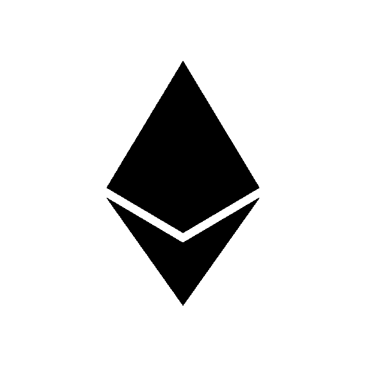

# 2018 年 10 月 5 日:神秘领域最大的故事

> 原文：<https://medium.com/swlh/10-05-2018-biggest-stories-in-the-cryptosphere-7bc2e33ce50a>

## 通过 BlockEx

1.  **EIP 0 峰会与会者承诺以太坊治理计划**

在峰会上，以太坊社区的成员同意支持新的[治理计划](/eip0-summit/eip0-summit-statement-of-intent-to-support-ethereum-governance-initiatives-e54ff782933)。以太坊社区面临着许多需要处理的重要治理问题，它需要一种解决这些问题的方法。因此，包括 Parity Technologies、Aragon 和 Web3 Foundation 在内的团体致力于:

*   致力于以太坊的共同价值观，基于最初的使命，但也来自当前的社区
*   支持和构建开源工具，从以太坊社区收集关键信号和指标，以便他们可以判断其情绪
*   主持每月治理电话会议
*   组织第二届 EIP0 峰会

**2。诺沃格拉茨与彭博推出加密指数**

前对冲基金经理、加密货币领域最富有的人之一迈克尔诺沃格拉茨(Michael Novogratz)将与彭博合作推出一种加密指数。根据[公告](https://www.bloomberg.com/company/announcements/bloomberg_galaxy_launch_cryptocurrency_index/):“BGCI 是市值加权的，衡量十种以美元交易的加密货币的表现，包括比特币、以太坊、Monero、Ripple 和 Zcash。”这对加密市场来说是重要的一步，因为它将有关加密领域的信息带到了传统金融机构的许多交易员每天使用的平台上。它将提供详细和准确的信息，使他们能够做出更好的交易决策，并使他们的投资组合多样化。

**3。熊市情绪回归比特币？**

继昨日短暂反弹后，比特币仍有跌回 9000 美元关口以下的风险。昨天它打破了周六高点后的熊市趋势，但今天它停止了。从最近的高点 9990 美元回落到今天的低点 9263 美元。这波涨势提升了向 10，000 美元关口更强劲迈进的希望，但涨势已被打断。

## 这篇文章发表在 [The Startup](https://medium.com/swlh) 上，这是 Medium 最大的创业刊物，有 323，238+人关注。

## 在此订阅接收[我们的头条新闻](http://growthsupply.com/the-startup-newsletter/)。

