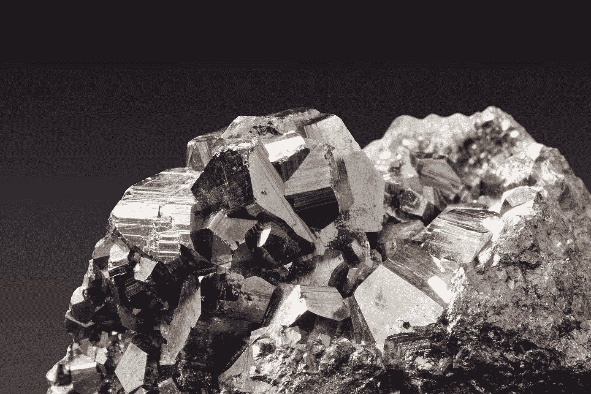

# 2018 年 10 月 7 日:神秘领域最大的故事

> 原文：<https://medium.com/swlh/10-07-2018-biggest-stories-in-the-cryptosphere-8d4687a8b1ce>

**1。尼日利亚企业家正在使用比特币而不是本国货币**

越来越多在尼日利亚经营[的企业家使用比特币](https://www.ccn.com/nigerian-entrepreneurs-are-choosing-bitcoin-over-the-national-currency/)而不是本国货币奈拉做生意。这一决定部分是由于尼日利亚货币的高度波动性。这种波动如何影响业务的一个例子是 Nerve Mobile 的联合创始人 Silas Okwoche 通过中国电子商务阿里巴巴购买 Android 智能手机。一旦奈拉兑日元贬值 15%,他就不得不关门大吉。相反，Temo 设法利用比特币开展了相同类型的业务，在阿里巴巴上购买硬件。他将使用 P2P 市场，与传统平台相比，这里的交易费用较低。这并不奇怪，因为我们之前[报道过](https://hackernoon.com/20-02-2018-biggest-stories-in-the-cryptosphere-100cd402b7d8)通过 13 个交易所每周交易 380 万美元(截至 2 月 20 日)。

**2。摩洛哥区块链峰会——区块链如何帮助拯救地球？**

昨天，我们[报道了](/swlh/09-07-2018-biggest-stories-in-the-cryptosphere-ac1a78ea412e)谷歌联合创始人谢尔盖·布林在摩洛哥参加区块链峰会。据透露，热门话题之一是区块链如何帮助拯救地球。Ocean Elders 创始人兼首席执行官 Gigi Brisson [称赞了](/@BitfuryGroup/saving-the-planet-a-bit-at-a-time-reflections-from-the-2018-blockchain-summit-in-morocco-253ab8d2eb05)区块链如何能够创造“一个更加强大、准确和不可改变的供应链”。这将导致受过教育的消费者知道他们的产品来自哪里。她的话也得到了维珍集团创始人理查德·布兰森的回应，他也参加了小组讨论。在那里，他承诺结束一次性塑料的使用。

**3。eToro 与英国大学合作发布研究论文**

eToro 公司与著名的伦敦帝国理工学院合作发布了一篇研究论文。在文件中，他们表示加密货币可能在未来十年成为主流法定货币。还讨论了这些新兴技术对银行的影响，就像手机对电话亭的影响一样。事实上，尽管货币的概念随着时间的推移而变化，但其主要功能仍然保持不变。由于某些加密货币开始满足这些功能，它们成为主流似乎不再是不可想象的了。然而，也有人指出，分布式账本技术(DLT)带来的好处远不止是为世界提供一种新货币。这一消息与伦敦经济学院(LSE) [宣布推出名为“加密货币投资和破坏”的在线课程](https://ftalphaville.ft.com/2018/07/09/1531136722000/The-London-School-of-Cryptonomics/)的时间差不多。

> 这是由 [BlockEx](http://bit.ly/BlockEx_) 为您带来的新闻综述。

> 要想在你的邮箱里收到我们的每日新闻综述，请在这里注册:[*http://bit.ly/BlockExNewsAndUpdates*](http://bit.ly/BlockExNewsAndUpdates)

## 这个故事发表在 [The Startup](https://medium.com/swlh) 上，这是 Medium 最大的企业家出版物，拥有 343，876+人。

## 在此订阅接收[我们的头条新闻](http://growthsupply.com/the-startup-newsletter/)。

