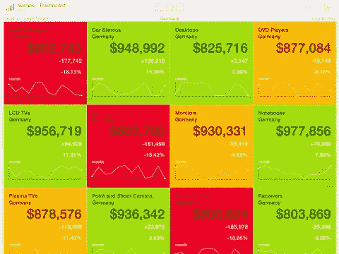
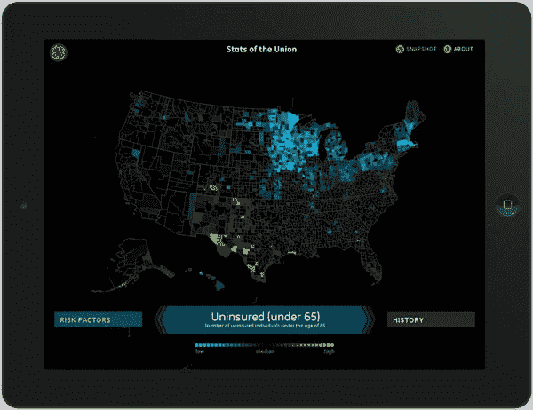
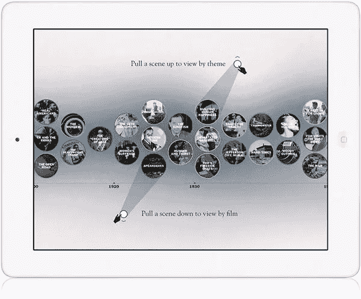
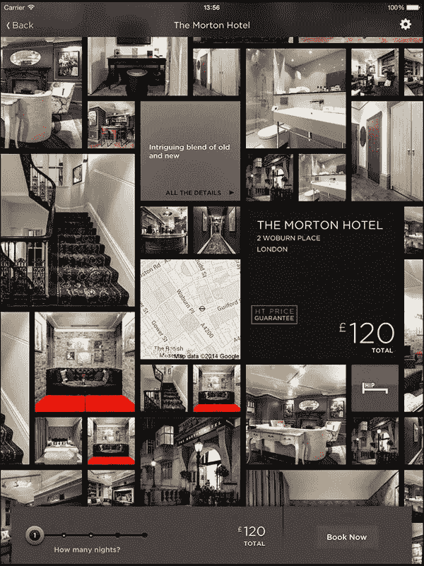
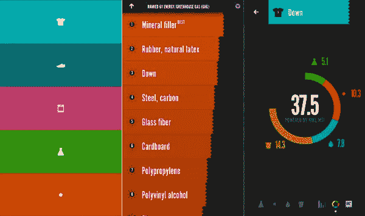
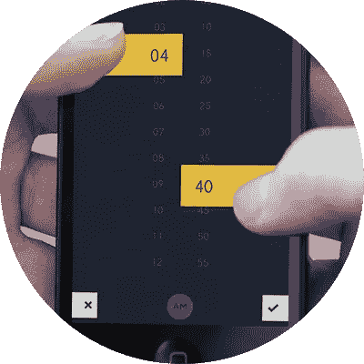
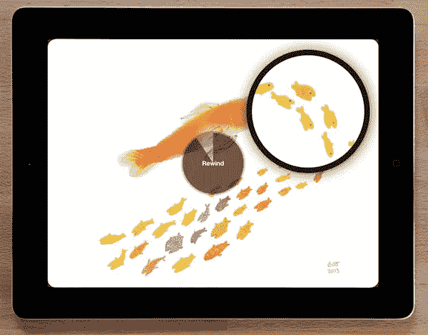
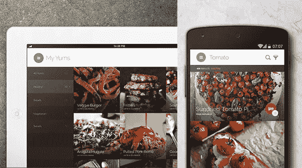
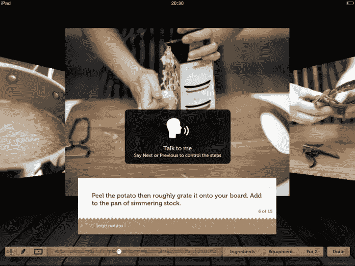
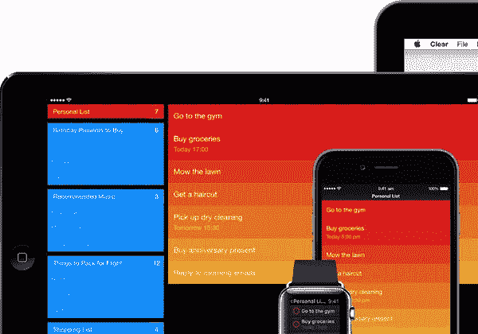

# 10 款我们喜爱的令人敬畏的 UX 应用

> 原文：<https://medium.com/swlh/10-apps-we-love-for-the-awesome-ux-b57c7ba12053>

## 或者“为什么我从来没有想到这个想法？”

“我会通过电子邮件将我们喜爱的一些移动应用的链接发给你。研究它们。祝你下次尝试一切顺利！”

对于大多数求职者来说，这是我的标准底线，他们最终会在我之前面试一个移动 UX 设计师的职位。优秀的人才非常罕见。但我真诚地希望，越来越多的人将为用户体验设计这一令人惊叹且复杂的领域做出贡献。

这里有十个我们喜欢的移动应用程序，它们的用户体验和“哇！”因素，没有特别的顺序。

# 1.Roambi 分析

[iOS | Android | Windows](http://mkt.roambi.com/try-roambi)

We are fans of Roambi Squares

如果您正在寻找仪表板和数据可视化，请不要再看了。

这个应用程序中的所有内容都值得仔细研究。一个如何将条形图、折线图、饼图/甜甜圈图、瓷砖……转化为艺术作品的完美例子。

# 2.联邦统计数据

[仅限 iPad】](http://fathom.info/indicators)

Stats of the Union. Design by Fathom Information Design.

Union 应用程序的统计数据可视化了美国的健康状况——从预期寿命到获得医疗护理。

这个应用程序显示了美国数据的热图。查看该应用程序，了解如何处理地图和数据向下钻取视图。

# 3.本·伯恩斯

[仅限 iPad】](http://www.bigspaceship.com/case-study/past-present/)

Ken Burns. Design by Big Spaceship.

这个应用程序将美国历史分为艺术、战争、创新等主题

该应用程序的亮点是“时间线”的巧妙实现。信息图表、手势、动画……都是一种享受。

# 4.今晚酒店

[iOS | Android | Windows](https://www.hoteltonight.com/#apps)

Hotel Tonight. We love this endless image wall!

“今夜酒店”应用程序有助于确保在旅行目的地进行最后一分钟的酒店预订。

iPad 应用程序有一个从酒店内部照片创建的无限图像马赛克。你可以通过向任何方向滑动来玩这无尽的墙。它战略性地放置了带有可点击内容或导航的图块。

# 5.由耐克 MSI 提供动力的 make of make

[仅 iOS](http://news.nike.com/news/nike-unveils-new-app-to-help-designers-invent-better)

Making of Making

MAKING 是由 Nike MSI(材料可持续性指数)提供动力的工具，旨在激励设计师和创作者。

这个应用程序的动画和过渡中融入的物理特性(惯性、塑性变形、弹性……)令人惊叹。枯燥的索引以彩色编码和生动的信息图呈现。

# 6.查看日历

[仅限苹果手机](http://www.peekcalendar.com/)

Peek Calendar. Set time sliders.

“阴影”手势，晃动手机获取随机日历条目，设置任务持续时间的滑杆，完美的手风琴动画……哇名单是无穷无尽的！

# 7.53 岁之前的论文

[仅 iOS](https://www.fiftythree.com/paper)

Paper by FiftyThree. Rewind gesture.

《53 的纸》不需要介绍，因为它是 iPad 的“Photoshop”。

撤销/重做的“倒带”手势是一个瑰宝。工具箱、颜色混合、翻页动画……究竟 53 工作室是如何想出这些点子的？

# 8.美味

[iOS | Android | Windows](http://www.yummly.com/mobile/)

Yummly. Mouth watering.

Yummly 是一款美食 app，面向热爱烹饪、美食和分享的吃货们。

整洁的设计，开胃的食物照片，导航层次的无缝切换，惊人的搜索过滤器…你还想要什么？

# 9.杰米·奥利弗的食谱(旧版本)

[仅 iOS](http://www.jamieoliver.com/shop/jamies-apps/)

Voice command feature in an older Jamie Oliver’s Recipes app. Image source: [UI Treat Wordpress blog](https://uitreat.wordpress.com/2012/03/15/voice-control/)

这是来自名厨[杰米·奥利弗](https://en.wikipedia.org/wiki/Jamie_Oliver)的烹饪食谱应用。

这个 iPad 应用程序的旧版本提供了免提操作的语音命令识别功能。烹饪时，只需说“下一步”,而不是滑动手指，就可以进入食谱的下一步。

如果你正在使用新的应用程序，可能你必须先洗手，擦掉水，然后在 iPad 上滑动，进行下一步。为什么杰米，为什么？你为什么删除这个惊人的功能？

# 10.清楚的

[iOS | Mac](http://realmacsoftware.com/clear/#downloads)

Clear app. Very clear!

“Clear”是一个设计精美的应用程序，用于快速简单地保存待办事项列表。

当这个应用程序在 2013 年出现时，没有人真的想到在列表中添加左右滑动来实现各种功能。添加新笔记的捏手势棒极了。列表中基于优先级的颜色渐变是独一无二的！

# 等等，还有呢！

以下是 **10 款额外应用**，分别链接到相应页面(可用平台)，以及*我们为什么喜欢这个…*

## [11。雅虎！天气](https://in.mobile.yahoo.com/weather/) (iOS | Android)

*云、风等微妙的动画…*

## [12。雅虎！新闻摘要](https://in.mobile.yahoo.com/newsdigest/) (iOS | Android)

动画和“你知道吗？”最后！

## 13。窗外 (iPhone | Android)

*颜色，颜色…*

## 14。国际足联 (iOS | Android)

*比赛装置、记分卡的布局…*

## 15。路透社-大图(仅限 iPad)

*惊人的图像，“加载…”图形类似于前进条形图，故事页面布局…*

## [16。通知](http://inform.com/inform-app.html)(仅 iOS)

*令人惊叹的标签云设计被称为“文字墙”，通过自动学习用户的阅读习惯来实现个性化新闻……*

## 17。圆点 (iOS | Android)

这个应用程序不需要介绍。首轮演练是最好的一次！所有奖杯都是基于多色圆点主题设计的。

## [18。纽约现代艺术博物馆抽象表现主义(AB EX NY)](https://www.moma.org/explore/mobile/abexnyapp) (仅限 iPad)

*令人惊叹的图片库，具有独特的浏览体验。*

## [19。初级读本](https://www.yourprimer.com/) (iOS | Android)

*简约的展示设计，专注于内容。*

## 20。SketchBook Xpress(iOS | Android | Windows)

*命令(撤销、重做……)被分配到屏幕角落，以便于访问，并采用双击手势来触发它们。*

那么，就用户体验和‘哇！’而言，哪些是你最喜欢的应用呢因素？我们错过了什么吗？您能在下面的空白处告诉我们您的想法吗？

喜欢这篇文章吗？通过分享和推荐把快乐传播给他人！
另外，前往[*www.antzFxWay.com*](http://www.antzFxWay.com)*获取更多设计和摄影素材。*

*发表于* **创业、旅游癖和生活黑客**

-