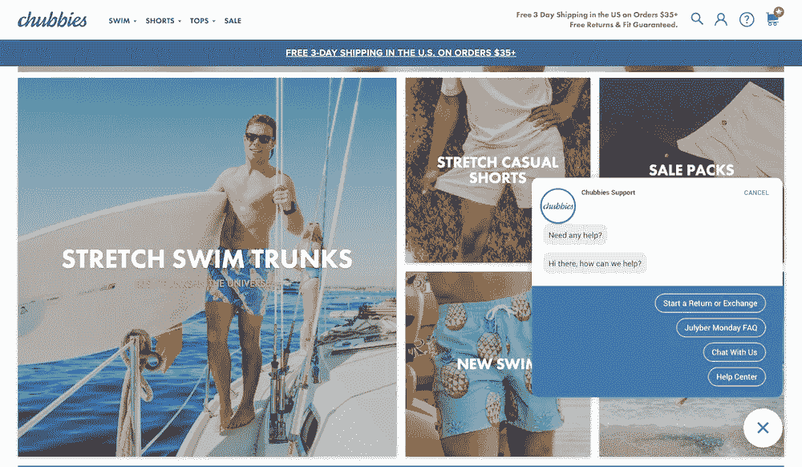
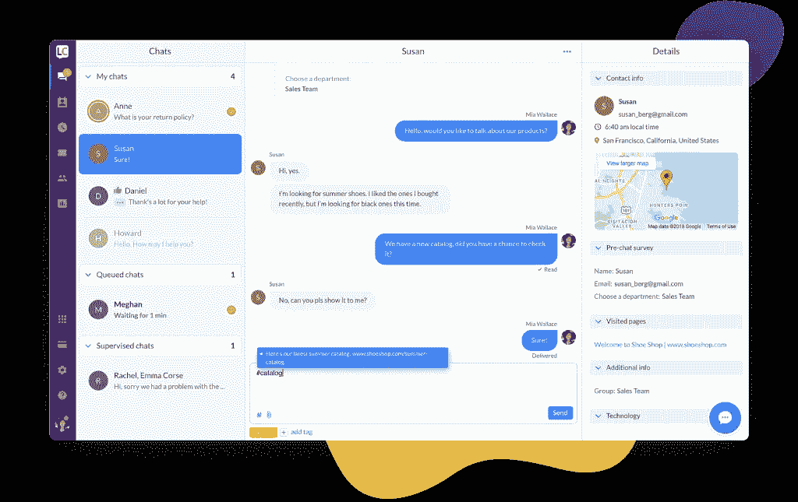
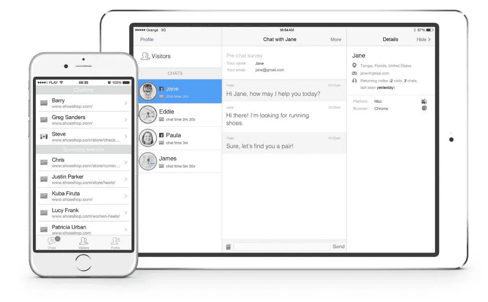
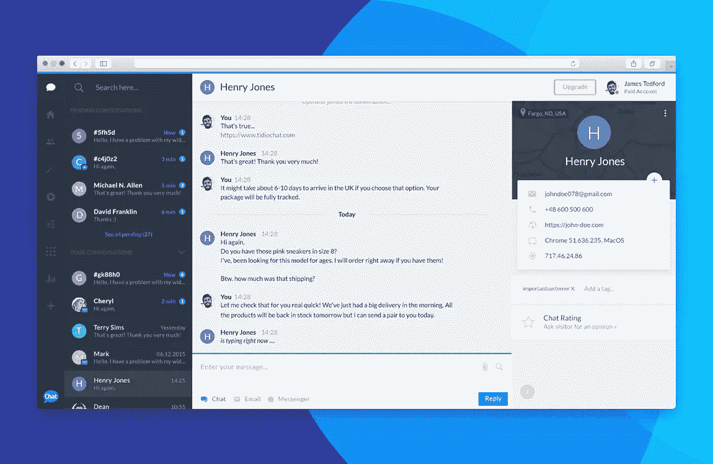
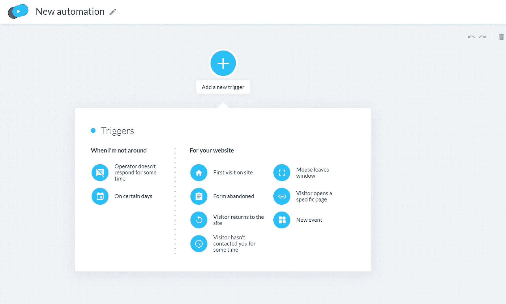
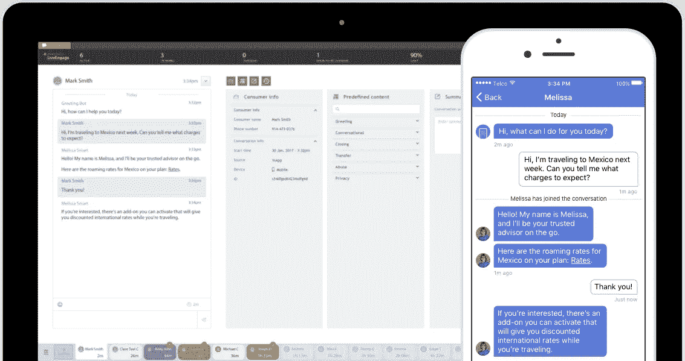
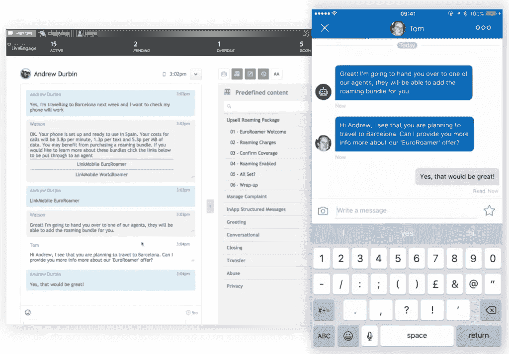

# 10 个最佳电子商务软件解决方案(1/10 —电子商务实时聊天)

> 原文：<https://medium.com/swlh/10-best-e-commerce-software-solutions-1-10-live-chats-for-e-commerce-b5f8d7f51305>

*这是在 picksaas.com**发布的电子商务软件系列* [*的 10 个部分中的第一个，这是一个专家社区，通过咨询最佳商业云软件解决方案来帮助企业发展。*](https://picksaas.com/blog/ecommerce-software-solutions/)

当今世界，开网店没什么大不了的。市场为你提供了大量的[直运](https://www.shopify.com/guides/dropshipping/understanding-dropshipping)机会和电子商务软件，所以你甚至可以出售实际上不属于你的产品，只需关心产品的营销和交付。

建立电子商务商店的标准和基本流程可能如下所示:

1.  找到你认为可以销售产品的利基市场。
2.  设置您的产品生产或直运流程(例如与[奥伯罗](https://www.oberlo.com/)或[全球速卖通](https://www.aliexpress.com/)
3.  使用 Shopify 或 BigCommerce 这样的 SaaS 平台，或者在开发者的帮助下，使用 Magento 这样更先进的平台，创建你的在线商店。
4.  使用 PayPal、Stripe 或本地支付网关等服务建立支付系统。
5.  为你的店铺建立营销(如社交媒体、AdWords、内容营销)并开始销售你的产品。

一旦你建立了自己的电子商务商店，或者如果你已经经营了一家业绩良好的商店，是时候考虑如何发展和销售更多的产品了。

在这份材料中，我们分析了主要的电子商务趋势和数据，为您提供最佳的电子商务软件建议，帮助您发展您的在线商店。

**电子商务业务软件推荐:**

*   客户沟通/支持->网站的实时聊天软件
*   商店/访客分析->网站分析软件[TBA]
*   邮件自动化->自动与客户进行电子邮件通信的软件[TBA]
*   登陆页面->帮助您推广产品的登陆页面创建者[TBA]
*   为社交媒体设计图形->社交媒体设计应用程序[TBA]
*   社交媒体发布->社交媒体日程安排工具[TBA]
*   客户管理->电子商务 CRM[TBA]
*   员工/工作时间安排->工作时间应用[TBA]
*   营销->营销渠道和管理渠道的应用程序[TBA]
*   如果你还没有自己的商店->电子商务平台

# 利用云解决方案发展电子商务商店

那么，如何利用现代软件来发展网上商店呢？

在我们开始之前，让我们来看看一些可能有助于找出发展您的业务的方法的提示:

> 通信是电子商务和社区的核心。——梅格·惠特曼 [***惠普***](http://www.hp.com/country/us/en/uc/welcome.html) 总裁兼首席执行官

*   尽可能提供最好的客户服务。

当今世界，人们有各种各样的商店可供选择。让你的品牌独一无二，并确保你的访问者记住你网站的客户体验。

*   确保你的网站和产品页面为搜索引擎优化做了很好的优化

商店开业后不久，你将不会体验到多少有机客流量。尽管如此，从长远来看，来自谷歌的 ***流量可能会成为你业务最有价值的来源。***

*   成为客户的可靠来源

电子商务和信任有很大关系。通过清楚地展示你是谁，确保你的顾客相信你的品牌。利用客户的推荐可能对你的最终成功至关重要。经营博客也可以提高你的可信度。

*   优化您网站的用户体验

你网站的流量为你提供了关于用户行为的有价值的信息来源。利用这些数据来 ***创造尽可能好的用户体验*** *。*

*   为你的企业找到合适的营销渠道

*有许多不同的渠道来建立你的在线商店。* ***明智地专注于社交媒体、付费广告还是*** [***内容营销***](https://contentmarketinginstitute.com/what-is-content-marketing/) *，取决于你的受众类型。*

# 1.为你的商店添加实时聊天窗口，并开始与你的访客交流。

最好的电子商务商店不需要特别的指导。它们是用户友好的，每个访问者都可以很容易地浏览它们。你想要的最好的商店结构是能让你的用户顺利浏览你的商店。尽管如此，还是有一些时候你的访客会想要联系你，在今天的世界里，没有人愿意等着被服务。有这么多可供选择的产品，人们在看你的商店时最有可能从你的右边购买。

那么，如何在提供卓越的客户服务的同时，提供即时的问题解答呢？

最常见的解决方案之一是实时聊天软件。在你的网站上安装一个聊天窗口可能[有助于显著提高你的在线商店的转化率。](https://neilpatel.com/blog/how-live-chat-can-maximize-conversions/)

Chubbies — an online store based on Shopify, using live chat solution

这种奇迹是如何发生的？您可以通过几种方式在电子商务商店使用实时聊天软件:

*   只需**提供即时信息**来回答任何关于产品供货/运输选项的问题
*   在特定的产品页面上向您商店的访客发送**自动消息**(例如宣传您的新产品或最受欢迎的产品)
*   **退出意图动作**:一旦有人试图退出你的商店，就自动发送带有折扣的问候
*   提供个性化定制的客户服务:使用实时聊天解决方案，您可以即时访问关于您的访问者和聊天参与者的**信息。您可以利用这些数据来个性化您的通信。**
*   使用 **chats 的绩效数据**更好地处理客户支持。例如，根据聊天对话的评分分析客户的满意度

# 如何在网站上安装实时聊天？

在网站上安装实时聊天窗口可以简单到只需点击一下，从你已经在使用的软件市场添加应用程序，或者最难的是，复制一段代码并将其添加到你网站的代码中。不知道如何开始？随时在聊天中询问我们。

# 电商最佳实时聊天？

市场上有相当多的[实时聊天](https://picksaas.com/live-chats)解决方案。你可能会问:有没有哪种实时聊天最适合电子商务？

可能没有这样的答案，因为每个商店和企业可能有自己的需求、偏好或设计准则。

例如，如果您正在寻找一个非常基本的实时聊天解决方案(仅用于回复到访您商店的顾客)，您可以尝试一些免费的解决方案。然而，如果你在寻找一个能为你提供数据分析、自动化信息、票务系统或队列管理的软件，你会更愿意寻找更高级的解决方案。

让我们来看看几个您可以在电子商务业务中使用的实时聊天解决方案:

## 1.LiveChat —为电子商务提供的优质、用户友好的实时聊天，带有目标跟踪和票务系统。

LiveChat 在电子商务中尤其知名。它专注于通过销售和目标跟踪等附加电子商务功能向在线商店提供增值。它还非常注重用户友好性，为新代理/操作员提供了简单而精心设计的界面和循序渐进的指南。

电子商务的主要 LiveChat 功能:

*   **自动问候** —自动发送信息给你的访客，例如在产品页面上
*   **票务系统**——一个内置系统，让你稍后通过电子邮件处理更复杂的客户案例
*   **客户分析** —浏览您商店的访客的视图和分析，他们的来源、地理位置、访问历史
*   **销售/目标跟踪** —分析聊天对话对您销售的影响
*   与电子商务平台的轻松和广泛集成，与 [BigCommerce](https://picksaas.com/e-commerce-platforms/bigcommerce) 的良好集成
*   选择**连接 Facebook Messenger** 在一个地方处理通信

## 2.ti dio Chat——一个实时聊天解决方案，具有简单的自动化设置和出色的 Shopify 和 WIX 集成

Tidio Chat 是一个免费的实时聊天解决方案，以其简单的自动化设置而闻名。这是什么意思？有了 Tidio，你可以很容易地通过聊天或电子邮件起草自动发送给你的访客的信息流。你唯一需要做的事情就是拖放发生在 Tidio 中的特定触发器和动作。例如，代理超过 2 分钟没有响应->发送自动聊天消息，询问访问者的电子邮件。

Tidio 的另一个伟大之处是它的免费试用版本，以及与最受欢迎的电子商务平台如 [Shopify](https://picksaas.com/e-commerce-platforms/shopify) 或 [WIX](https://picksaas.com/website-builders/wix) 的良好集成。

适用于电子商务的 Tidio 的主要特点:

*   为自动消息轻松设置工作流程和**场景(例如，为废弃的购物车消息)**
*   **整合电子邮件**作为额外的沟通渠道
*   回复**脸书粉丝页面消息**在蒂迪奥内部
*   与 [Shopify](https://picksaas.com/e-commerce-platforms/shopify) 的广泛集成，让你设置**自己的机器人来回答关于订单状态或交付选项的问题**
*   内置与 [WIX](https://picksaas.com/website-builders/wix) 的集成，允许在 WIX 管理面板中处理**聊天对话**

## 3.LivePerson —为要求更高的客户提供的企业级实时聊天解决方案

[LivePerson](https://picksaas.com/live-chats/liveperson) 是为大型企业设计的解决方案，旨在帮助他们更有效地与客户沟通。它以其内置的机器人功能而闻名，让您自动处理简单的客户案例，无需人工参与。它也是为数不多的专注于将在线聊天与移动消息联系起来的解决方案之一，集成了 SMS、iMessages 或 Facebook Messenger。

针对大型电子商务商店的 LivePerson 的主要功能:

*   设置 bot 来自动处理和定向请求。可用于:
    —处理账单:余额信息、账单支付
    —订单管理:订单状态更新、退货处理
    —客户路由:将客户路由至正确的部门或代理
*   建立与客户的多渠道沟通(例如，通过 SMS、iMessages)
*   共同浏览:浏览顾客的商店，引导他浏览订单

# 还没有自己的商店吗？用一个电商平台去搭建一个。

如今开网店不成问题。几年前，您可能需要开发人员的帮助和支持来创建一个。在当今世界，即使对于一个不太懂技术的人来说，创建一个也不是问题。在电子商务平台的帮助下，你将能够轻松创建自己的品牌，添加产品，描述，设置支付，交付方式。你还可以将它与亚马逊、脸书或 Etsy 连接起来，通过多渠道销售。

## 选择电商平台要看什么？

在选择电子商务平台时，你最好看一看:

*   支持的支付系统/费用
*   模板和设计的选择
*   产品/网站的 SEO 优化
*   本地化/语言
*   与其他应用程序/市场的集成
*   移动友好
*   博客设置
*   库存管理选项

虽然有许多[电子商务平台](http://picksaas.com/e-commerce-platforms)(你可以在 picksaas 上浏览它们，或者在 chat 上询问我们的建议)，但只有少数几个能提供不错的服务质量，值得在开店时考虑。

## [Shopify](https://picksaas.com/e-commerce-platforms/shopify)——最具用户友好性/设计质量——我们的电子商务平台推荐

这是一个非常受欢迎的在线电子商务平台，让你自己设计一个在线商店。

**购物优势:**

*   与 app store 中数百种不同的应用程序集成
*   模板和设计的广泛选择
*   注重用户友好性的解决方案(简易商店编辑器)
*   轻松访问商店的 HTML 代码
*   简易搜索引擎优化版

**Shopify 缺点:**

*   有限支付集成
*   许多国家不支持 Shopify 支付
*   如果您想要添加多个应用程序并使用全部功能，可能会非常昂贵

## 替代电子商务平台:

*   [BigCommerce](https://picksaas.com/e-commerce-platforms/bigcommerce) —大型商店的电子商务平台
*   ecWID——一个为 WordPress 用户设计的平台
*   [Shoplo](https://picksaas.com/e-commerce-platforms/shoplo) —专注于多渠道销售的平台(例如与 Etsy 集成)
*   [Volusion](https://picksaas.com/e-commerce-platforms/volusion) —用户友好的电子商务平台，为小型商店提供价格优惠的方案
*   Magento —一个非常流行但更先进的电子商务平台，需要开发者的参与

*原载于 2018 年 8 月 1 日 picksaas.com**的* [*。这篇文章将每两周更新一次。*](https://picksaas.com/blog/ecommerce-software-solutions/)

*在*[*picks AAS*](https://picksaas.com/)*，我们帮您找到 saas 软件，发展您的业务。*

*与我们聊天，关注我们的* [*推特*](https://twitter.com/picksaas) *，或* [*订阅我们的*](https://picksaas.us16.list-manage.com/subscribe/post?u=0a811ad254e7cd14718599e3a&id=bdf0cfd955) *每周 SaaS 软件更新。*

## 这个故事发表在 [The Startup](https://medium.com/swlh) 上，这是 Medium 最大的企业家出版物，拥有 355，974+人。

## 在这里订阅接收[我们的头条新闻](http://growthsupply.com/the-startup-newsletter/)。

