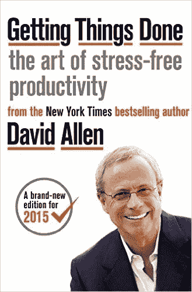
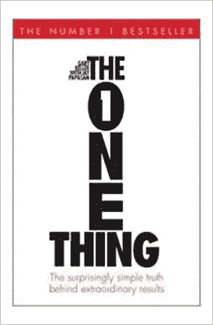
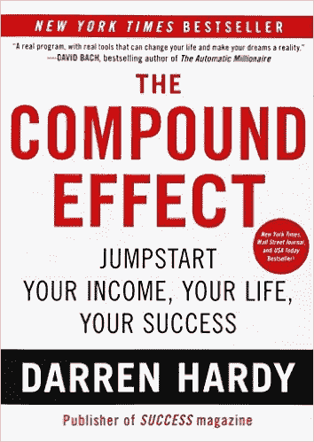
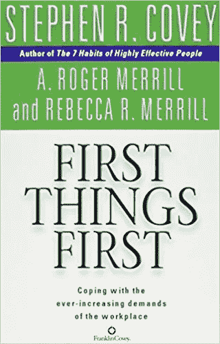
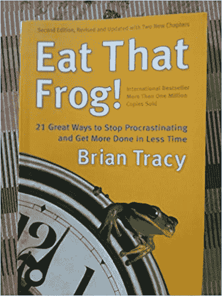
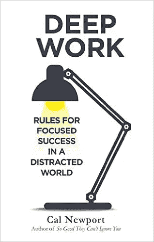
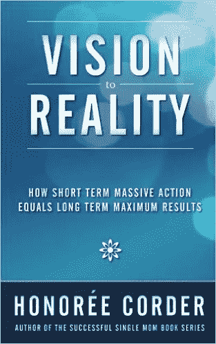
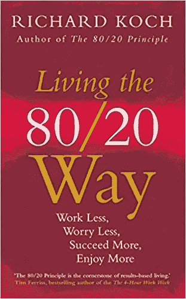
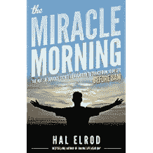
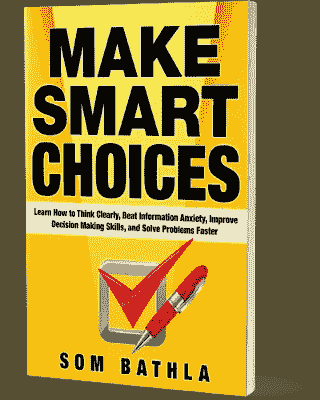

# 10 本精彩的书将极大地提高你的注意力和工作效率

> 原文：<https://medium.com/swlh/10-bestseller-books-to-improve-your-focus-and-productivity-achieve-your-goals-faster-aaf50ffd299c>

> 像明天就要死去一样生活，像永远活着一样学习”~圣雄甘地

毫无疑问，这个星球上的每一个人都在努力寻找传递更多的方式。不仅仅是想在更短的时间内交付更多。

旅程不会就此结束。

人类总是努力变得越来越好。

就体力而言，人类潜力的弹性可以通过这样一个事实来判断，即每隔几年，旧的记录就会在世界的每个竞技场上被打破。

在技术领域，人类正在不断寻找各种方法来带来工具和技术，以实现人类活动的自动化并更快地交付结果。

但有一点是肯定的！

人类总是渴望在生活的各个方面变得越来越好。

如果你正在读这篇文章，恭喜你！你在游戏中不断学习，提高你的生活质量。

你和我都意识到，在我们的努力中富有成效会带来巨大的好处，仅举几个例子:

> 1.我们能够更快地交付成果，为全世界带来更多价值，并获得回报。
> 
> 2.富有成效有助于我们远离压力和焦虑。
> 
> 3.生产率提高带来的成就感是无法解释的。
> 
> 4.最重要的方面，我们在我们的思想和心灵中感觉到我们正在成长和进化成一个更新的人类。

**你们有些人可能会想，这不是很明显吗？**

简短的回答是:是的。有人可能会说“常识”，但是

> “常识并不常见”——伏尔泰

原因是我们已经听说了很多，我们中的一些人甚至觉得自己是生活各个哲学方面的“专家”。

但问题是，我们大多数人只是“理智地”知道它，这意味着我们没有“实践”这些智慧，或者实际上没有在我们的生活中实施这些哲学。

但是，你知道吗？

有时候，我们需要从不同的角度看待同一件事，才能获得更好的视角。

你永远不知道，什么会触动你的大脑，它会改变你的生活。所以，让我们对可能性保持开放(即使我们认为自己是知识分子或专家)

**好吧，但是这些书是学习新知识的最好来源吗，包括关于生产力的知识？**

不，因为最好的资源总是写这种书的活生生的人。你可以解释你的观点和生活中的情况，你在任何特定的时间点，并获得下一步该做什么的实时建议。

是的，实时一对一辅导是最好的资源。但这将是一个昂贵的计划，而且一旦一个人完全投入，这个计划就会奏效。

然而，这些书肯定可以被认为是下一个最好的资源…当然，更便宜，如果你致力于实现这些书中的智慧和策略，这些也很好。

好吧，看起来关于书的解释很多！！！

现在让我们吃肉吧！

这里有 10 本最受欢迎和推荐的书，可以提高我们工作场所和日常生活的效率:

# 1.[完成工作:无压力生产的艺术——作者大卫·艾伦](http://geni.us/73Qi)

看看顾客评论的数量就知道了！哎呦！超过 2600 个，并且还在增长…

这本书确实是个人组织和商业成功领域的瑰宝。“GTD”这个缩写词已经成为每个人在生活中处理职业和个人事务的一种方式的简写。

书中提到的哲学和策略是永恒的。例如，“去做，委托，推迟或放弃”是快速清空收件箱最有效的规则。

《把事情做完》是让你摆脱焦虑、迷茫和被工作压得喘不过气来的感觉的最好的书。一生必读的结果。[点击此处获取更多详情](http://geni.us/73Qi)。

# 2.[加里·凯勒著](http://geni.us/SWaZD)

加里·凯勒在这本书里非常明确地指出，在任何人生活中的任何情况下，并不是很多事情都很重要。这真的只是一个改变，它可以极大地改善一个人的成长旅程。

这本书在各方面都很棒。但我特别喜欢“聚焦问题”的想法，它几乎在生活的每个领域都被问到。选择你生活的任何领域，无论是精神、身体健康、个人生活、人际关系、工作、商业、金融等等。问下面的焦点问题会立即改变你对解决方案的关注。

> “我能做哪一件事，通过做这件事，其他所有事情都会变得简单或不必要？”

这本书肯定会帮助你更有效率，因为它允许你:

> 穿过杂乱的人群
> 
> 用更少的时间获得更好的结果
> 
> 朝着你的目标前进
> 
> 克服那种不知所措的感觉
> 
> 恢复你的精力
> 
> 坚持；保持
> 
> 掌握对你重要的东西
> 
> [还有更多。](http://geni.us/SWaZD)

# 3.[复合效果——达伦·哈代](http://geni.us/4fDdbWR)

*另一本很棒的书，解释了*你的决定塑造你的命运的原则。小小的日常决定要么会让你过上你想要的生活，要么会让你陷入灾难。

每天采取的看似微不足道的小行动，经过一段时间的积累，将会导致巨大的成功。这本书坦率地将背景设定为关注你更强的人生目标，然后再将你推向策略和系统。

这个易于使用的，一步一步的操作系统可以让你倍增你的成功，记录你的进步，并实现任何愿望。

这本书写得非常好，得到了 1600 多名顾客的积极评价，如果你真的对它很认真的话，这本书是一本创造你想要的成功的圣经[**。**](http://geni.us/4fDdbWR)

# **4.[首先要做的事情——斯蒂芬·科维](http://geni.us/ttl4ue6)**

****

**这本书从一个完全永恒的角度出发，迫使你超越表面现象。**

**考虑以下陈述:**

> **我在更少的时间里做了更多的事情，但是丰富的人际关系、内心的平静、平衡、我做最重要的事情并把它做好的信心在哪里呢？这个烦人的问题是否困扰着你，即使你觉得自己已经发挥出了最大的效率？**

**如果是这样，那么*可以帮助你理解为什么我们的第一件事往往不是第一件。***

***斯蒂芬·柯维给了你一个指南针，而不是给你另一个时钟让你和它赛跑，这是因为:***

> ***“你要去哪里比你走得多快更重要”~斯蒂芬·柯维***

# ***5.[吃青蛙——布莱恩·特雷西](http://geni.us/aeQF)***

******

***布莱恩·特雷西非常艺术地将青蛙的比喻用于一项具有挑战性的工作活动，但这样的工作对你的生活有很大的积极影响。***

***他在书中继续解释说，我们没有足够的时间去做清单上的每一件事，而且永远也不会有。成功人士学会专注于最重要的任务，并确保完成这些任务。换句话说，他们吃他们的青蛙。***

***有一句古老的谚语说，如果你每天早上做的第一件事是吃一只活青蛙，你会有一种满足感，因为你知道你完成了一天中最糟糕的事情。***

***这本简短的书被分解成 21 个秘诀，特雷西自己用它们创造了自己的卓越成功。这些提示非常容易获得，这本书也很容易阅读，对初学者来说是一个很好的起点。***

# ***6.《深度工作:在纷乱的世界中专注成功的规则》——卡尔·纽波特***

******

***顾名思义，这本书是关于聚焦于你的深层工作。为世界提供巨大价值并最终获得回报的工作。***

***这本书解释了人类思维变得分散注意力的一般趋势。此外，在这个不断变化、联系紧密的世界里，社交媒体的发展已经到了令人抓狂的地步，人们专注于深层工作的能力大大降低了。***

***卡尔·纽波特(Cal Newport)在自己的生活中研究并实践了在工作中培养不受干扰的生产力的方法和心态，现在，在深度工作中，他展示了任何人如何才能达到这种难以捉摸的状态。***

***他解释了为什么掌握工作实践中的这种转变对于任何想要在复杂的信息经济中保持领先的人来说都是至关重要的，以及如何系统地训练注意力。***

> *****简而言之:发展和培养一种** [**深度工作**](http://geni.us/f3dt) **实践是我们在这个日益纷乱的世界中所能做出的最佳决定之一。*****

# ***7.[从愿景到现实:短期的大规模行动如何等于长期的最大结果——获奖者 Corder](http://geni.us/GE6mS4q)***

******

***Honoree Corder 是关于设定宏大的目标，并解释在最短的时间内实现这些目标的策略。***

***她很聪明地提出了设定 100 天目标的想法，而不是一年的目标。这背后的原因很简单。而一年的时间太长了，很容易被动摇而一事无成。另一方面，每周或每月的目标时间太短，无法实现任何有意义的目标。***

***因此，100 天的目标，一个合理的短，但不是太长的时间来设定和实现你的目标。***

***STMA 的独特概念——短期大规模行动(在本书中了解更多)值钻石。当你清楚自己到底想要什么，如何得到它，并运用 STMA，你会以闪电般的速度得到结果。***

***在这本书里，你会发现:***

> ***识别和实现你的愿景的一步一步的过程***
> 
> ***如何制定大胆大胆的目标，并开始采取行动实现这些目标***
> 
> ***为什么激光聚焦能给你力量去做你从未想过的事情***
> 
> ***如何让你的团队和你自己发挥最大的作用***

***在[亚马逊](http://geni.us/GE6mS4q)查看更多关于这本书的细节***

# ***8.[80/20 生活方式:少工作，少担心，多成功，多享受](http://geni.us/pTx3dqe)***

******

***80:20 原则，也称为帕累托原则，一直是我们社会的基石，在当今这个节奏飞快、信息超载的时代更为适用。***

***这条原则表明，这个世界围绕着这样一条原则运转，即你生活中只有 20%的活动(甚至更少)与 80%的结果(甚至更多)同等重要。以下事实可以证实这一点:***

> ***1.世界上 99%的财富只由 1%的人积累。***
> 
> ***2.每个企业 80%或更多的营业额/利润是由 20%或更少的客户贡献的。***
> 
> ***3.如果你让生活中 20%的人对你的工作感到满意，那你就有 80%的把握过上完美的工作生活。***
> 
> ***4.这个清单还在继续。***

***理查德·科赫采用了广为人知的 80/20 原则，并向我们展示了在当今这个混乱而又充满压力的世界中，如何找出少数真正重要的事情，以及少数能给我们带来这些事情的方法，从而带来更多的快乐和更大的成功。***

***[***80/20 生活方式***](http://geni.us/pTx3dqe) **解释了为什么“少即是多”不仅仅是一句谚语，而是实现你的目标和过上最好生活的万无一失的方法。*****

# ***9.《奇迹的早晨:保证在早上 8 点前改变你生活的不那么明显的秘密》——作者哈尔·埃尔罗德***

******

***恰如其名，这本书有能力让你的早晨(以及每一天)变得不可思议。奇迹早晨的概念在世界范围内掀起了一场革命。只要谷歌一下或者看看脸书，世界各地都有以“奇迹早晨”为名的团体、社区或论坛。***

***虽然这本书涵盖了晨间仪式背后的原理，但它并没有就此止步。它给出了实用的技巧和方法，开始在你的生活中植入哲学。***

***我喜欢这本书里陈述的 **S.A.V.E.R.S .原则，它是关于在你的清晨养成一些基础习惯(沉默、肯定、想象、锻炼、阅读和涂鸦**(日记))并且回报是巨大的，以增强头脑清晰、注意力集中、视野清晰和在你所有的工作时间里更有效率的形式。更重要的是，它解释了如何在你的日常日程中安排这些。***

***所以加油吧！***

***[***进入奇迹早晨***](http://geni.us/vPd1C) 。现在世界上成千上万的人正在实践的也许是创造你一直想要的生活的最简单的方法。它就在我们面前，但这本书最终让它变得生动起来。***

# ***10.做出明智的选择***

# ***你想彻底提升你的决策技能吗？***

***看看我的书[做出明智的选择](https://www.amazon.com/Make-Smart-Choices-Information-Decision-ebook/dp/B07VWVQCLJ/)***

***这本书将帮助你了解你的**决策原型**，了解导致错误选择的隐藏陷阱，学习有效的技术**做出更明智的决策** &让你的生活更上一层楼！***

******

***如果你刚到 audible.com，你可以免费听这本书的有声读物版本(试用期间)。***

***[**点击**](https://www.audible.com/pd/B07WNY3HDD/?source_code=AUDFPWS0223189MWT-BK-ACX0-161874&ref=acx_bty_BK_ACX0_161874_rh_us) 获取《做出明智的选择》有声读物***

# ***希望你喜欢这篇文章！***

***你能给我一两下掌声吗？也把这个资源分享给你的朋友。***

# ***如果你喜欢上面的，你也可以看看我下面的其他文章:***

***[以高绩效者的方式激活“心流状态”的简单公式！](/@sombathla/this-is-how-peak-performers-get-into-state-of-flow-and-you-too-can-c32bfca47493)***

***[了解拖延如何帮助你产生新的想法(一步一步的过程)](/@sombathla/learn-how-procrastination-can-help-you-generate-new-ideas-step-by-step-process-a00aa7130bb5)***

***了解你活动的四个区域，过上快乐充实的生活！***

# ***想提高你的表现(和结果)吗？***

## ***[点击此处下载免费报告，了解 5 种心态转变，在短短 30 天内提升你的表现](https://sombathla.com/mentalshifts/)***

******

***Photo by [Quino Al](https://unsplash.com/@quinoal?utm_source=medium&utm_medium=referral) on [Unsplash](https://unsplash.com?utm_source=medium&utm_medium=referral)***

## ***[Master 5 心态转变，在短短 30 天内提升你的表现——下载你的免费报告](https://sombathla.com/mentalshifts/)***

******

## ***这个故事发表在 [The Startup](https://medium.com/swlh) 上，这是 Medium 最大的企业家出版物，拥有 292，582+人。***

## ***在这里订阅接收[我们的头条新闻](http://growthsupply.com/the-startup-newsletter/)。***

******