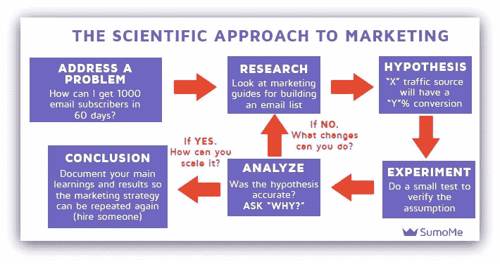
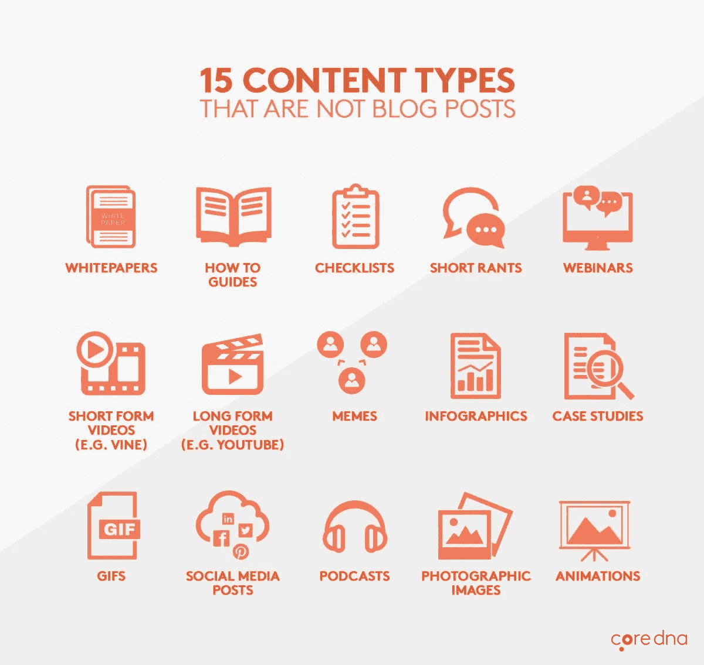

# 每个创业公司都应该避免的 10 个内容营销错误

> 原文：<https://medium.com/swlh/10-content-marketing-mistakes-every-startup-should-avoid-3574d793247f>

## 它们会让你付出昂贵的代价

Via [energepic.com](http://www.energepic.com)

内容营销并不像看起来那么容易。

你不仅仅是创造内容，把它推向社交，称之为“内容营销”信不信由你，做这件事有高效的方法，也有有效的方法。
本帖讲的是后者。

作为人类，当谈到我们的营销时，我们都陷入了一刀切的公式，尽管已经阅读了无数的博客帖子，也听了太多关于这个主题的播客。

在创业公司营销的早期，早期采用者在公司发展方向上扮演着重要角色。

以下是每个初创公司都应该避免的 10 个内容营销错误:

# **1。没有总体规划**

伟大的内容营销需要两样东西——有效的战略和伟大的战术执行。
你的战略就是你的主计划。这是你为什么以及如何努力的蓝图。
你的战术就是你的日常执行。正是你在微观层面上的所作所为让你更接近活动的最终目标。

如果你曾经发现自己大量写作和创作内容，但结果令人失望，这可能是因为你的策略没有效果。

一个很好的框架是诺亚·卡根的[基于量化的营销](http://okdork.com/quant-based-marketing-for-pre-launch-start-ups/)。

首先，你必须弄清楚你的 S.M.A.R.T 目标。
S —特定的
M —可测量的
A —可分配的
R —现实的
T —基于时间

S.M.A.R.T 目标的一个例子是，“在 3 个月内将脸书的有机赞增加 100，000”，而不是“在 3 年内拥有一个强大的脸书页面”。

一旦你明白了这一点，逆向工程。计算一下你需要多少个赞才能达到这个目标，以及你需要实施什么策略。把它分解成微小的、可管理的、可衡量的步骤。

SumoMe 的 Wilson Hung 在实现 S.M.A.R.T .的“90 天内 1000 名电子邮件订户”的目标时，使用了一个不同的框架，并且做得非常出色。

通过定义这些参数，您可以根据您的进度调整您的内容营销工作。

评估你的活动的有效性，而不定量地评估进展，就像看一场没有记分牌的篮球赛。

随时记录分数。

# **2。内容索然无味**

谁不喜欢好的内容？

每秒钟有超过 2.5 亿条内容发布，您如何能够与您所在领域的佼佼者竞争？

答案是优质内容。

有许多方法来生产一流的内容和不同类型的内容来考虑。

你可以研究竞争对手，找出他们的获胜公式，坐下来等待灵感迸发，或者只是实验，无情地审视你的作品，直到你创作出你的杰作。

当我做以上所有建议的时候，我更喜欢使用一个指南来开始。

对于博客帖子，我使用了由来自 Backlinko 的 Brian Dean 流行的[摩天大楼技术](http://backlinko.com/skyscraper-technique)。

简而言之，这项技术的目的是让高质量的链接和有针对性的流量回到你的网站。

它有一个 3 步流程，即:
1)找到已证实的[可链接资产](https://www.quicksprout.com/university/how-to-create-linkable-assets/)。2)创造更好的东西(通过收集最好的内容并提供你的分析。接触合适的人(在你的领域中有影响力的人，包括你提供信息的人。)

# **3。您的内容没有用**

把你的人生故事留给酒吧吧。但是如果你打算把你的博客部分当成个人日记…至少要用正确的方式。

马来西亚初创公司 TheLorry 写了一篇很棒的文章，讲述了他们在创业过程中学到的东西。

在博客中，他们写下了他们是如何创办公司的，以及他们的发现对有抱负的企业家和创始人来说是可行的。

他们写了他们用来创业的框架，叫做[目标和关键结果](https://www.slideshare.net/HenrikJanVanderPol/how-to-outperform-anyone-else-introduction-to-okr)，创始人甚至截屏了他发给员工的电子邮件。

以及他们的招聘流程，其中包括 4 个主要问题:
1)大为什么——为什么他们想加入我们而不是其他公司？沟通技巧——他们能清楚简洁地表达自己的想法吗？
3)技术、资格和工作经验——简历材料
4) X 因素——申请中的“umph”

像这样的内容对那些对他们的旅程感兴趣并希望从中学习的观众来说是非常有价值的。

创作内容时，首先要为观众增加价值，其次才是介绍自己。

# **4。你卖得太多，教得太少**

你有没有见过脸书的广告只喊“出售！出售！出售！仅限时间！”？这确实令人讨厌，尤其是如果这是你第一次遇到的话。

内容营销的核心理念是**付出多于索取**。

企业家兼 VaynerMedia 首席执行官加里·维纳查克宣扬[刺拳、刺拳、刺拳、右勾拳](https://www.garyvaynerchuk.com/the-one-thing-i-didnt-clarify-enough-in-jab-jab-jab-right-hook/)的哲学，翻译过来就是给予、给予、给予、要求(而不是索取)。

总是给予尽可能多的价值，不期望任何回报，然后要求一些东西(再次强调，不是索取)。

虽然大多数营销人员卖的比教的多，但比起销售，更要强调教和教育你的观众关于你的产品、服务、公司和行业。

简而言之，为观众创造教育和有价值的内容**比仅仅是宣传内容多得多**。

# **5。你的内容不是常青树**

在构思过程中，决定你是想创造一个抓住当前趋势的内容还是常青的内容。

作为营销人员，我们知道如果做得好，利用趋势可能会获得巨大的回报。

iPrice，一个价格比较电子商务平台，最近在亚马逊进入东南亚时做了一个[愚人节恶作剧](https://iprice.sg/blog/amazon-ready-to-launch-in-singapore-here-are-the-first-official-images-of-their-website/)，并被《新海峡时报》和 ChannelNewsAsia 等新闻媒体报道。

但是它的主要问题是内容不能在以后重新使用。

常青树内容可能不性感，但它确实提供了更长期的价值。

现在，你如何创建常青树内容？

根据[缓冲](https://blog.bufferapp.com/the-complete-list-of-evergreen-content-ideas-for-your-blog)，有几个简单的规则:
1。成为权威的来源(确保你尽可能的全面)。为初学者而写(由于搜索这类内容的用户大多是初学者)
3。缩小你的话题范围(过于宽泛会导致与那些寻找具体答案的人脱节)
注意，尽管这些规则是针对博客的，但也适用于其他形式。

# **6。错误的目标受众**

客户角色不仅仅是猜测。随着你的创业公司成长并吸引了一批追随者，你可以利用这些数据来建立一个更准确的客户档案。

有很多收集和分析数据的例子——可以通过脸书洞察或使用 SurveyMonkey 等调查工具。

根据内容营销协会的说法，拥有一个记录在案的[客户角色](http://contentmarketinginstitute.com/2015/04/content-marketing-personas/)不仅仅有助于营销团队——它有助于协调所有其他部门关注相同的受众。

# **7。忽略竞争对手的策略**

你应该感谢在你的空间里有竞争对手，因为这让你尽可能多地从他们的活动中学习。

对于社交分享，使用 BuzzSumo 找出什么类型的内容对他们来说像病毒一样传播。
当谈到他们的链接建设计划时，使用 Majestic 等工具来获取和反向链接个人资料，并观察他们链接最多的内容类型。

# **8。不是你社交频道的本地人**

加里·维纳查克在他的书《刺拳，刺拳，刺拳，右勾拳》中详细讲述了这一点。

简而言之，他的做法要求他对每个社交平台上的细微差别保持敏感。

例如，信息图表在 Pinterest 上运行良好。

短的方形视频在脸书很好用。

在他的社交渠道上关注他，观察他如何打造自己的个人品牌。

# **9。没有明确的行动号召(需要时)**

作为内容营销人员，我们的职责是为我们的创业公司获得曝光率，并在理想情况下成为消费者对我们类别的第一印象。

在创建内容时，要有意识地想让你的观众从内容中得到什么。是要分享到社交媒体上吗？是要留评论吗？是要双管齐下吗？

一个很好的例子是来自 socialtriggers.com 的 Derek Halpern，他在他的[视频](https://youtu.be/fxv1o_9mJfE?t=5m18s)的结尾用类似于*的语句发出了明确的号召:“只与一个你认为会从中受益的人分享。”*

# **10。只在博客文章中思考**

我明白了。与创建视频或信息图表等视觉内容相比，写博客需要的工作量和资源最少。但是要在这场比赛中取得成功，每一个优势都很重要。

以下是一些建议:

前景更加广阔，某些人群比其他人更容易接受某些形式的媒体，即
B2C——短视频；
B2B —白皮书；
千禧一代— [移动视频](http://www.adweek.com/brand-marketing/why-smartest-video-strategy-focuses-mobile-millennials-and-new-formats-171115/)。

说大多数内容营销不尽如人意是一种保守的说法。我们为什么做我们做的事情的策略远比我们每天实施的策略更重要。

很多时候，我们缺乏关于我们正在创造的特定媒介和我们所处平台的背景知识。

但有了所提供的资源，作者希望该地区所有创业公司的内容营销努力都能达到标准，或者至少与他们所迎合的受众更加相关。

*本文首发于*[*customer think*](http://customerthink.com/10-content-marketing-mistakes-every-startup-should-avoid/)*。*

# 行动呼吁

如果你喜欢这篇文章，请随意👏👏👏多达 50 次，它也帮助其他人找到这个。

我在 [BenSimBlog](https://bensimblog.com/) 写。我每个月都会发一篇**免费的高质量**简讯关于生产力、事业和自我提升。这是很好的策划和容易去。

[**加入这里独家访问**](http://eepurl.com/c6iwjv) **。**

## 这篇文章发表在 [The Startup](https://medium.com/swlh) 上，有 259，700 多人聚集在一起阅读 Medium 关于创业的主要报道。

## 在此订阅接收[我们的头条新闻](http://growthsupply.com/the-startup-newsletter/)。

