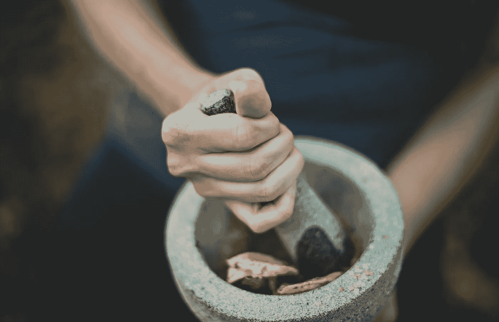

# 最成功企业家的 10 个日常习惯

> 原文：<https://medium.com/swlh/10-daily-habits-of-the-most-successful-entrepreneurs-9a0bb5e9e91b>

每天都在纠结这几点。创业很辛苦。这需要持续的纪律和对自己的信心。很多人不会喜欢的。但对于那些少数能够找到办法让苦差事运转起来的人来说，创业是世界上最有回报的工作、生活方式和身份。

> “要么你驾驭白天，要么白天驾驭你。”——[*吉姆·罗恩*](https://amzn.to/2k3lKvk)

这篇文章旨在给任何有抱负的企业家一个建立所有企业家都需要的关键习惯的开端，或者帮助现有的企业家重申这些习惯。

# 10 个日常习惯

## 1.创建一个例程

每天早上和晚上我都做同样的事情。起床，洗脸/刷牙，冥想(最好在你还有点迷糊的时候)，减肥，吃我周日准备的早餐玉米煎饼。每天晚上，我都有一套单独的日常事务，包括卫生、写日志和为明天做准备。

这有助于我脚踏实地，始终如一。

最优秀的企业家会像我一样建立每日、每周和每月的例行公事，这些例行公事根植于让自己保持理智、高效和快乐。创业是有压力的，你会发现稳定的常规成为你构建生活的基石。

## 2.从一天中最艰难的任务开始

被称为“[吃青蛙](https://amzn.to/2L6Rlsm)”，这意味着当你在一天的早些时候最有精神的时候，开始你最令人沮丧、最累人或最容易拖延的任务。

这有一系列的好处。

*   相比之下，这让其他所有的任务都变得简单了。
*   它会立刻给你多巴胺的冲动，让你完成有价值的事情。
*   它防止你在重要的任务上拖延太久。

我很高兴你读了这篇文章，但是当你读完之后，就去吃青蛙吧。相比之下，你一天中剩下的时间将会变得轻而易举。

## 3.锻炼和冥想

我自己也在纠结这个。当生活轻松时，常规就容易遵循。但是当我在旅行，或者为某事焦虑或紧张，或者我很忙的时候。我放弃了早晨的例行公事，试图为自己创造时间或空间，有时完全是出于偶然。

我相信你已经猜到了，这只会让事情变得更糟。我变得易怒，感觉迟钝，思维模糊，即使有了“额外”的时间，我的整体效率也会下降。

不要找借口。健康和精神平静对快乐的生活方式至关重要。它们是生产力的基石，而不仅仅是几天、几周或几个月。但是年复一年。我想在老年时成为社区中充满活力的一员，每天为你的健康付出一点点努力就是你实现这一目标的方法。找一些对你有用的活动、运动或实践，并通过让自己负责任而使之成为习惯。

## 4.计划明天，今天

作为我晚上例行工作的一部分，我会列出明天的任务清单，并计划如何将不同的会议、约会等联系在一起。这让我可以打包行李，解冻我的餐点，为明天我清醒和警觉的时候做好准备。所以当我醒来时，我感到昏昏沉沉和疲倦，我不必担心它。

今晚试试吧，你会发现这比你想象的要快得多。它让你对明天有了一些以前没有的了解(包括你要吃的青蛙是什么)，并帮助你抓住你可能错过的事情(你忘记的会议等)。)

## 5.让你自己与你的优先事项保持一致

通常的方法是设定目标。我有一个 Excel 电子表格，上面有短期、中期和长期目标，并经常查阅它，以保持对我工作的关注。有些人发现 1 年、3 年和 5 年这样的时间框架很有帮助，但我发现这更容易拖延后面的时间。这个系统的诀窍是随着你生活状况的变化，不断地把目标向前拉。

例如，我一直想完成铁人三项，但这一直是我三年多的目标。但是我发现我有一段时间可以做类似的事情。我研究了我的长期目标，思考了不同的场景，认为铁人会很适合这个街区，现在已经训练了几个月做准备。我刚刚完成了多伦多马拉松，这是我训练的一部分。这就是这些目标设定系统的力量。他们给你空间去做重要的事情。

## 6.记录你的进步

我发现最好的方法是写日记。我还没有确定我的系统。我更喜欢手写，但后来我发现我写满了笔记本，由于我凌乱的笔迹，我无法整理、查阅或真正阅读。虽然我更喜欢数字日志，但我发现把我的想法打出来远不如随手写下来轻松。我还发现，因为我打字速度快得多，所以我写的东西往往更浅显，因为我不需要像手写时那样想得那么透彻。

为自己找到一些行之有效的方法。记录你的日、周、月、想法、想法、梦想和感知对你的生活保持稳定至关重要。我发现，当我没有时间去理解我的经历时，我变得更加缺乏同情心、外向和同情心。如果你以前从未记过日记，请尝试一下。你会很快发现这是一种非常愉快的方式来结束你的一天，这种好处会影响你的一生，无论是职业上还是个人上。

## 7.为你的社区腾出时间

我们每个人都有自己独特的社区。对我来说，这是我的家人，几个高中朋友，几个大学朋友，以及一些我在各种比赛和活动中遇到的人，我通过 FaceBook Messenger 保持联系。对你来说，这可能是一个体育俱乐部，你的孩子，你的配偶或其他重要的人，同事，或任何你喜欢花时间和他们在一起的人，他们丰富了你的生活。我们每个人都有自己的社区。但这既是对他们的责任，也是对我们自己的责任，以确保我们与他们保持持续的联系。

我发现，在我的生活中，如果我变得忙碌，不再去看我的朋友，不再在情感和理智上与家人在一起，我就更容易变得冷漠、疲惫或易怒。我们每个人都珍惜的这些人对我们的幸福如此重要，很遗憾我们很容易停止给他们应得的时间。

确保你认识到你的社区是谁，每周至少一次与他们中的每一个人保持接触、感同身受和交流(根据你是和你的孩子、配偶还是同事一起喝酒而明显不同)。

## 8.鼓励你的团队

无论你是哪种类型的企业家，你都有某种团队在支撑你的成功。如果你和我一样，我也有在各种项目上合作的伙伴，大学里的同事和队友。我也有人阅读我的文章，这些是我的社区和团队成员，我珍惜他们，并在他们自己的生活中尝试和鼓励他们。对你来说，可能是你的管理团队，或者你在某个部门的同事。甚至可以是你的老板。没关系。你的团队是你在职业生涯中直接联系的人，是你在某种程度上依赖的人。

花时间鼓励这些人，做检查，确保他们与自己的目标一致。确保他们在个人和职业两方面都得到发展。如果他们的家庭生活不同步，就会影响他们的表现。提出问题，深入探究他们心中的梦想。这很重要，有影响力的领导者、[改变世界的 5 级领导者](https://amzn.to/2GvqEKf)知道他们是自己的团队，只有他们的团队做到了，他们才能成功。

## 9.优先考虑深层工作

这是一个来自[叫做新港](https://amzn.to/2KxvSb1)的概念，我很喜欢。它反映了 [Csikszentmihalyi](https://amzn.to/2Gv6QqC) 的心流概念。但相反，它是我们的代理人，而不是如果我们设置正确的变量就会发生的事情。

最有影响力的企业家每天都会花时间深入研究他们最重要的目标。深度工作是你在实现目标的最重要的障碍上所花的时间，乘以你对它的关注程度。

*高质量的工作成果=(花费的时间)x(关注度)*

知道那个任务是什么，来自于*点 2* 和吃青蛙。但是能够将你最深层次的注意力集中到任务上完全是另一种技能。它需要你精心营造工作空间，消除令人分心的颜色、物体和感官刺激。这需要忽略电子邮件、社交媒体和肤浅的工作，比如在亚马逊上订购你现在绝对需要的东西。这些小任务应该放在你工作日的外围，一旦你的意志力耗尽，你累了，完成了你需要做的事情。

我通常每天安排两个街区进行深度工作，仔细计划结果，一旦我精神枯竭并准备放松，我就在晚上做我的外围工作，如电子邮件。试着记录你实际花了多少时间深入工作，如果你对这个数字感到惊讶，采取行动让它变得更好。你会发现你以前没有意识到自己有能力达到的生产力水平。

## 10.每天安排一些学习

创业者需要不断学习。世界在不断变化，最有影响力的企业家通过不断参与他们专业知识外围的[知识走廊](http://www.effectuation.org/wp-content/uploads/2017/06/Towards-a-schematic-theory-of-entrepreneurial-alertness.pdf)，发展他们的 [T 形轮廓](https://collegeinfogeek.com/become-t-shaped-person/)。

我的背景是设计和战略，但我发现作为一名企业家，我一直需要了解一些工程和计算机科学，以便为我的企业做出更有意义的贡献。这两个我都不是特别擅长。但是每天我都通过读书、做练习和听播客来学习它们。在过去的几个月里，通过每天投入少量的时间，我的技能和理解力都有了很大的提高。

审视你的未来目标，确定哪些技能或能力最终会成为你的障碍，并从今天开始学习，为这些挑战做好准备。对于许多工程师和设计师来说，障碍可能是管理、项目规划或财务。你的可能会让你大吃一惊。

无论你认为什么是最重要的，每个人都有一些他们可以学习更多的主题，更多地了解这个世界总是会成为你的竞争优势。把它当成今天的一项小投资，在你的余生中获得回报。

> 学习吧，就像你会永远活着一样。——*圣雄甘地*

你可能已经注意到了这些创业技能的一个趋势。**它们都不是真正关于商业的。最成功的企业家不是最精明的金融家或最有魅力的演说家。他们是那些能够致力于实现世界变革的人，并且能够经受住马拉松式的考验，通过看到这种变革。**

这从来都不容易，常常令人沮丧，却异常有趣。

它要求你围绕这一使命来构建你的整个生活，以确保你不会耗尽或放弃你的余生，并保持一贯的、充满活力的快乐。

最终，唯一真正的成功是个人的成功。

## 现在出去改变世界吧。

**想要更多？**访问我的[博客](https://www.andrewjwalls.com/blog/10-daily-habits/)。或者加入 100 多名读者的行列，获得 10 个故事，每周一次我最好的文章、引用、我使用的资源等等。感谢阅读！

## 这个故事发表在 [The Startup](https://medium.com/swlh) 上，这是 Medium 最大的创业刊物，拥有 326，962+人关注。

## 在这里订阅接收[我们的头条新闻](http://growthsupply.com/the-startup-newsletter/)。

