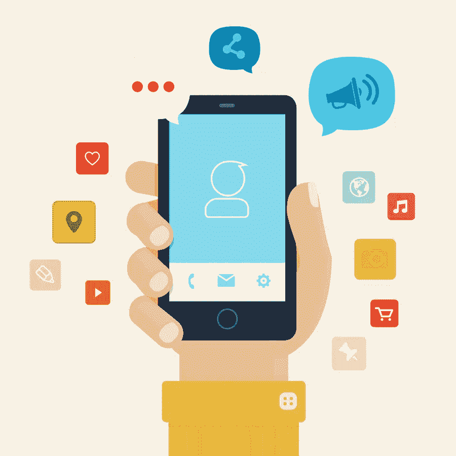
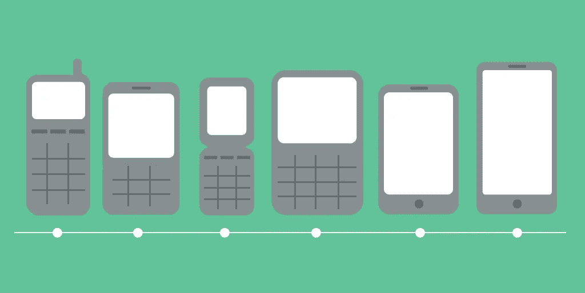
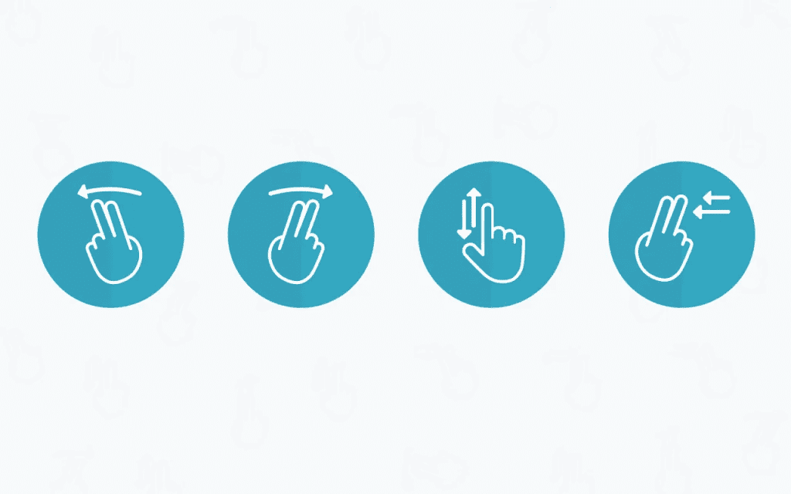
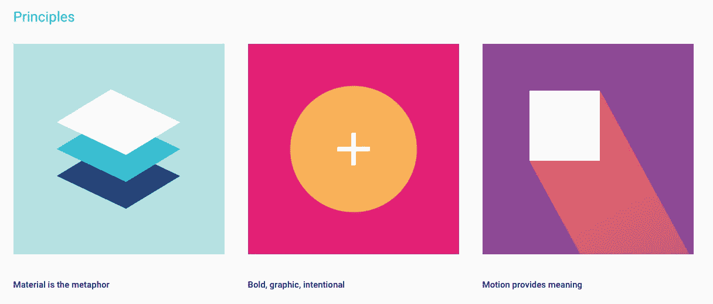
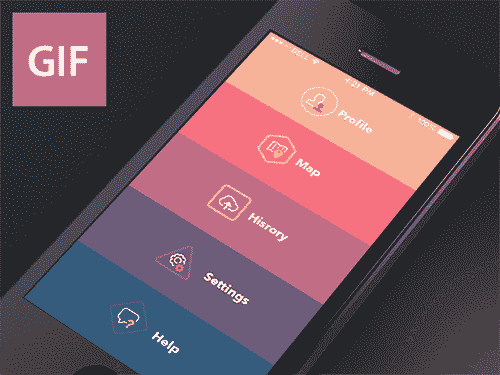
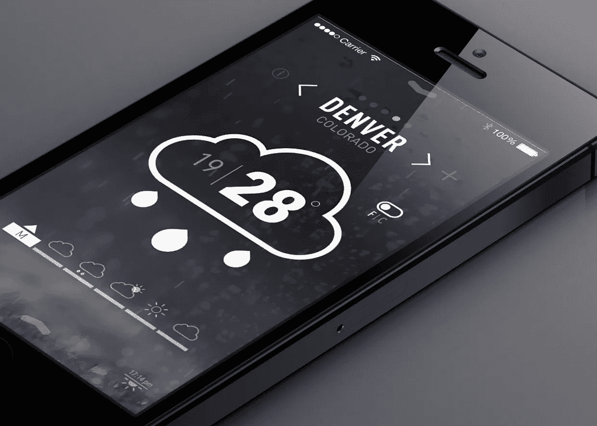
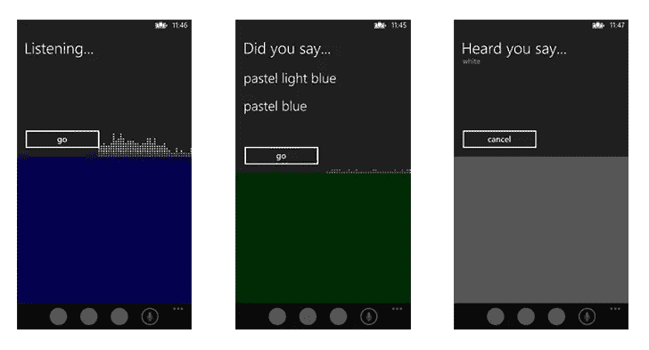
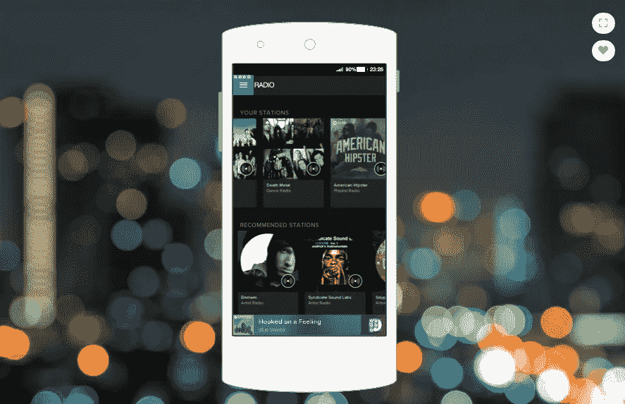

# 移动应用程序设计的 10 个令人兴奋的趋势

> 原文：<https://medium.com/swlh/10-exciting-trends-in-mobile-app-design-30ea9856ede0>

从优步到 Vine，我们开始对未来五年移动应用的发展趋势有了更好的认识。在任何给定的时间，有许多因素决定着移动应用的外观，从共享经济等社会趋势到技术的变化——今年，我们将看到与微型可穿戴设备搭配的巨大手机屏幕。

越多的用户将移动技术融入他们的日常生活，他们就有越多的带宽来思考他们的应用程序。查看工作邮件？预订酒店房间。点一份无麸质玛格丽塔派外卖？在人群中脱颖而出的应用程序，如 Airbnb 和 GrubHub，最大限度地减少了使用它们的时间，因此用户可以花更多的时间进行多任务处理和*做*，而不是花更少的时间考虑如何找到你需要的选项或屏幕。用户越是一心多用，他们就越要求移动应用设计能够预测他们的需求，并在他们需要的时候提供他们想要的东西。

考虑到这一点，以下移动应用设计趋势正在给用户带来他们现在想要的东西:

# 1.更大的手机屏幕。

不管你喜不喜欢，T2 平板手机 T3 的兴起已经消耗了越来越多的二手房地产。这对移动应用设计者和开发者意味着什么？

除了显而易见的“设计更大”，重要的是要考虑用户在使用设备时如何握持设备。这意味着使最重要的导航元素容易被人的拇指触及，而拇指可能够不到它对面的顶角。很简单，对吧？只需将你的互动元素放在屏幕的右下角。除了 T4 没有 T5 那么简单，因为你的用户中有 10%是左撇子。

你可以强迫你的左撇子用户采用双手握持——考虑到我们的移动设备变得越来越大，这将是一个更频繁使用的手的位置——或者，如果你真的想要一个可用的、可访问的体验(你确实想要)，你将确保所有的交互元素足够大，可以从设备的任何一侧访问。毕竟，您可以使用更多的屏幕空间。另一个想法是简单地使用可定制的界面，包括翻转 UI 的选项。

但是不管你的用户是左撇子还是右撇子，重要的是要理解某些设计选择不仅会导致不可用或不直观的界面，还会导致手抽筋和疲劳。这是测试和 QA 中需要解决的一个重要细节。

当然，在处理大屏幕时，记住以下几点会有所帮助:

# 2.划动是新的敲击方式。

当支持触摸屏的移动应用首次出现时，设计师和开发人员不得不面对为一种截然不同的物理对象编程的现实。当我们在 2007 年第一次接触 iPhone 时，缩放是一个非常新颖的功能，但被迫缩放来阅读内容不是好的移动应用程序设计。也就是说，我们都遇到过太小而无法点击的按钮，除非你拥有微小手指和音乐会钢琴家运动技能的罕见组合。

滑动是一种更自然的使用移动设备的方式，尤其是当你只有一只手空闲的时候。想要证据吗？握住你的手，就像你拿着你的手机一样。现在假装你的拇指在隐形手机的屏幕上敲击。记下这种感觉。现在用你的拇指扫过屏幕。哪个感觉更舒服？

当然，应用滑动最明显的例子是 Tinder，它将约会和提取的著名复杂特性归结为两个简单的选项:向右滑动或向左滑动。在比看一部浪漫喜剧预告片还短的时间内，你就向一群潜在的帅哥发出了一个信号，只需一个拇指。Tinder 似乎有一个正确的想法，事实证明它拥有超过 10 亿的用户，

# 3.可穿戴设备开始影响移动应用设计。

平板手机热潮的另一面是，它们越来越多地伴随着手腕上更小的屏幕。国际数据公司(International Data Corporation)预测，2015 年，供应商将向[发运 4570 万台可穿戴技术设备](http://www.idc.com/getdoc.jsp?containerId=prUS25519615)，其中包括腕戴设备(占比最大，为 4000 万台)、服装和眼镜。

随着 Apple Watch 和 Android Wear 的发布，可穿戴健身设备热潮开始进入更大的领域。可穿戴设备不再只是带有睡眠和心率追踪器的美化了的计步器——它们是真正的智能设备，能够告诉你你的工作通勤将持续多长时间，明天的预测是什么，或者在你阿姨来访时提醒你为她准备好水壶。这将如何影响移动应用程序设计人员的工作方式？

我们仍处于这一新兴趋势的早期阶段，因此苹果(Apple)和 T2()安卓(Android)对各自的产品提出了一些建议。作为手表类设备的制造商，他们都强调了眼神的重要性。与用户希望长时间盯着看的手机或平板电脑不同，为可穿戴设备设计的应用应该以合适的速度提供足够的内容，让用户一眼就能消化，甚至是用眼角余光。这意味着排版、颜色对比和上下文(用户在哪里？用户现在需要什么数据？)在可穿戴设备的设计和开发中尤为重要。

因为这是一项相对较新的技术，所以比以往任何时候都更重要的是关注可操作的用户反馈，并将其应用到未来的更新中。虽然苹果和安卓可能会有他们的建议，但设计未来可穿戴移动应用的将是他们的用户。

# 4.分层布局。

在永恒的平面设计与 skeuomorphism 的辩论中，有中间立场吗？在美学层面上，在批评者看来，skeuomorphism 就像数字环境中对现实生活纹理的老生常谈，就像你汽车仪表板上明显的假木质镶板一样俗气。但是平面设计，尽管作为这十年的数字美学而引人注目，也不是没有它自己的问题。随着所有纹理从移动应用程序设计中移除，如果你能分辨出不同设计元素之间的界限，就很难分辨出哪些元素是交互式的。

[Google Material Design Principles](https://www.google.com/design/spec/material-design/introduction.html#introduction-goals), Google

正在出现的妥协是分层平面设计，或者谷歌所说的“T4”材料设计。这种美学仍然倾向于平面设计，但有一些原则是从 skeuomorphism 借用来的。与平面设计一样，分层或材料设计中的元素本质上仍然是几何图形，带有色块，而不是天然纹理或明显光泽的复制品。但是，像 skuo formula 设计一样，分层平面设计借用了自然界的隐喻——具体来说，就是物体如何运动以及如何相互影响。这意味着阴影和其他灯光效果又回来了。

平板设计与自然物理的融合让用户对屏幕上的元素如何工作有了更直观的理解。当你在你的设备上操作物体时，物体有重量和惯性。当你在屏幕上滑动它们，或者在它们下面的元素上投下阴影时，它们可能看起来有重量。它将 skeuomorphism 的可用性与平面设计的美感结合在一起，创造出优雅的用户体验。

# 5.更多的动作。

你的智能手机的计算能力超过了美国国家航空航天局(NASA)将人类送上月球的团队，以及 1997 年击败国际象棋世界冠军加里·卡斯帕罗夫的深蓝超级计算机。*而且只会越来越聪明*。不仅我们的移动设备正在成为越来越强大的计算机，而且随着 3G 让位于[三种类型的 4G](http://www.digitaltrends.com/mobile/what-is-4g-the-ultimate-guide-to-4g-wireless-networks-phones-coverage-and-more/3/) ，每一种都试图在速度和功率方面超越对方，你有更多的自由来激活你的移动应用程序设计。

[Timeline Page](https://dribbble.com/shots/1378768-Timeline-Page), Sergey Valiukh

移动为移动应用程序设计提供了如此多的好处。它可以将焦点吸引到一个特定的项目上，引导用户采取必要的行动，并简单地创建一个更令人愉快和惊喜的用户体验。智能手机现在已经足够先进，它们的网络也足够强大，可以利用你已经在桌面体验中使用的 HTML5 动画或视差设计。随着对带宽和功耗的限制越来越少，我们今年将看到移动应用设计的更多变化，而且随着我们的智能手机变得越来越智能，这种变化只会越来越大。

# 6.简单柔和的配色方案。

每一年都有它自己选择的调色板，现在，我们专注于强调柔和对比的非常简单的配色方案。这是平面移动应用程序设计整体极简主义的自然结果，但它也反映了目前的流行颜色(Pantone 的【2015 年春季调色板强调“用微妙的暖色调选择更冷更柔和的颜色”)。尝试一种不同色调的布局，白色的排版和对比元素。或者，尝试只有两三种冷色调的布局。

在移动应用程序设计环境中，这种简单性的结果是一种不那么分散的体验，鲜明的颜色对比需要更多的注意力。盯着发光的屏幕看对你的眼睛来说已经很刺眼了，但是将颜色调暗并减弱光泽(同样，平面设计的优势)会让你的移动应用设计感觉更流畅、更舒适。

# 7.印刷术进步了。

似乎就在不久前，移动排版还仅限于任何低分辨率下可读的网页安全字体。在过去的两年里，iOS 和 Android 都在优化他们的操作系统，以获得更流畅、可扩展和可读的字体。大屏幕和技术创新(谢谢你，TypeKit)的另一个副作用是使用排版来为你的移动应用程序设计增添美感和表现力。无论是搭配时尚的大背景图片还是[负空间](http://thenextweb.com/dd/2015/01/02/10-web-design-trends-can-expect-see-2015/4/)，你都可以让你的字体说话，以简约的方式传递强大的信息。

[Wild Canada iOS App](https://itunes.apple.com/us/app/wild-canada/id824973694?mt=8), by Marshall Lorenzo

# 8.内置模糊。

给半透明应用程序增加即时可用性的一个移动应用程序设计趋势是背景模糊。虽然生活在用户背景之上的移动应用程序可以给用户一个干净、完整的体验，但有时它们会导致可用性问题。

[UI Weather](https://www.behance.net/gallery/15438327/UI-Weather), by Nathan Smith

根据用户为设备选择的背景，以及背景上有多少图标或小部件，缺乏不透明性会使你的应用程序很难阅读。将高斯模糊效果嵌入到您的移动应用程序设计中，可以使您的应用程序可读性更好，看起来更舒服，同时保留用户背景的自定义感觉。

# 9.无障碍移动应用设计的创新。

另外，今天的设计趋势事实上更容易理解。具有大元素和字体的更简单的布局需要更少的视觉处理，而宏手势(滑动)相对于需要更精细运动控制的运动(收缩到缩放，点击)对行动受限的人来说更容易。由于 Typekit 允许我们在移动应用程序设计中使用更多的实时文本，而不会牺牲高质量的排版，它还使我们的应用程序对于使用阅读设备的视觉障碍人士来说更容易访问。甚至更大的设备和平板手机的更广泛可用性也使得更多的人可以使用移动应用程序设计。

An example of the built-in recognition flow for a speech recognizer that uses a SRGS-defined constraint.

请记住，在你的移动应用程序设计中构建可用性意味着批判性地思考你的产品的可访问性。对于需要更大、可读性更强的文本的人来说，这种布局是可定制的吗？你是否为那些需要更多互动元素响应的人建立了一个触觉反馈选项？在您进行设计时，使用可访问性清单会有所帮助。易访问性项目为设计者和开发者提供了大量的资源，使他们的产品对更广泛的受众可用。

# 10.更智能的原型制作。

我们使用的每一个应用都曾经是原型。许多概念的证明开始是一个简单的线框，打印在几张纸上或保存为静态 PDF。随着移动应用程序设计变得越来越复杂，仅仅展示几个静态框架并强迫客户或开发者想象你正在考虑的运动是不够的。如果你的应用程序严重依赖动画来引导用户或提供视觉兴趣，你的客户就失去了很多使应用程序有趣和可用的东西。另外，扁平的线框并不能提供太多的“惊喜”因素。

[Spotify App](https://spaces.proto.io/project/441DE8BA-AD4E-D7E5-AD18-1E794BB19F60/Spotify/), prototype made with Proto.io

然而，编写概念验证程序本身也有一些令人头疼的问题，因为开发人员将带宽投入到编码元素中，而这些元素甚至可能不会成为最终的原型。要么设计师必须与开发人员非常清楚地交流他们的意图，以避免浪费精力，要么设计师必须亲自创建原型，以便它反映他们的愿景。

幸运的是，有了今天的[原型解决方案](https://proto.io/)，设计师们可以做到这一点。设计师只需很少的编码知识或不需要任何编码知识，就可以创建一个概念证明，展示用户应该如何与应用程序交互，以及对移动应用程序设计至关重要的任何动画或动作。这不仅产生了令潜在客户或顾客震惊的原型，还简化了应用程序开发的过程。既然你已经敲定了应用程序应该如何移动以及如何与用户交互的所有细节，那么开发者所要做的就是创建产品——而不需要编写无休止的设计修改。

*准备好给当今最热门的移动应用程序设计趋势一个旋转了吗？尝试使用* [*Proto.io*](https://proto.io/) *来创建你下一个项目的原型。*

*原载于 2015 年 6 月 19 日*[*blog . proto . io*](http://blog.proto.io/10-exciting-trends-in-mobile-app-design/)*。*

*发表于* **创业、旅游癖和生活黑客**

-