# 让你的网站更有效的 10 个免费工具

> 原文：<https://medium.com/swlh/10-free-tools-you-need-to-make-your-website-more-effective-294ca327c7>

*Photo by* [*Egor Lyfar*](https://unsplash.com/photos/8KsxiPk6qko?utm_source=unsplash&utm_medium=referral&utm_content=creditCopyText) *on* [*Unsplash*](https://unsplash.com/?utm_source=unsplash&utm_medium=referral&utm_content=creditCopyText)

互联网上有两种类型的网站。第一种是创收吸引游客的机器。而其他人只是在互联网上。

如果你点击了这个博客，可能是因为你的网站属于第二类，或者你对释放你网站的全部潜力感兴趣。

无论你的动机是什么，这个博客将为你提供 10 个免费工具，让你的商业网站跻身精英阶层，充分发挥效率。所以让我们开始吧。

# 1.铅形式

一个没有引导表单的商业网站就像一支没有削尖的铅笔*——没有意义*。无论你是婚礼策划人、餐饮服务商、艺术家、网络开发公司还是出售婴儿用品的网上零售店，引导表对于你的网站来说都是必不可少的，因为它可以让访问者与你取得联系或向你发送快速查询。

*“可是嘿！我已经在页面上添加了我的联系信息。这还不够吗？”*

当然，提供联系信息是一个好主意，但是在页面上添加销售线索表单是您不想忽视的事情。为什么？因为有了销售线索表，你就主动要求访问者立即放弃询问，而不仅仅是提供联系信息，这样就有可能出现*“也许我会在晚上打电话。或者明天。还是在世界末日的时候！”*

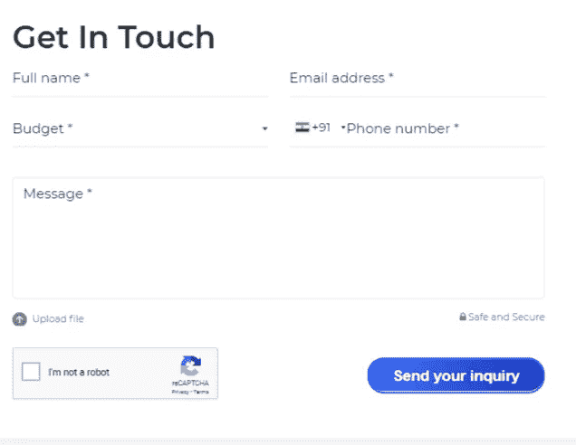

但是您的工作并没有就此结束，因为在决定表单的字段时，您必须非常小心。表格中询问的任何不必要的细节都会在将访问者转化为潜在客户的过程中产生摩擦。以 Expedia 为例。全球旅游巨头[仅仅通过从表格中删除一个不必要的字段，就将其年利润提高了 1200 万美元。所以，确保你的网站上有一个引导表单，包含适当的字段，将访问者转化为引导。](https://ppc.org/expedia-removes-one-form-field-and-makes-12-million-in-profit/?__hstc=229822019.9953c90bb936a151a802201b8795443a.1535363708237.1535363708237.1535363708237.1&__hssc=229822019.1.1535363708237&__hsfp=3463596766)

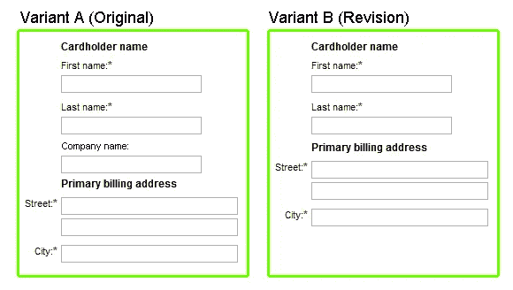

# 2.谷歌分析

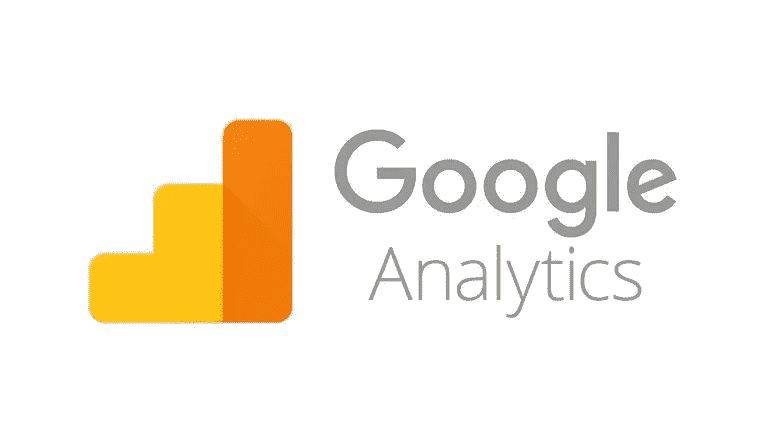

数字世界是由数据构成的，能够分析数据的人肯定比其他人有优势。Google Analytics 是为你提供关于你的网站的有价值的数据和见解的工具之一。

这个工具是挤满了迷人的功能，让您了解您的访客和网站的表现，在一个更好的方式。最棒的是，只需几个步骤，你就可以[开始使用谷歌分析](https://support.google.com/analytics/answer/1008015?hl=en)，而且完全免费！

Google Analytics 为您提供数据，如总流量、访客数量、跳出率、访客在您的网站上花费的平均时间、访客的人口统计和地区等。下面我们来详细了解一下它的好处。

**了解你的受众**

谷歌分析给你像 x 教授一样的超自然精神力量。(好吧，不是字面意思！)但没错，它确实能让你了解和理解你的用户、他们的行为、人口统计以及他们的兴趣。在制作网站内容时，这些数据是一座金矿。您可以创建针对您的受众的内容，并获得更好的效果！

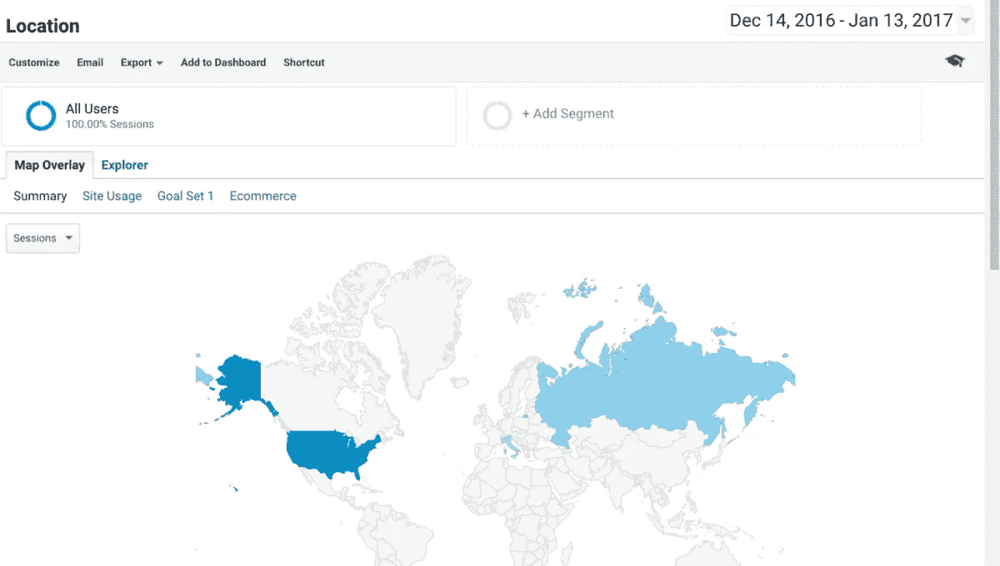

**降低网站跳出率**

跳出率表明访问者对你的网站不满意。这可能是由于无关的内容，可能是你的网站没有足够的吸引力来抓住他们的注意力，或者内容没有实质内容和质量。这严重影响了转换！有了谷歌分析，人们可以分析跳出率较高的页面和用户花费更多时间的页面。因此，帮助你了解缺陷并做出必要的改变。

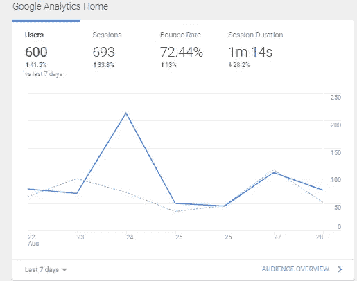

**转换和高性能页面**

Google Analytics 提供关于您最受欢迎或最常访问的页面以及访问者认为相关的页面的数据，以便您可以相应地改进其他页面。

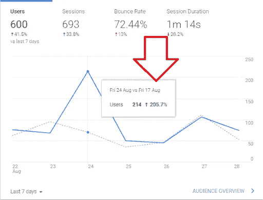

# 3.谷歌网站管理员(搜索控制台)

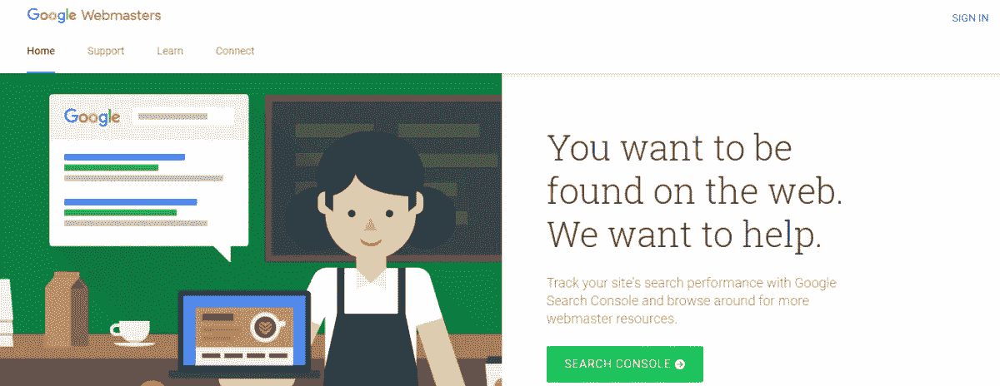

如果你对谷歌分析充满敬畏，让我说最好的还在后头:*谷歌站长。*

谷歌网站管理员是谷歌的免费服务，帮助网站所有者诊断问题和优化他们的网站。它不仅为您提供有价值的见解，还允许您解决这些问题并采取行动，例如:

1.  找出网站的问题，并提供解决方案。
2.  获得关于外部和内部链接的见解和报告。
3.  你的目标关键词和在搜索引擎上的印象。
4.  通知您的网站是否被任何类型的恶意软件或垃圾邮件感染。
5.  帮助抓取和索引您的网站内容，甚至修复抓取错误。
6.  为您提供谷歌上有价值的搜索统计数据。

# 4.博客

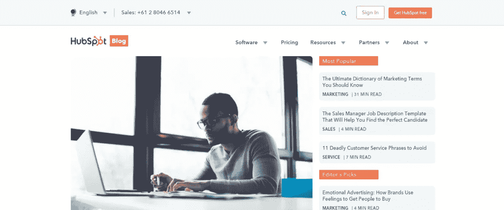

博客是任何企业提升在线形象的最常见策略。在这个人们比以往更多地使用博客和文章的时代，它可能是实现你所寻求的增长的一个很好的工具。

博客是传播公司理念、分享行业知识、获得专家认可以及联系受众的最高效、最具成本效益的方式之一。事实上，像 [HubSpot](https://www.hubspot.com/) 和 [Coschedule](https://coschedule.com/ls) 这样的软件产品已经以博客和分享优质内容为基础创建了他们的帝国。以下是在你的网站上开博客的一些主要好处。

**提振流量**

一个写得好的博客通常在搜索引擎上排名更高，从而增加网站的流量。当你有一堆这样的博客在 SERP 上面时，你的网站肯定会被访问者淹没。从而增加网站的有机流量。

**建立权限**

博客允许你与读者分享你的专业知识和行业知识。无论是什么行业，无论是健身、时尚、家居装饰还是物流，当你分享对你所在领域有用的见解和建议时，阅读这些内容的人会认为你是树立你权威的专家。

**生成入站链接**

生成链接是提高网站搜索引擎优化性能的主要因素之一。当你通过你的博客提供高质量的内容时，它就成为了其他人的资源，自然会产生到你的网站的反向链接。

# 5.时事通讯

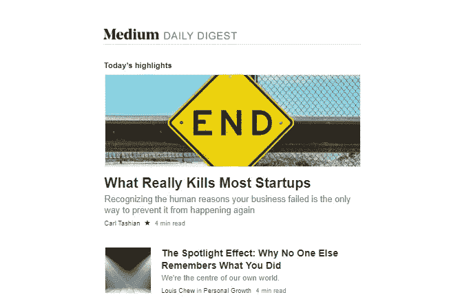

博客是与你的读者交流的一种很好的方式，但是，它们不是一种主动的交流方式。你可以写最好的博客，提供深刻的洞察力，但是如果读者没有看到，它们就没有用了。你可以分享博客并在 SERP 上推广，但是让内容到达你的受众的最简单的方法之一是时事通讯。

简讯的最大好处是，即使客户不访问你的网站，你也能与他们保持联系。你可以为他们提供博客和有用的见解，或者直接在他们的收件箱里分享关于你的业务的新闻和更新。

定期发送简讯也有助于保持你的品牌名称在脑海中的位置。当一件事在脑海中浮现时，它会在舌尖上，通过口头传播促进推荐。

# 6.表单上的验证码

验证码已经成为互联网上令人讨厌的一部分有一段时间了，但我们不能否认它作为垃圾邮件发送者的救星的重要作用。它被用来区分人类和机器人，确保您的网站不会收到垃圾邮件。所以如果你的网站上有一个表单，验证码是不言而喻的。

最近，谷歌推出了一个名为 reCAPTCH 的新工具来避免垃圾邮件。它是一个类似于验证码的工具，允许网站区分机器人和人类。但是，现在用户只需点击一个复选框，或者有时识别一些图片，就可以证明他们是人类，而不是用令人恼火的混乱的文字来伤害人类的眼睛。简单而有效！

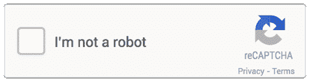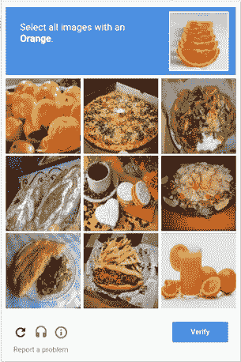

# 7.Whatsapp 业务

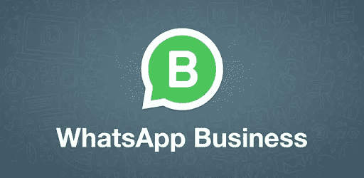

在其官方博客上，Whatsapp 宣布其日活跃用户数量突破 10 亿大关。这是一个巨大的数字！为了利用这一巨大的用户群为中小企业造福，Whatsapp 推出了名为 [Whatsapp Business](https://www.whatsapp.com/business/) 的新移动应用。

它允许用户创建一个业务档案，使其易于与客户保持联系，而[将其集成到网站](https://developers.facebook.com/docs/whatsapp/api/reference)将帮助您更有效地保持联系。与传统电话号码相比，它有一些令人惊叹的功能，可以提升客户体验。

**创建您的商业档案**

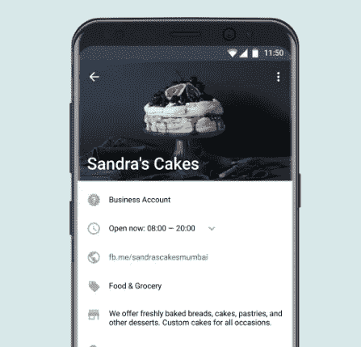

人们可以创建提供诸如联系号码、电子邮件地址、网站、企业商店地址等信息的企业简介。这个轮廓也可以像脸书的蓝扁虱一样被验证。

**即时通讯工具**

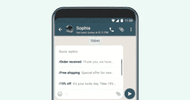

Whatsapp business 是一款即时通讯工具，让企业和客户之间的联系变得更加容易。企业还可以针对任何常见问题或在您不在时设置“快速回复”和“自动回复”。

**获取更多信息**

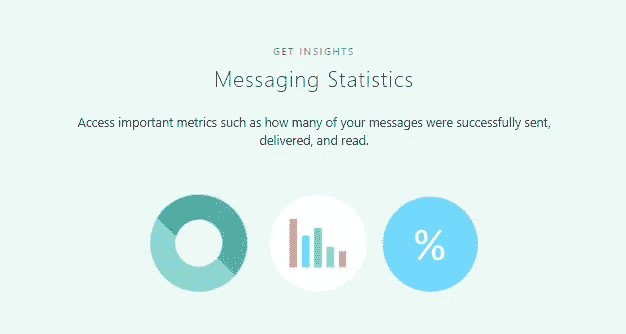

邮件存档是业务中可以使用的数据源。此外，像发送、传递、接收和阅读的消息这样的消息统计也非常方便。

# 8.嵌入 Instagram 订阅源

谁不爱惊艳的画面和有着精美滤镜的故事！你知道我在说什么，对吧？

Instagram 是使用最广泛的社交媒体移动平台之一。现在，通过将提要嵌入网站，它可以在自己的应用程序之外使用。但是为什么有人会把 Instagram 整合到他们的网站上呢？

Instagram feeds 对用户的影响很大。[统计数据显示](https://www.inc.com/melanie-curtin/21-things-every-brand-should-know-about-instagram.html)有 5%的用户是在帖子的启发下做出决定的。因此，Instagram 新闻提要可以成为在你的网站上营销和推动销售的一个很好的工具。将 Instagram gallery 整合到公司的网站上，可以吸引访问者，让他们更多地了解品牌、公司文化和员工生活。它也非常适合作为您公司的产品组合，可以提供产品和服务的图像。

事实上，当你在网站上使用人脸和用户生成的照片时，访客更有可能与品牌产生联系，从而导致[提高转化率](https://www.techuz.com/blog/how-to-boost-conversion-rate-with-web-design/)。

# 9. [DMCA](http://www.dmca.com/)

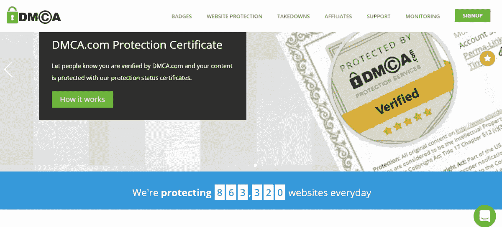

DMCA 代表数字千年版权法，保护你在互联网上的创造性作品，如博客、文章、照片和视频，防止抄袭。

DMCA.com 在您的网站上为您提供一个徽章，防止窃贼复制或窃取您的内容。如果他们这么做了，DMCA.com 会帮你把内容撤下来。它的一些特点是:

**DMCA 徽章**

你在网站上得到一个 DMCA 批次，描述你的内容是受保护的，如果抄袭可能会采取法律行动。

**水印图像**

网站上的图片带有版权信息和品牌水印，从而防止任何非法使用。

**扫描抄袭内容**

DMCA.com 扫描互联网，寻找重复的内容，并代表用户将其删除。

# 10.一个 WordPress 安全插件

虽然现在你的网站安全了，不会被那些试图复制内容的窥探的眼睛看到，但是你需要提防另一个强大的威胁——黑客*！*

*随着网站数量的不断增加以及我们对网络世界的依赖，网络犯罪变得越来越严重。事实上，根据网络犯罪风险投资公司的一份报告，到 2021 年，网络犯罪造成的损失将达到每年 6 万亿美元。*

*这一年的损失比加拿大、沙特阿拉伯、瑞士和俄罗斯的 GDP 总和还要多！*

*所以，当涉及到你网站的安全时，采取额外的预防措施是必要的。*

*感谢这个一体化的 WordPress 安全插件，它为你的网站提供了额外的安全来抵御任何类型的恶意入侵者。它能满足你所有的安全需求，最棒的是它是完全免费的！*

*一体化 WordPress 安全插件提供安全功能，如用户登录安全、用户注册安全、数据库安全、文件系统安全、黑名单功能、防火墙功能等等。你可以查看他们的官方博客以获得更深入的信息。*

# *包裹*

*拥有一个商业网站在当今世界是势在必行的。但更有必要的是确保它服务于帮助你的业务增长的目的，而不仅仅是互联网上的一个域名。*

*很多时候，我们相信我们需要一些高端的工具来获得最好的结果，但是，即使是免费的工具，当用一点智慧，也可以产生戏剧性的结果！现在，您拥有了最好的免费工具。所以继续前进，并利用他们来获得最大的结果，你正在寻找你的网站。*

**原载于*【www.sociable.co】*

****

## **这篇文章发表在 [The Startup](https://medium.com/swlh) 上，这是 Medium 最大的创业刊物，拥有+424，678 名读者。**

## **在这里订阅接收[我们的头条新闻](https://growthsupply.com/the-startup-newsletter/)。**

****