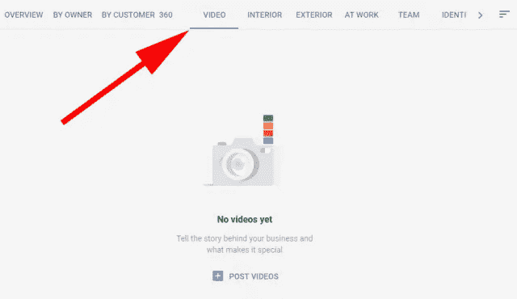

# 你可能错过的 10 个谷歌更新

> 原文：<https://medium.com/swlh/10-google-updates-you-may-have-missed-7e4872920f42>

## 谷歌很少停滞不前。

## 事实上，这家搜索巨头声称每天至少调整其搜索算法 3 次。

其中一些更新比其他更新更大，过去的一个月带来了前所未有的有新闻价值的增强。

举例来说，就在昨天，业内盛传谷歌将从 7 月起正式成为 T2，将页面速度作为其移动搜索算法的排名因素。

然而，并不是所有的谷歌更新都引起了巨大的轰动，因此其中一些可能已经被你忽略了。为了帮助解决这个问题，我们收集了 10 个最有可能影响搜索营销人员的谷歌最新更新。

# 1.16 个月的搜索控制台数据(！)

也许在过去的几年里，SEOs 向 Google 提出的最常见的请求就是向[搜索控制台](https://searchenginewatch.com/2017/09/05/google-search-console-what-the-latest-updates-mean-for-marketers/)添加更多的历史数据。3 个月的限制一直是 SEO 性能分析的一个障碍，特别是当我们开始依赖搜索控制台来获得查询级别的数据时。

经过一段时间的测试后，谷歌现在发布了新版本的搜索控制台，里面有 16 个月的历史数据。它将在未来几个月慢慢推出，但许多人已经在他们的仪表板上看到了变化。历史数据也将很快通过搜索控制台 API 提供。

如果说这在业内受到了积极的欢迎，那是一种保守的说法。

然而，新的搜索控制台不仅仅提供额外的数据。新的索引覆盖报告提供了对谷歌从您的网站索引的网址的深入了解，以及对任何索引问题的解释。比以前更精细地过滤和细分数据的能力将是一个非常有益的补充。

问题跟踪功能还将使用户能够识别任何指数化问题，并直接与团队成员共享行动项目。

最后，搜索控制台带来了 SEO 分析和影响性能所需的所有功能。

# 2.PageSpeed Insights 中的真实数据

谷歌[上周](https://webmasters.googleblog.com/2018/01/real-world-data-in-pagespeed-insights.html?m=1)宣布，其[的 PageSpeed Insights](https://developers.google.com/speed/pagespeed/insights/) 工具将使用来自 Chrome 用户体验报告的真实世界数据。这一举措解决了 PageSpeed Insights 最大的缺点。尽管这份报告的意图(揭示一个 URL 的加载速度)很重要，但它的执行却很欠缺，因为它的发现并没有显示实际用户的页面加载速度有多快。

这导致业内许多人使用其他资源进行页面速度检查，包括 Chrome 用户体验报告 API。

谷歌已经清楚地表明了新的 PageSpeed Insights 如何改进旧版本:

*   **速度评分**将一个页面分为快、一般或慢。这是通过查看两个指标的中间值来确定的:第一个内容丰富的绘画( [FCP](https://developers.google.com/web/updates/2017/06/user-centric-performance-metrics?utm_source=GDB&utm_campaign=GDB2018Jan#first_paint_and_first_contentful_paint) )和 DOM 内容加载( [DCL](https://developers.google.com/web/fundamentals/performance/critical-rendering-path/measure-crp?utm_source=GDB&utm_campaign=GDB2018Jan) )。如果这两个指标都在前三分之一，那么这个页面就被认为是快速的。
*   **优化分数**通过评估页面的性能提升空间，将页面分为好、中或差。该计算假设开发人员希望保持页面的外观和功能不变。
*   **页面负载分布部分**展示了该页面的 FCP 和 DCL 事件如何在数据集中分布。通过与 Chrome 用户体验报告中的所有事件进行比较，这些事件被分为快速(前三分之一)、平均(中间三分之一)和慢速(后三分之一)。
*   **Page Stats 部分**描述了加载页面的[呈现阻塞资源](https://developers.google.com/web/fundamentals/performance/critical-rendering-path/?utm_source=GDB&utm_campaign=GDB2018Jan)所需的往返行程，页面使用的总字节数，以及它与往返行程数和数据集中使用的字节数的中值相比如何。它可以指示如果开发人员修改页面的外观和功能，页面是否会更快。
*   **优化建议**是可以应用于该页面的[最佳实践](https://developers.google.com/speed/docs/insights/rules?utm_source=GDB&utm_campaign=GDB2018Jan)的列表。如果页面很快，默认情况下会隐藏这些建议，因为该页面已经位于数据集中所有页面的前三分之一。

鉴于网页速度对移动用户的重要性，特别是鉴于谷歌即将到来的速度更新算法的变化，这次更新将是一个非常重要的一次。

它还将提供对 URL 加载阶段的更好的了解，这将有助于 SEO 向其他受众传达他们想要的更改。

一段时间以来，这一直是一个需要更多技术细节的领域，许多页面速度报告都只是含糊其辞地说了一些“减少 JavaScript”的陈词滥调。向更广泛的营销人员引入像“DOM 内容加载”这样的指标只能是一个积极的发展。

# 3.增加了元描述字符限制

这个不起眼的元描述在相当长的一段时间里得到了最大的更新。

谷歌[在 12 月向搜索引擎 Land](https://searchengineland.com/google-officially-increases-length-snippets-search-results-287596)证实，潜在的片段长度已经增加到 320 个字符，尽管这并不意味着所有网站都将获得这一额外的空间。

尽管如此，有证据表明，摘录长度已经全面增加。

可以跟踪搜索结果页面特征的工具 Rank Ranger 显示，12 月元描述的平均长度有了非常显著的增长:

当然，这将导致营销人员质疑他们是否应该重写他们的描述，以及新的字符限制应该是什么。

Moz 的 Pete Meyers 博士给出了一个答案，他根据自己最近的研究建议将字数限制在 300 字以内。这似乎是一个有用的经验法则，因为谷歌几乎没有提供关于它到底如何决定在哪里截断一个片段的洞察力。

本质上，谷歌希望提供元描述，以反映搜索结果页面的变化性质，以及人们访问这些页面的设备。

新的字符限制本身并不是重写网站描述的理由。然而，它确实为尝试和获得竞争优势提供了可能性。

制作元描述的基本原理保持不变；我们现在只是有了更多的空间来应用这些最佳实践。

# 4.新的客户意向受众

在临近假期的时候，谷歌发布了一系列基于 AdWords 的公告。AdWords 环境中很少缺少新功能，但是新的自定义目标受众的发布尤其令人感兴趣。

这些受众列表允许营销人员通过基于主题或关键词创建受众分群，在通过谷歌展示网络(GDN)锁定新客户时增加更多细节。

即使是 GDN 的新手也能够向他们的品牌介绍新的潜在客户，因为谷歌的[机器学习](https://searchenginewatch.com/2018/01/02/artificial-intelligence-and-machine-learning-what-are-the-opportunities-for-search-marketers/)技术将分析搜索数据，并自动生成用户名单，这些用户愿意听取特定品牌或产品的信息。

AdWords 产品管理总监 Anthony Chavez 谈到这项新功能时说:

> *“有两种口味的定制意向受众。在一种变体中，广告商可以根据可能对其产品感兴趣的人阅读和访问的主题和 URL 创建自己的广告。第二种变化是基于机器学习的自动化。”*

这也与最近的举措相一致，即让搜索广告成为一个更全面的学科，包括漏斗上端的策略，以及推动其巨大成功的屡试不爽的漏斗下端的策略。

由于与脸书的持续竞争(加上来自亚马逊和 Pinterest 的威胁)，谷歌正在大力投资为营销人员提供价值的新方式。

# 5.丰富的结果测试工具

[搜索引擎结果页面](https://searchenginewatch.com/2017/03/29/a-visual-history-of-google-serps-1996-to-2017/) (SERPs)已经从早期的纯文本迭代中走了很长一段路。

这为营销人员创造了通过 SERPs 中的多种媒体形式与受众互动的机会，但也造成了一些混乱。

不仅有不同的方法来标记数据，还有大量不同类型的信息可以显示在搜索结果中。谷歌已经将所有这些归类到“丰富结果”的大标题下，而[的新测试工具](https://search.google.com/test/rich-results)(目前处于测试阶段)将揭示一个特定的网址是否具备显示丰富片段的能力。

诚然，谷歌确实对该工具的当前形式提出了以下一系列全面的警告:

目前列出的限制如下:

> *该测试目前仅支持以下丰富的结果类型:*
> 
> -职位发布
> 
> -食谱
> 
> -当然
> 
> -电影

即使记住了所有这些要点，我们也应该把这看作是向所有营销人员更容易获得丰富结果的入口迈出的一步。

# 6.语音搜索评分者指南

如果我们想了解谷歌搜索结果排名的方法，搜索质量评级指南是最有趣和透明的资源之一。

发布在谷歌研究博客上的最新指南现在包括了谷歌所谓的“裸眼技术”的评估结果。这里的核心焦点是 Google Assistant 交互的增长，其基础是认识到这种新的搜索方式需要一种评估结果相关性的方式。

被认为对声音效果特别重要的维度是:

*   **信息满意度:**回答的内容要满足用户的信息需求。
*   **长度:**当一个显示的答案过长时，用户可以快速直观地浏览，定位相关信息。对于语音回答，这是不可能的。更重要的是确保我们提供有用的信息，希望不要太多或太少。我们之前的工作的一部分目前正被用于识别最相关的答案片段。
*   公式化:一个公式化很差的书面回答比一个不合语法的口头回答更容易理解，所以必须更加注意确保语法的正确性。
*   **吐字:**口语回答一定要有正确的发音和韵律。文本到语音生成的改进，如 [WaveNet](https://deepmind.com/blog/wavenet-generative-model-raw-audio/) 和 [Tacotron 2](https://research.googleblog.com/2017/12/tacotron-2-generating-human-like-speech.html) ，正在迅速缩小与人类表现的差距。

随着我们迈向新的搜索界面，无论是在旅途中还是在家中，来自谷歌的指令都是无价的读物。指南的完整列表可以在找到[。](https://storage.googleapis.com/guidelines-eyesfree/evaluation_of_search_speech_guidelines_v1.0.pdf)

# 7.AdWords 中审核扩展的新规则

谷歌一直试图在付费和有机列表的评论中找到正确的平衡。虽然正品顾客评论对消费者有帮助，但一些第三方平台可以通过品牌过滤，在搜索结果中只突出正面评分。

一份长长的限制清单[已经公布，谷歌发布了以下声明:](https://support.google.com/adwordspolicy/answer/3197294?hl=en-GB)

> *从 2018 年 1 月开始，评论扩展将不再与广告一起显示。*
> 
> *2018 年 2 月，审核扩展将与其绩效数据一起被删除。要保存这些数据，请在 AdWords 的****Ads&Extensions****页面前往****Extensions****下载扩展报告。如果您想继续在广告中显示更多信息，我们建议您使用* [*站点链接*](https://support.google.com/adwords/answer/2375416) *、* [*标注*](https://support.google.com/adwords/answer/7301149) *和* [*结构化片段*](https://support.google.com/adwords/answer/6280012) *扩展。*

这很可能会影响到大多数付费搜索营销人员，这是在搜索巨头试图清理有机列表中的评论之后。品牌有责任提供一个更透明的客户反馈，如果他们希望评论返回到他们的 PPC 广告。

# 8.谷歌我的业务允许视频上传

谷歌我的业务现在允许商家和客户添加长达 30 秒的视频。重要的是，企业主也可以标记他们认为不相关或没有帮助的视频。

# 它是如何工作的:

*   视频将出现在谷歌我的业务仪表板的概述选项卡中
*   客户上传的视频可在“客户”选项卡中找到
*   商家上传的视频可以在“所有者”标签中找到
*   所有视频都可以在“视频”标签中一起观看
*   上传后，视频可能需要 24 小时才能出现。一旦直播，他们会在本地照片所在的地方展示。

谷歌还表示，对该功能的本地移动支持将在不久的将来出现。

# 9.站长视频返回

在大约 3 年的长时间中断后，谷歌带回了它的网站管理员视频系列——现在被称为“搜索引擎优化片段”。

这些由 YouTube 托管的短片将解决网站管理员论坛上最常见的问题。在过去的一个月里，该系列已经解决了一些话题，包括永恒的“子域或子文件夹”问题，处理多个 H1 标签，以及固定罚款对搜索引擎优化性能的影响。

# 10.谷歌将审查高端 YouTube 内容

在过去的一年里，谷歌一直面临着确保 YouTube 广告与相关内容一起出现的巨大压力。主要品牌广告与极端内容一起出现的故事引发的争议损害了谷歌的收入和声誉，尽管不是不可挽回的。

脸书也面临着类似的斗争，这是一场不容易解决的斗争。监控每秒上传到这些网站的内容数量是一项艰巨的任务，但谷歌正押注于人与技术的结合来重建对 YouTube 广告的信任。

所有通过优质“谷歌首选”广告渠道推广的内容都将由一个由 10，000 多名版主组成的团队进行审查，并采用人工智能驱动的技术来帮助根除不适当的内容。

在主要品牌像信任电视一样信任 YouTube 之前，还有很长的路要走，但谷歌正在采取措施，确保其最高收入的客户得到某种程度的保证。

尽管这些头条新闻在业内引起了轩然大波，但即使是最警觉的搜索专业人士，在如此频繁的活动中漏掉一些也情有可原。

进入 2018 年，我们行业的发展速度正在加快，营销人员拥有比以往更多的[工具来提高搜索性能。](https://searchenginewatch.com/2017/12/19/which-tools-should-i-buy-to-advance-my-seo-strategy/)

*原载于 Searchenginewatch.com*

## 这个故事发表在 [The Startup](https://medium.com/swlh) 上，这是 Medium 最大的创业刊物，有 286，184+人关注。

## 订阅接收[我们的头条新闻](http://growthsupply.com/the-startup-newsletter/)。

