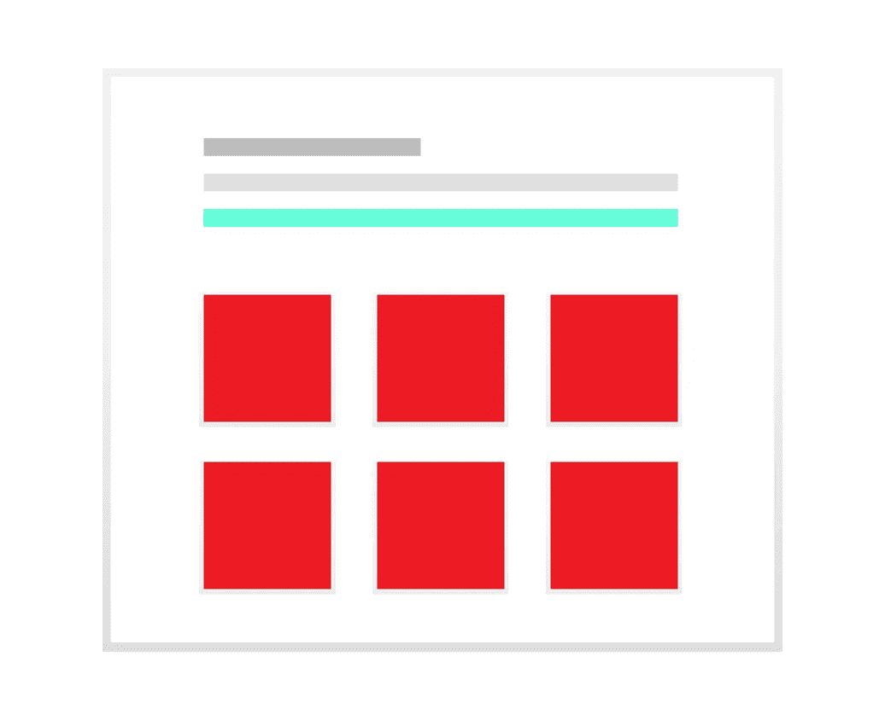

# 10 大用户体验技巧！

> 原文：<https://medium.com/swlh/10-great-user-experience-tips-2fc22d69cc68>

UX (user experience)是一种提高用户满意度的方法，它通过改进用户与设计界面的可访问性、可用性和效率来实现。转化率和用户体验是紧密联系在一起的，因此，我们给你带来了 10 个提高转化率的好方法！

## #1.制作一个吸引人的主页

你想让用户不要错过的服务/产品的关键信息放在首页。为了确保获得 UX 奖，不要把所有东西都放在首页！保持你的信息简洁明了，因为你的主页是所有访问者登陆的第一页，你不希望它难看和混乱。第一印象很重要！

要遵循的提示！

*   (吻)保持它小而简单
*   最重要的内容放在文件夹上面
*   将徽标链接到主页

## #2 提高装载速度

This Loading Illustration was designed by [Mahisa Dyan Diptya](https://www.sketchappsources.com/contributor/mahisadd)

理想情况下，一个网站应该在 3-4 秒内加载。如果你的加载速度超过这个速度，你的用户就不会有好的体验，用户离开你的网站的机会也更大。

一项研究表明，装载时间延迟 2 秒会导致 87%的废弃率。

## #3 强制呼吸空间

你的主要目标是让访问者看到你最重要的数据，这需要你的页面有足够的呼吸空间，给它一个干净优雅的外观。

除了突出重要的数据，呼吸空间还能提高阅读理解能力，让你的设计更加流畅。

## #4 使用令人信服的行动号召(CTA)

CTA 告诉你的访问者在你的网站上做什么。才是导致转化率高的元素。有许多正在运行的网站没有明确的 CTA，因此，让客户不知道该采取什么行动。你的 CTA 应该是加粗突出的，应该在你的页面上突出出来。

为此，有几个小技巧可以让 CTA 按钮具有对比色。在这样做的同时，要理解颜色的心理学，理解不同的颜色唤起不同的情感。决定你想要传达的信息，然后选择相应的按钮颜色。

其次，你需要决定在 CTA 按钮上使用的文字。使用能向用户传达点击会发生什么的文本，避免使用“下一步”、“继续”、“链接”等文本示例。

## #5 使用图像和视频

抓住用户注意力的最好方法是包含图片和视频！这是一种非常直接的方式。他们使你的网站人性化，人们最终会更加信任这样的网站。

研究表明，如果你包含快乐的图片，转化率会增加。同时，如果你有一个产品，那么视频比单纯的文本更容易理解它的特性。

## #6 合并搜索字段

这很容易让用户感到沮丧，没有比不包含搜索字段更好的方法了，让用户在试图定位信息的某个特定部分时感到烦恼！他们没有时间通过你提供的“聊天”框联系你，并且很快就会放弃你的网站。

因此，除非你有一个内容较少的极简网站，否则最好包含一个搜索字段。理想情况下，把你的搜索框放在右上角，并设计得足够大以适应中等大小的查询。

想象一下，像亚马逊、Flipkart 或 Jabong 这样的网站没有搜索框，搜索是手动的！可怕的经历，对吧？

## #7 提供完整的联系信息

通常情况下，你的用户会有一些疑问或疑问，并希望与你联系。在这种情况下，如果地址、联系号码或邮件地址不可用，你就限制了他们与你联系的方式，这可能会导致愤怒和沮丧。一句难听的话，需要很小的时间去传播！

建议把联系电话和邮箱放在每页的页脚处，方便快捷！完整的信息也能建立信任，因为你的网站看起来是合法的！

## #8 修复断开的链接

*Image courtesy Freepik*

断链是完全不能接受的！点击一个链接，给出一个错误和导航到任何地方是令人沮丧的，因为它可以得到！

客户会立即重新考虑在你的网站上花费他们的宝贵时间，因为断开的链接只是你路线上的路障，会让你改变路线。

现在真正的问题是如何识别和修复断开的链接？

这里有一些简单的方法:

*   你可以使用免费的检查网站，如免费的 404 检查和谷歌网站管理员工具。
*   请求从搜索引擎历史中删除旧的 URL
*   将旧页面或帖子重定向到新的 URL

## #9 提高可读性

构建句子是最重要的，因为这将决定你的用户如何回应你的信息！

下面是如何去做:

*   保持句子简短
*   保持大字体
*   使用项目符号列表
*   不要给不是链接的单词加下划线
*   在白色背景上使用黑色文本，而不是相反
*   保持段落简短，大约。3 行。

## #10 去除不必要的元素

最后但并非最不重要的一点是消除网站上不必要的元素。

简约是生活和设计的方式！

这里有一些你可以消除的大问题:

*   不需要的广告
*   不停闪烁的横幅
*   无关图像
*   链接到未维护的社交媒体账户

## 最后

要在网上商业世界生存，你需要在游戏中处于领先地位。通过提供良好的用户体验，你可以让人们一次又一次地访问。

我们希望这些 UX 小贴士能帮助你，让你的网站更加人性化！

*您可以关注我们的* [*脸书*](https://www.facebook.com/monsoonfish)*/*[*LinkedIn*](https://www.linkedin.com/company/13404751/)*/*[*Twitter*](https://twitter.com/monsoonfishy)

*原载于 monsoonfish.com***。**

**

## *这个故事发表在 [The Startup](https://medium.com/swlh) 上，这是 Medium 最大的企业家出版物，拥有 277，994+人。*

## *在这里订阅接收[我们的头条新闻](http://growthsupply.com/the-startup-newsletter/)。*

**