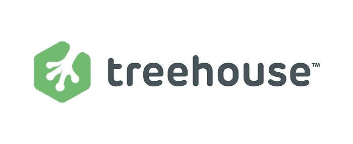
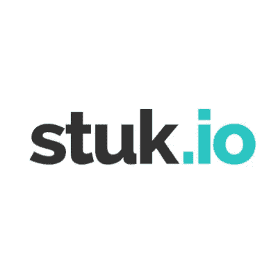

# 学习编码的 10 大网站

> 原文：<https://medium.com/swlh/10-great-websites-to-learn-coding-ff7e411d708d>

## 别再找开发商了。开始构建自己的项目。

这里列出了 10 个你可以开始学习编程的网站。

**1-**[Freecodecamp](http://freecodecamp.com/)

提供独特的体验。学习 HTML&CSS，全栈 Javascript，数据库等等。最后，你可以成为一个非盈利项目的一部分，开始建设。

**2-** [**奥丁项目**](http://www.theodinproject.com/)

跟随学习路径成为一名 Web 开发人员。像 Freecodecamp 这样的好例子，但主要集中在 Ruby on Rails 上。

**3-**[**uda city**](https://www.udacity.com)

我见过的最详细的课程。他们深入探讨了这些主题，并通过实例进行教学。

**4-** [**树屋**](http://teamtreehouse.com/)

具有非常人性化的设计。你可以学习 Web 开发、Web 设计、Rails、Ruby、Python、Swift 等等。

**5-**[**Thinkster**](http://thinkster.io/)

学习 AngularJS 的最佳指南之一。他们经常增加新的内容，如 Swift、MEAN Stack、Django、Firebase 等。

**6-**[**code academy**](http://codecademy.com/)

免费和精心准备的指南绝对初学者。它包括 Rails、AngularJS、HTML&CSS、Javascript、jQuery、PHP、Python 等。

**7-**[**stuk . io**](https://stuk.io/)

这是一个非常棒的网站，适合那些想通过搭建约会应用、社交网络等真实项目来学习 Ruby on Rails 的人。

**8-** [**破折号**](http://dash.generalassemb.ly/)

一个好的开始方式。通过项目学习 HTML，CSS，Javascript。

**9-**[**code 4 startup**](http://code4startup.com/)

通过 Udemy、Airbnb 等项目学习编程。

**10-** [**一个月**](https://onemonth.com/)

一个月学会 IOS 版的 Rails，HTML，Python，Swift。

> 如果你喜欢这篇文章，请点击♥，这样其他人也可以欣赏。

*发表于* **创业、旅游癖和生活黑客**

-