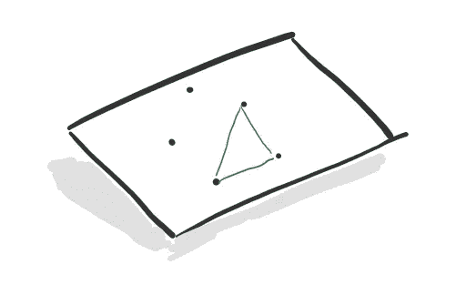
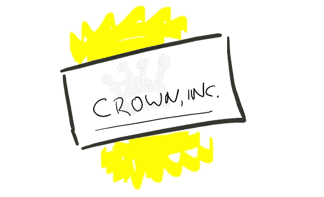
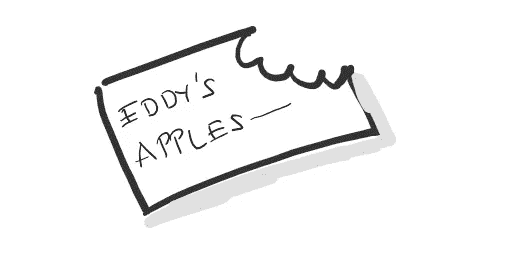
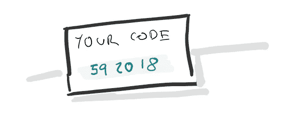
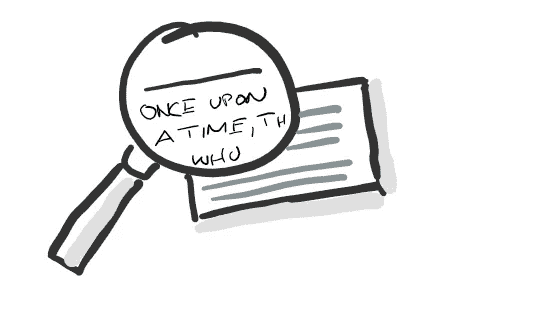
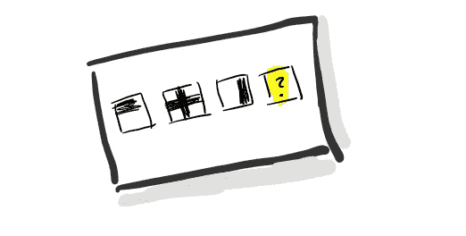
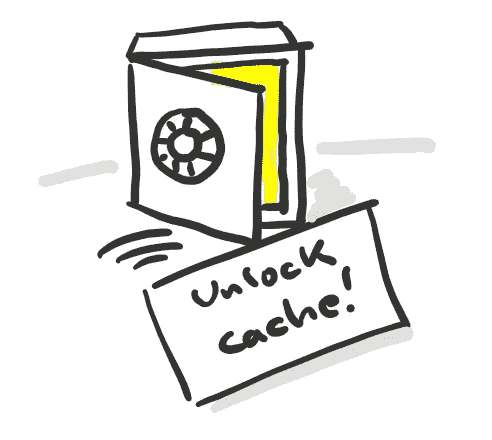
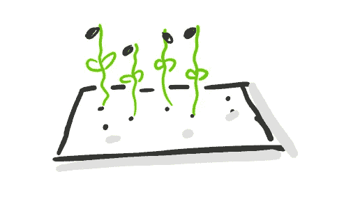
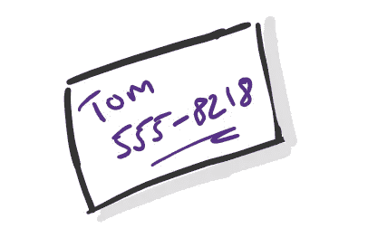

# 你下一张名片的 10 个非常不寻常的想法

> 原文：<https://medium.com/swlh/10-highly-unusal-ideas-for-your-next-business-card-86973d464639>

## 吃饭，开锁，画画。你会尝试哪一个？

不久前，在一次无聊的火车旅行中，我写下了一些关于名片的想法。即使在我们的数字时代，名片仍然很有用。

> 不寻常的卡片会引起别人的注意，帮助你的商业伙伴记住你。

这里有 10 个新颖的想法。

## 用数字连接圆点/颜色

儿童经典:用数字连接点和颜色。通过根据印刷的数字连接点或着色，新的图像将是可见的。它促进互动，因为你鼓励你的伴侣用卡片做一些事情。例如，让他们制作你的商标！非常适合艺术家或艺术学校。

## 折叠说明

制作一张可以折叠成新东西的卡片。也许是一些简单的折纸或只是一个骰子。对于建筑商来说，它可以是一张折叠成小房子的卡片。与卡片的互动(用手做一些事情)一定会留在脑海里。如果结果是一个装饰性的物体，则更是如此。

## 水印

在你的卡片上添加一个秘密会让它更有趣。你可以加一个水印，只有当卡片对着光的时候才能看到。同样的原理可以在更现代的钞票上找到。如果它与你的业务相关，那将是最有意义的:灯光显示了一家灯具店或一家出售太阳镜的商店的口号。

## 可食用卡片

你可以把卡片印在可食用的纸上。这不仅是可持续的，也是食品相关行业的完美选择。一个类似的想法是将卡片溶于水，制成茶或增加水的味道。唯一的缺点是联系方式会丢失...但是顾客们肯定会记得他们从哪里得到了一张有味道的卡片。

## 单独的数字和代码

有了数字印刷，很容易在卡片上印刷个人代码。你可以用它们来分发一些个人的东西，也许是你的软件的试用版。客户会感到感激(他们有一个唯一的访问代码)，你可以跟踪谁访问你的报价。一旦这些卡有了额外的好处，顾客就更有可能使用它们，而不仅仅是把它们塞进抽屉里。

## 变小

一张名片能写多少字？如果你把它们打印得很小，只有用放大镜才能看清，那会怎么样？或者更小，用显微镜？微型印刷可以很容易地得到一整本书的缩略图大小，这是一张卡片典型大小的一小部分。诚然，它只有在特殊设备下才可读，但这可能是寻找最佳客户的好机会——如果你是销售显微镜配件的话。如果你在看似正常大小的文本中通过微缩印刷隐藏信息，会得到加分。

## 提出一个谜语

我的一个朋友实际上是这样用的:他在他的卡片背面放上小的脑筋急转弯和谜语。他的客户和合伙人倾向于一遍又一遍地拿起卡片，直到他们解决了问题。也许在答案中隐藏一个行动号召，让你的客户一有解决方案就给你回电。这对招聘很有用，例如在招聘会上。

## 作为钥匙的卡片

与第五点相似，这张卡片可以是一把钥匙，不是一个网站的钥匙，而是一个真实位置的钥匙。如果客户是唯一能够访问某些内容的人，这将给他们很大的权力。这个东西可能是你店里的一个装满小赠品的储藏室。每个人都可以看到它，但只有持卡人才能打开它。这个原则也适用于贵宾卡。保证给你的店带来客户！

## 卡会增长

你可以将种子嵌入卡片的纸张中。当你把它放进土里，定期浇水，植物就会从中生长出来！一些植物，如豆瓣菜，维护成本很低，也可以用作沙拉配料。想象一下，如果你的顾客能从你的卡片上种出一株植物，他们会有多感动。让您的业务关系也得到发展！

## 空卡

如果你的卡是空的，而你要在与客户互动的时候填写相关信息，那会怎么样？这对人际关系至关重要的企业尤其有效。然后，你可以利用空闲空间记下你正在谈论的任何想法，或者会议的时间和地点。确保你的字迹清晰，但是额外的努力不会被忽视。如果你预算有限，这很有用。

## 结论

让我知道你还有哪些创意名片的想法，或者你遇到过哪些！

*感谢阅读。*

## 这篇文章发表在[《创业](https://medium.com/swlh)》上，这是 Medium 最大的创业刊物，有 297，332+人关注。

## 订阅接收[我们的头条新闻](http://growthsupply.com/the-startup-newsletter/)。

