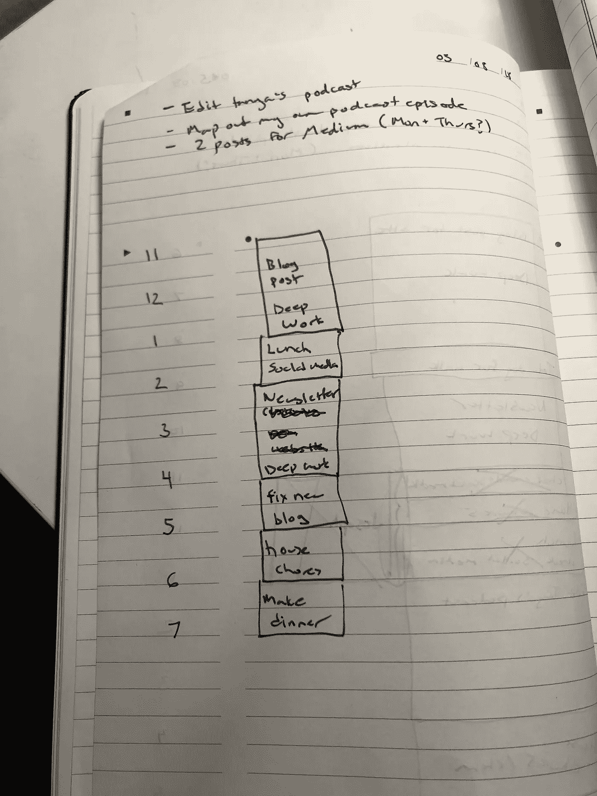

# 10 个深入的策略来提高你的注意力并产生高质量的工作

> 原文：<https://medium.com/swlh/10-in-depth-strategies-to-improve-your-focus-and-produce-high-quality-work-b0fbf40de655>

工作计划，加强创造性认知，等等。

A photo of my work plan for one Sunday

早在 2015 年，微软加拿大[发布了一份报告](https://www.scribd.com/document/265348695/Microsoft-Attention-Spans-Research-Report)臭名昭著地得出结论，人类的注意力持续时间比金鱼短。

根据这项研究，2000 年人类的平均注意力持续时间是 12 秒，相比之下，2013 年是平均 8 秒。