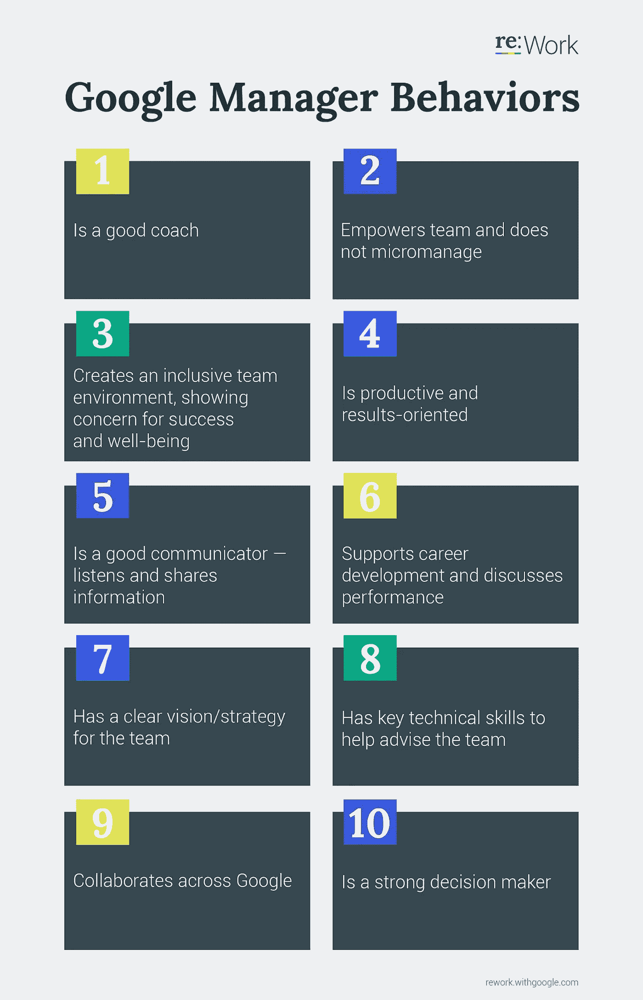
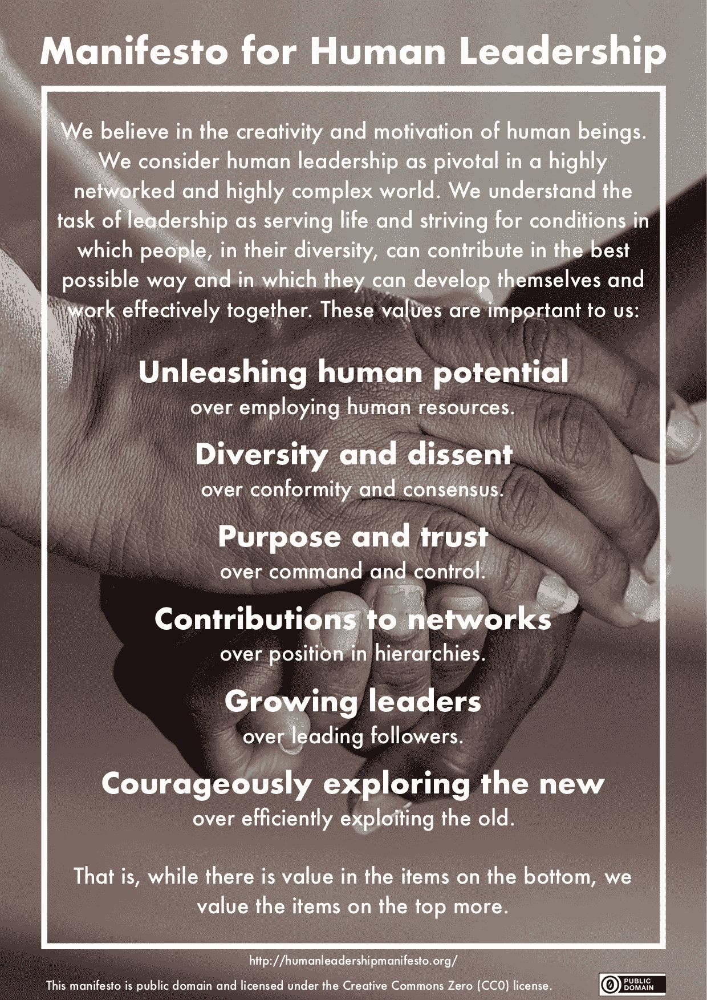

# 谷歌寻找优秀领导的 10 个洞见

> 原文：<https://medium.com/swlh/10-insights-from-googles-search-for-good-leadership-d9f7f9fbe4b9>

2008 年，谷歌的一个团队启动了[氧气项目](https://rework.withgoogle.com/guides/managers-identify-what-makes-a-great-manager/steps/learn-about-googles-manager-research/)。该项目的目的是找出什么是好的领导，什么样的行为是谷歌优秀经理的特征。作为一家数据驱动的公司，该团队根据员工调查和经理年度绩效评估的数据来处理这个问题。最初的八种行为[最近被重新制作](https://rework.withgoogle.com/blog/the-evolution-of-project-oxygen/)，并增加了两种新行为。乍一看，它们似乎仍然很琐碎，或者，正如《纽约时报》在 2011 年的文章[中提到的，几乎就像电视连续剧《办公室》中白板上的一个插科打诨。但是人们不能被这种简单所欺骗。近年来，通过将这些发现纳入培训，并通过出版物对领导力的高度关注，谷歌在员工满意度、人员流动和绩效方面取得了积极效果。这足以成为再看一眼的理由。](https://www.nytimes.com/2011/03/13/business/13hire.html)

Source: [Google re:Work](https://rework.withgoogle.com/guides/managers-identify-what-makes-a-great-manager/steps/learn-about-googles-manager-research/)

这是 Oxygen 项目的 10 个行为(其中 3 和 6 与第一个版本相比有所改变，9 和 10 有所增加)。乍一看，这听起来很合理，但并不真正具有突破性。

谷歌人力资源部自称的“人力运营”副总裁拉兹洛·博克在 2011 年第一次阅读《要点》(当时是 8 点)时也有类似的经历。“我第一反应就是，就这样？”《纽约时报》的文章引用了他的话。直到团队对这些行为进行排名时，才出现了一点惊喜(至少对于那些曾经阅读过谷歌高级管理职位招聘广告的人来说，像我一样，可能会惊讶地发现那里有“强大的编程”技能)。到目前为止，技术专长，例如，一个经理能把自己编程得多好，影响最小。更重要的是，经理花时间进行讨论，并像教练一样通过问正确的问题而不是简单地给出答案来帮助员工找到解决方案。

> 作为一名领导者，你的大部分工作就是让那些人成功。与其说是为了成功(你自己)，不如说是为了确保你有优秀的员工，你的工作是消除障碍，为他们清除路障，这样他们才能在工作中取得成功。
> 
> *谷歌 CEO 桑德尔·皮帅(Quelle:* [*石英*](https://qz.com/879633/let-others-succeed-google-ceo-sundar-pichais-simple-but-effective-leadership-style/) *)*

尽管不是基于数据和分析，谷歌描述的许多行为在这里发表的[人类领导力宣言](https://fuehrung-erfahren.de/2018/02/manifesto-human-leadership/)中得到了很好的反映，这让我非常高兴。在谷歌也是如此，正如谷歌首席执行官桑德尔·皮帅自己说的，领导力本质上是让其他人成功。[微观管理](https://fuehrung-erfahren.de/2018/07/people-over-processes/)和命令&控制一样不可接受。相反，领导力是基于[目标和对员工创造力和积极性的信任。](https://fuehrung-erfahren.de/2018/03/leading-with-purpose-and-trust/)

为了找到优秀领导的例子，你当然不必大老远跑到山景城。例如，德国酒店经营者兼作家博多·让桑用下面这句话道出了所有的要点，并凭借这种通过升值创造价值的态度，让他的连锁酒店 Upstalsboom 取得了相当大的成功。像谷歌的发现一样，他的结论听起来也很简单——然而却很难应用。好的领导会产生决定性的影响，尤其是在知识工作、敏捷、自我组织、新工作或更好工作的时代。

> 领导是一种服务，而不是特权。为员工服务就是为他们提供发展自己的机会。
> 
> 博多让桑

*原载于 2018 年 9 月 12 日*[*fuehrung-erfahren . de*](https://fuehrung-erfahren.de/en/2018/09/10-insights-from-googles-search-for-good-leadership/)*。*

## 这篇文章发表在 [The Startup](https://medium.com/swlh) 上，这是 Medium 最大的创业刊物，拥有+368，675 名读者。

## 在这里订阅接收[我们的头条新闻](http://growthsupply.com/the-startup-newsletter/)。

