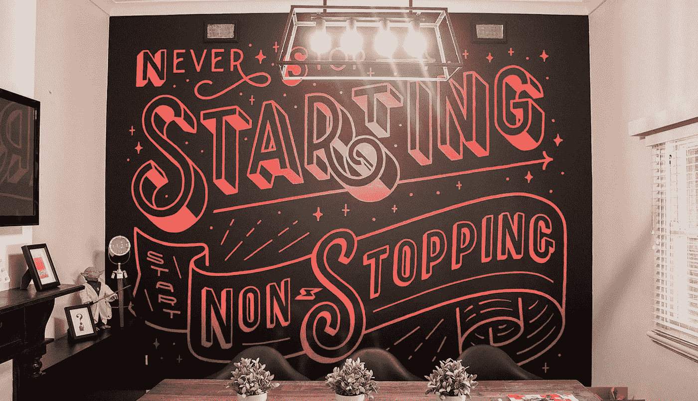

# 我的创业迷幻药之旅的 10 个教训

> 原文：<https://medium.com/swlh/10-lessons-learned-on-my-startup-acid-trip-57b657473dd6>

> 永不停止开始不停地开始…..

这篇文章可以很容易地成为一百个教训，不，是一千个教训，这些教训是在创业之路上最奇怪、最可怕、最疯狂、最美丽和最神奇的旅程中学到的。这同样是有史以来最好和最糟糕的迷幻之旅，充满了改变生活的见解，黑暗的低谷和超级怪异的狗屎。

是的，这不会是我们标准的“你的网站需要这样做”类型的帖子。

所以，简单回顾一下我 6 年的旅程。

2012 年，我放弃了“激烈的竞争”,加入了一家音乐流媒体初创公司，在 Spotify 出现之前的数字音乐领域担任创意总监(澳大利亚在推出方面落后于欧洲和美国)。

创始人筹集了 300 万澳元，这对于一个以采矿和资源闻名的澳大利亚州的娱乐应用来说是不小的成就。创始人之一是近亲(插入闪红灯)。我们创建了一个令人难以置信的移动应用程序，并组建了一个由超级天才和人脉广泛的人组成的团队，他们将让事情爆炸。我们在东南亚的道路上取得了巨大的成功，并且正在与电信公司讨论合作和整合事宜。

推出三周后，我们就没钱了。

现在，300 万美元不是一个永不枯竭的春天，但根据我的计算，至少应该还有 100 万美元。

开门见山地说，似乎一半的董事会成员(包括我自己)和投资者都被创始人领着在胡扯大道上欢快地跳舞。

接下来的 18 个月里，我会对所有细节进行详细分析，但不用说，这是这次旅行中“非常非常低”的部分。早点说出来很好，但值得注意的是，这次经历可能会在某种程度上扭曲我的观点。然而，学到的经验仍然有效，并被应用到我所做的其他事情中。

12 个月的时间里，我很快回到了创业之路上，涉足 iBeacon 技术。一年来，一群投资者向另一群投资者传递的实际上是概念性的想法。最大的教训——概念性的想法仅仅是概念性的。如果你没有正确地集中注意力，一匹马有时可能是一头驴。

到目前为止，我认为“创业”这个词只适用于投资者领导的、前沿的、改变世界的、价值数十亿美元的商业创意。我没有想到，所有的企业都是从某个地方开始的，无数的错误和经验教训可以很容易地应用于擦窗业，就像它们可以应用于一家资金雄厚的科技初创公司一样。

这让我开始数字化。我做了所有好的 Instagram 报价告诉我做的事情，我跟随我的激情。对右脑创造性思维的热情。对艺术、营销、音乐和所有数字化事物的热情。我在当地寻找机会，全押了进去。在短短两年多的时间里，我们已经建立了一个 8 人的团队，并且我们正在与一些我做梦都想不到的客户合作。还是不容易。我们工作时间很长，做出了很大的牺牲——我们仍在犯错，但这是 6 年来第一次感觉良好。

在我学到的 10 课中会有矛盾，因为生活就是这样，还有无数其他的“洞见”,在我之前已经有数千人写过了。没关系。一吐为快真好。在很大程度上，这些可以像移动应用程序开发一样容易地应用于管道行业。

1.  永远不要和家人一起做生意。我爱我的家庭，但任何试图将事业和家庭混为一谈的努力都以失败告终——有一次还进了监狱，但那是另一回事了。澄清一下，那不是我(我用我最粗哑的声音打出来的)。
2.  **工作。很难。**见过有人在空中变戏法 10 个球吗？现在想象杂耍 10 把燃烧的刀，骑独轮车，只穿你的内裤(可选)。戏剧性？是的，但有时候就是这种感觉。不管你的企业有多辉煌，你的团队有多了不起，经营自己的企业都需要艰苦的努力、牺牲和不眠之夜。这导致了:
3.  **现实一点。**几年内你都不会在摩纳哥买那艘游艇。
4.  **知道数字。我们中的许多人天真地进入商界，期望立即盈利和/或拿到薪水。重要的是，不仅要全面了解企业的财务状况，还要了解财务机制——钱从哪里进来，又从哪里出去。不要入不敷出。常识是对的，但这显然是企业失败的主要原因。**
5.  如果它适合你的业务，并且你足够幸运地找到了一个愿意让你的业务更上一层楼的投资者，**确保投资者被投资** (ha)。不言而喻，你的投资者应该清楚地了解你的商业模式和战略，但同样重要的是，他们对你的业务及其潜力充满热情和兴奋。例如，对采矿和资源行业有长期历史和了解(并听取澳大利亚乡村和西部)的投资者可能不是尖端移动音乐流媒体应用程序的最佳投资群体。
6.  **了解你正在解决的问题**并说出来。每 101 家初创公司中都有这种情况，但不能低估。无论你是一家割草公司还是金融机构，你都应该为你的客户解决“一些事情”,并推广这一点。这个世界充满了噪音，充满了竞争，争夺我们越来越少的注意力。作为消费者，我们需要知道你在做什么，为什么我们应该立即选择你，否则你只是在增加噪音。
7.  **不要害怕寻求帮助。**我还在学这个。如果你想让你的生意扩大规模，那么你就需要其他人的帮助。尝试自己做所有的事情，你会筋疲力尽——或者逐渐消失。
8.  **尽职调查/风险缓解。**无论你是打算合伙经营、租用办公场所还是购买特许经营权，最好设想最糟糕的结果，然后逆向操作。戴上你最好的福尔摩斯帽子，调查一切。地点是否合适，是否有需求，我们的预期投资回报是多少，我的潜在商业伙伴是否使用 deoderant，谁是我们的客户。你不会想尽一切办法，但最好尽可能多的去收集。
9.  如果感觉不对，那很可能就是不对的。这几乎可以适用于任何情况，但出于某种原因，在我们急于把事情做好的时候，初创公司和新企业擅长忽视我们的直觉。在继续前进之前，问问自己事情是否“感觉正确”。如果你不确定，问问你身边的人。我妻子从我头上捡起一些东西，每次她都是对的。妈的，我讨厌她是对的，但这确实让我(和我们)免于做出错误的决定。
10.  **永不停止开始开始不停。在某些时候，你需要开始。进行下一步。注册那个域名，建立那个登陆页面，和那个朋友聊天，给自己做一个标志，和人们联系，谈论你的生意。继续前进。停止把你的想法当成一个想法，开始把它当成一个完全可操作的业务来思考和讨论。开始吧。**

经营自己的事业是一个不断进化的野兽。有些时候，我们乘风破浪，有些时候，我们却被甩得头破血流。如果只是骑马而没有倾倒，那就没什么可学的了。对吗？

我们有个计划。我们有策略。但是我们也跟着感觉走，参与到我们感兴趣的数字项目中。拿我来说，我迫不及待地想看看这一切会把我们带向何方。

所有登上神奇的神秘之旅。

Start Digital 是一家位于澳大利亚珀斯的网络设计和在线营销机构

## 这篇文章发表在《创业公司》杂志上，这是 Medium 最大的创业刊物，有 307，492 人关注。

## 订阅接收[我们的头条](http://growthsupply.com/the-startup-newsletter/)。

