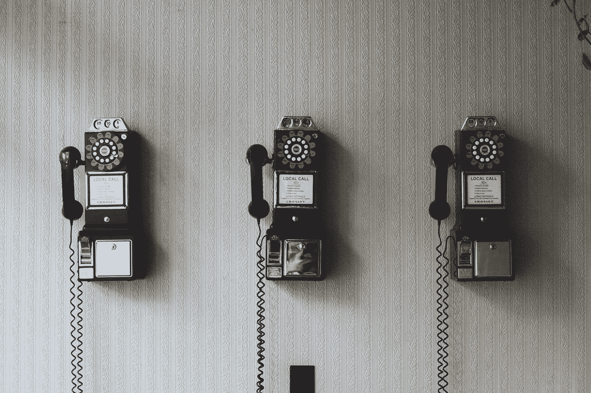

# 来自 14000 次电话推销的 10 条人生经验

> 原文：<https://medium.com/swlh/10-life-lessons-from-14-000-cold-calls-1bfc7792547f>

[Image Source](https://unsplash.com/photos/71CjSSB83Wo)

我花了一年时间给美国每个州打电话。

从大学伦理学和哲学专业毕业后，销售是我最不想做的事情。我不重视销售，也从未给予它应有的尊重。

我错了。

销售是一个需要勇气和技巧的职业。它建立在同理心和自律的基础上。这是…的艺术