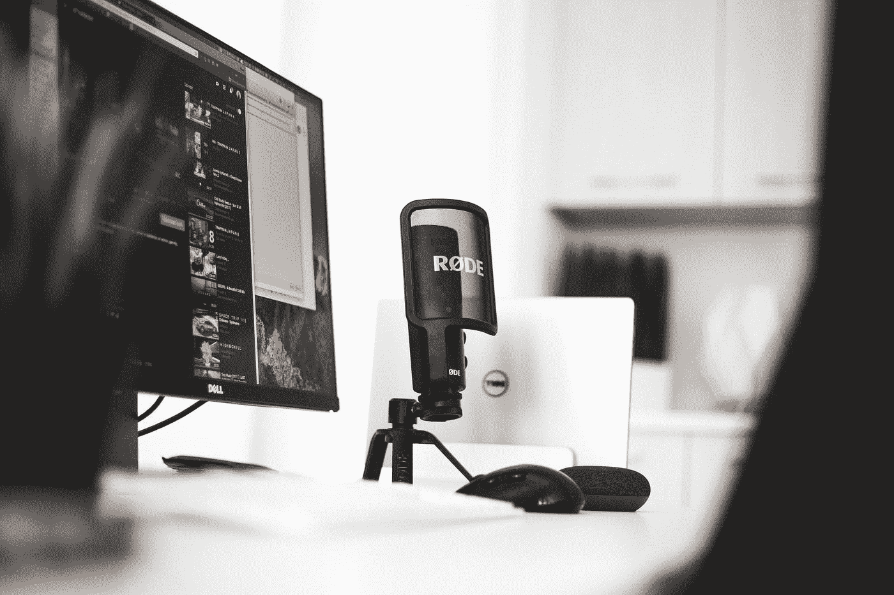

# 我从创建播客中学到的 10 条人生经验

> 原文：<https://medium.com/swlh/10-life-lessons-i-learned-from-starting-a-podcast-1b7b4028ef48>

Photo by [Blake Connally](https://unsplash.com/@blakeconnally?utm_source=medium&utm_medium=referral) on [Unsplash](https://unsplash.com?utm_source=medium&utm_medium=referral)

作为一名(即将毕业！！在一所历史悠久的黑人大学里，我经常遇到非裔美国教授和医生，他们拥有丰富的知识、非凡的经历和丰富的个人故事。这些人面临着巨大的挑战、挫折和歧视，但仍然达到了他们职业的最高水平。

是什么让他们坚持下来的？他们是如何克服障碍的？他们哪里来的力量？

我真的很好奇他们的生活，每当我在病房遇到他们时，我经常询问他们的医学道路。但是当两位教授突然去世时，我意识到我们正在失去一段重要的，而且往往是不为人知的历史。

所以我决定开始一个播客，[这是我的生活](https://home.mmc.edu/podcast/)。虽然一开始我不知道自己在做什么，但在整个过程中，我学到了很多关于谈话和面试的重要经验。这让我成为一个更好的沟通者，并提醒我，即使是像说话和倾听这样的技能，我们每天都认为是理所当然的技能，也需要不断的有意识的练习来保持敏锐。

以下是我从这个项目中学到的一些经验:

# **1)听着**

看起来很简单，对吧？但这并不像听起来那么容易。当我第一次开始录制采访时，我发现自己已经忘了我的采访对象在说什么。我太忙了，想不出回答或下一个问题。我没有停留在当下，专注于一场精彩的谈话，而是全神贯注于我被录音的事实。不止一次，当突然的停顿迫使我意识到我不知道自己在谈话中的位置时，我感到措手不及。说到尴尬…

在她的 [TED 演讲](https://www.youtube.com/watch?v=R1vskiVDwl4)中，电台主持人 [Celeste Headlee](https://en.wikipedia.org/wiki/Celeste_Headlee) 谈到了我们在倾听方面的问题。太多时候，我们更关心我们接下来要说什么，而不是听我们的对手想要传达什么。我们等待我们的谈话要点，一听到我们等待的关键词就马上吐出来。那不是对话，而是在谈论彼此。

开始一个播客教会了我慢下来，停留在当下，真正地集中注意力。

# **2)问正确的问题**

我们都经历过从开始的那一刻就开始消失的对话。在几个是或否的问题之后，双方的热情开始消退，人们开始在可怕的尴尬沉默到来之前寻找出口。但是有了正确的、开放式的问题，聊天会突然变得活跃起来。

谁、什么、何时、何地以及为什么这些问题是让你的主题开始谈论的好方法。询问某人在特定情况下的感受或他们学到了什么是另一种敞开心扉的好方法。不止一次，当我让受访者回忆他们最大的成就时，他们会潸然泪下。允许他们沉浸在自己的成就中，给他们思考的空间，创造了美好、纯粹的时刻，我很幸运能够见证这些时刻。

专注于对对方的好奇，倾听他们的回答，提出深思熟虑的问题。这就是你如何保持对话的吸引力和活力。

# **3)有意识地说话**

在花了足够多的时间听我的录音后，我痛苦地意识到我不是[罗伯特·西格尔](https://en.wikipedia.org/wiki/Robert_Siegel)，那个共同主持 NPR 的《思考一切》超过 30 年的人。我所有的发声抽搐，*嗯嗯*，*啊啊*，*喜欢*，*你懂的*不断提醒我，我并没有想象中的那么圆滑。

为了改进我的演讲，减少这些填充词，我不得不有意识地放慢语速，并在我觉得必须填补沉默时插入停顿。放慢语速的好处是，它让听者有机会注意你话语的含义，给你一种深思熟虑的气氛，帮助你平静下来，让你的话语产生共鸣。

在奥巴马总统 2008 年的就职演说中，开头一段就表明了这一点:

Youtube: Obama Victory Speech 2008

“如果还有人/仍然怀疑/美国是一个一切皆有可能的地方/仍然怀疑/我们的创始人的梦想/是否在我们的时代仍然存在/仍然质疑/我们民主的力量/今晚/这就是你的答案。”

谈谈强有力的演讲。通过在每个短语的结尾稍微停顿，人们可以抓住每一个单词，它可以给短语的旋转带来更大的力量。

# **4)用同理心让人们放松**

对许多人来说，随身带着麦克风讲话是一种陌生的体验。突然间，我让被采访者坐直了，清晰地说出每一个音节，表现得好像我们有电视摄像机，准备拍摄《会见媒体》。除了告诉他们面试只是一次非正式的聊天，我还必须向他们展示，帮助他们忘记麦克风。

肢体语言很重要。目光接触，避开录音机或电脑，向说话者表明“我就在这里，我和你在一起。”真正参与到他们要说的话中，并像正常对话一样回应，这也是至关重要的。*新鲜空气*的熟练主持人特里·格罗斯表示，她的节目是关于[找到与主题的共鸣](http://www.vulture.com/2018/01/terry-gross-in-conversation.html)，并试图想象自己站在他们的立场上，并以此引导问题。试着和某人联系是让他们感到舒适的好方法。

# 享受宁静

太多时候，我们害怕对话中的沉默，并很快试图填补它。但是当你试图让某人暴露自己时，有时沉默会是你的朋友。我问的问题得到的是沉默，我的思维开始混乱，因为我想知道我是否冒犯了受访者或让他们困惑。但是，通过比我感到舒服的时间多等一两拍，受试者更有可能自己来填补沉默。通过给他们思考的空间，他们更有可能分享一些关于自己更深层次的东西。

[迪克·卡维特](https://en.wikipedia.org/wiki/Dick_Cavett)，艾美奖得主前电视主持人[曾说](https://www.fastcompany.com/1682030/the-art-of-the-interview-dick-cavett-on-how-to-elevate-a-qa):

> “你可以用沉默抓住一个人，让他继续下去。你倾向于觉得你需要填满所有的死气。有时候，如果你只是说“嗯嗯”，然后停顿一下，他们会出于一种绝望添加一些东西，结果非常好。让他们流点汗，然后他们会想出一些他们可能不会说的话。因为他们也会有“在这里浪费时间”的感觉。“你应该用谈话来填满这段时间，但没有法律规定你不能时不时停下来，让战略沉默降临。”

所以试试吧。让他们出点汗。

# **6)送礼**

开始一个项目并让它慢慢成为你的全部是危险的。抵制这种诱惑。关注主题，庆祝他们的成就和项目。试图把你自己和你的“智慧之言”插入主题，看起来似乎是强迫和不协调的。是的，这是你的播客，但你是在提供礼物，不应该期待任何回报。

通过贡献我的时间和服务，我看到我的人际关系发生了转变，其他人也更加欣赏我的工作。作者[塞斯·戈丁](https://en.wikipedia.org/wiki/Seth_Godin)非常喜欢送礼物，尤其是自己的艺术作品。在一次采访中，塞斯·戈丁在[的一次采访](https://www.experian.com/small-business/seth-godin.jsp)中说道:

> “我发现送礼物具有变革性。它让我变得更好。它理清了我的思路，让我可以做得更好。当我专注于为他人开门时，我会看到不同的东西，通常情况下，我的门也会被打开。”

付出，然后再付出更多。这是面试者大放异彩的时候。仅仅是给他们一个平台，你就在展示自己的价值。不要太努力。这是他们的时代。

# **7)人们爱说话**

作为一名采访者，我有一个重要的责任来确保我保护我的主题。尽管我让受访者最终决定播客的内容，但如果他们不习惯接受采访，他们往往不会意识到他们在说什么。麦克风只是把一些人的声音带了出来。

我让人们在录音的时候提到以前对手的名字，表达有争议的观点，说出他们的不满。虽然我大体上能认出正在发生的时刻，但我必须在心里记下把这一段删掉，或者转移他们的思路。我不想做“了解你”的采访。我想庆祝、提升和支持我的主题和他们正在做的工作。这要求我对最终的切割非常谨慎。

# 人们没有你想象的那么主观

参与制作播客的整个过程，从寻找和邀请嘉宾，到录制采访，再到编辑这一集，让我痛苦地意识到自己的缺点。有时音频不理想。其他时候，面试并没有按照我的计划进行。或者可能我的剪辑不够严谨。我很清楚，每个人都知道我做了多么糟糕的工作。

然而，当我与听我播客的人交谈时，所有人都告诉我，我做得有多棒。每当我要求反馈来改进时，不管是出于礼貌还是因为他们真的被打动了，大多数人告诉我他们没有想到什么。主要是他们想让我继续好好工作。

我相信我的听众会意识到当音频质量不好或者当我说话结结巴巴的时候，但是我意识到人们比我之前想的要慷慨得多，更少批判。人们称赞我敢于冒险，把自己和播客放在那里。我可能会犯错，但至少我在努力。而这种潜移默化的鼓励正是我需要不断创造的。

# 把熟人变成导师或朋友

我的播客项目的一个惊喜是了解我和受访者的共同点。随着谈话从采访转移到有意义的交流，我们发现自己在一个共同的经历或感受上真诚地结合在一起。我不仅在和一个我钦佩的人交谈，而且现在我觉得我们在以朋友的身份交谈。但是，只有当你带着真诚的目的去了解一个人而不期望任何回报的时候，这种方法才能奏效。

我采访过的许多医生从未得到他们的故事应该得到的好评。这些医生是开拓者，他们经常成为第一个参加住院医师培训项目的非洲裔美国人或系主任。当我从他们口中套出他们的故事，当他们生活中的挑战吸引我时，我就决策、领导力和克服我预期将在职业生涯中遇到的挑战征求意见。值得称赞的是，他们乐于分享。这是一次很棒的面试，但更重要的是，我发展了一种关系，下次我需要指导时，我可以回到这种关系中。

# **10)创作时原谅自己**

一开始，我发布的每一集都会让我产生焦虑，幸运的是，当我收到反馈时，这种焦虑就消失了。人们对此会有什么反应？(显然，他们很喜欢。)我是否对我的主题造成了伤害？(我准备了，所以没办法。)这样真的值得吗？(是的！完全同意。)

但是，让我们现实一点。播客永远不会完美。不管我多努力，这集总是需要修改。有些事情总是可以改进的。这没关系。说到制作、建造或创造，没有十全十美这回事。我原谅自己的弱点，我很感激我尽了最大努力。下次我会做得更好，因为我一直在寻求学习。

生产任何东西，把一个想法从概念变成现实，都要冒一定的风险。把自己放在那里很可怕。但是创造一些从未有人做过的东西？做一个开拓者？嗯，从这些了不起的医生身上我学到的是，成为第一个并为后面的人打开大门是无价的。

*本帖最初发表在我的网站上*[*【www.bassamzahid.com】*](https://www.bassamzahid.com/2018/02/17/the-fallacy-behind-im-just-not-creative/)*。如果你喜欢它，请分享！在*[*Twitter*](https://twitter.com/bassam_zahid)*或*[*insta gram*](https://www.instagram.com/bassam.zahid/)*上关注我。*

## 这篇文章发表在 [The Startup](https://medium.com/swlh) 上，这是 Medium 最大的创业刊物，有 325，962+人关注。

## 在这里订阅接收[我们的头条新闻](http://growthsupply.com/the-startup-newsletter/)。

