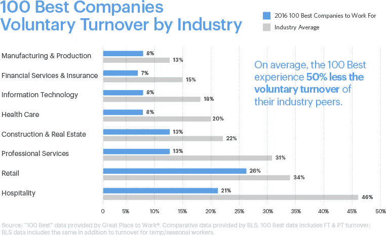

# 让人辞职的 10 个管理错误

> 原文：<https://medium.com/swlh/10-management-mistakes-that-make-people-quit-e7b07e25dfbf>

*由:*[蜜琪拉·帕里克 ](/@mikaelaparrick)

有效管理企业最重要的部分之一是知道如何与人合作。

员工是公司的缔造者，管理者的工作是带领他们走向成功，而不是把他们从公司赶走。

糟糕的经理倾向于将高离职率归咎于一切，而不是他们自己，但是人们不会离开工作岗位，而是离开经理。

根据每月的[职位空缺和劳动力流动调查](https://www.bls.gov/news.release/jolts.nr0.htm) (JOLTS)，美国目前的流动率约为 2.2%，但不同行业的流动率差异很大。

下图显示了“ [100 家最适合工作的公司”](https://www.greatplacetowork.com/best-workplaces/100-best/2018)与 2016 年行业平均水平的对比。

Source: Great Place to Work

“100 家最佳”公司的离职率都大大低于行业平均水平，这意味着大多数公司都在做错事——我们打赌这与管理有关。

以下是经理们会犯的 10 大错误，这些错误会赶走优秀员工，让你的公司出现高离职率。

# 10.他们让人们过度劳累。

经理们犯的最大错误之一就是让员工超负荷工作。

根据斯坦福大学的最新研究，当工作周超过 50 小时时，每小时的生产率会急剧下降，超过 55 小时后，生产率会下降很多，这完全是一种浪费。

加薪、升职和头衔变动都是可以接受的方式，既可以增加好员工的工作量，又不会影响他们的生产力或士气。

如果员工工作过度且得不到赏识，他们会另谋高就。

# 9.他们不给反馈。

肯·布兰查德公司(T21)的一项民意调查发现，不能提供反馈是经理们最常犯的错误。

糟糕的经理很少给予信任或反馈，也从不奖励达成目标或超额完成任务的员工。

不向员工提供及时反馈的经理剥夺了他们提高绩效的机会。

员工需要反馈，以便尽可能地做好工作，优秀的经理总是会给他们反馈。

# 8.他们未能发展员工的技能。

据《快公司》报道，高流动率的最大驱动力之一是相信在更远的地方有更好的职业发展机会。

一个好的经理会发现人才，并想方设法提高和拓展员工的技能。

通常，如果忠于公司的员工觉得他们需要更好的职业发展机会而辞职，那是因为他们的经理。

# 7.他们不能有效地沟通。

糟糕的沟通技巧是糟糕经理的普遍特征。

未能有效沟通会导致错误、绩效不佳、士气低落等等。

另一方面，成功的经理非常善于传达他们的价值观和想法，他们也鼓励员工分享这些价值观和想法。

他们推动公开讨论，不怕被证明是错误的。

他们的员工永远不必去猜测发生了什么或者他们来自哪里。

**【相关:** [**主动倾听终极指南**](https://brownandjoseph.com/the-ultimate-guide-to-active-listening/)

# **6.他们不关心他们的员工。**

**大多数人离职是因为他们和经理的关系。**

**优秀的经理会庆祝员工的成就，挑战他们发挥全部潜力，并在困难时期同情他们。**

**他们确保员工的需求得到满足，而且他们很开心。**

**根据 [Business 2 Community](http://www.business2community.com/) 的说法，伟大经理的标志是被邀请参加员工庆祝的重大活动，并且通常包括在员工组织的集体活动中。**

# **5.他们微观管理。**

**微观管理一直是人们对经理的最大抱怨。**

**完全摧毁了动力和创造力，保证把好员工赶出家门。**

**公司需要员工做的比他们被告知的更多，他们会自己思考并尝试新的方法，而这一切都被微观管理毁掉了。**

# **4.他们把员工扔到公共汽车底下。**

**一个糟糕的经理不会为错误或出错的事情承担责任，相反，他会把员工推到公共汽车下，并把问题归咎于他们。**

**这样做无疑会在员工中煽动对他们的仇恨、不尊重和不信任。**

**根据商业社区的研究，年轻一代越来越不愿意接受他们不尊重的人的指导。**

****【相关:** [**千禧一代为什么不想从事保险工作？**](https://brownandjoseph.com/why-dont-millennials-want-to-work-in-insurance/)**

****指责他人无助于推卸责任，只会造成经理和员工之间的不和。****

# ****3.它们不能解决问题。****

****对于一个经理来说，忽视令人不快的问题而不是努力解决它们是绝对不可接受的。****

****糟糕的管理者倾向于忽视问题，希望问题自行消失，这很少发生。****

****除非有人负责，否则一个简单的分歧或错误可能会变得更糟。****

****正如奥兰多·巴蒂斯塔曾经说过的，“错误不会变成错误，除非你拒绝改正它。”****

# ****2.他们忽视想法。****

****伟大的管理者思想开放，重视员工的想法。****

****他们经常征求反馈、想法和意见，并在做决定时考虑这些因素。****

****员工在分享想法、意见、反馈和担忧时应该感到安全和自信。****

****记住，一个聪明的人永远不会停止学习，我们从倾听他人中学习。****

# ****1.他们不会让事情变得有趣。****

****优秀的经理会通过举办竞赛、郊游和办公室聚会来找到让工作更愉快的方法。****

****这些都是让员工减压和保持高昂士气的好方法。****

****最好的管理者知道如何让员工 ***想要*** 为他们工作。****

******【相关:** [**成功的领导者如何激发忠诚**](https://brownandjoseph.com/how-successful-leaders-inspire-loyalty/)**】******

# ****感谢阅读！如果你喜欢这个故事，我们的[博客](https://brownandjoseph.com/blog/)上还有很多。😊****

****Brown & Joseph 是一家全国性的催收机构，专门从事保险债务的回收。****

****我们的结果不言自明—我们已经为客户恢复了超过 10 亿美元的额外收入。****

****请访问我们在 www.brownandjoseph.com 的网站了解更多信息！****

********

## ****这个故事发表在 [The Startup](https://medium.com/swlh) 上，这是 Medium 最大的创业刊物，拥有 333，253+人关注。****

## ****在这里订阅接收[我们的头条新闻](http://growthsupply.com/the-startup-newsletter/)。****

********