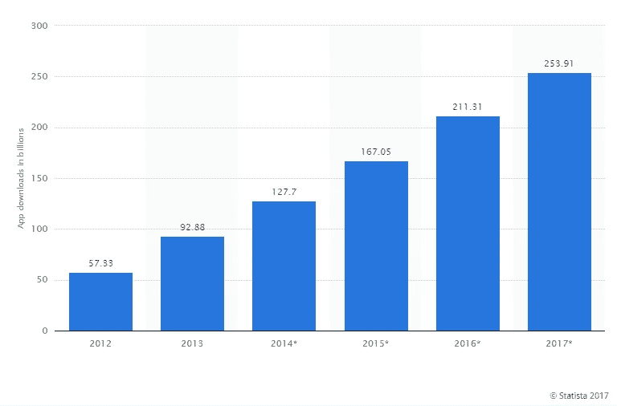
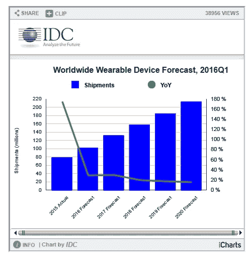

# 值得关注的 10 大移动应用发展趋势

> 原文：<https://medium.com/swlh/10-mobile-app-development-trends-to-watch-for-in-2017-6dcd4abff192>

ORIGINALLY PUBLISHED ON [http://www.APPSTERhq.com](http://www.appsterhq.com/?utm_source=CP&utm_medium=Medium)/

应用经济继续以惊人的速度扩张和增长。

2017 年下载的免费应用数量预计将从 2012 年的 573.3 亿增加到 2539.1 亿。这相当于地球上平均每人有 37 个应用程序。

用户也越来越多地下载付费移动应用程序。虽然 2011 年付费应用的下载量为 28.9 亿，但这一数字很可能在 2017 年增长近 7 倍，达到 147.8 亿。

下载数量的增加导致了[应用收入](https://www.statista.com/statistics/269025/worldwide-mobile-app-revenue-forecast/)的增加。分析显示，从 2015 年的 697 亿美元，应用收入将在 2020 年达到近 1890 亿美元。

随着移动应用世界的不断成熟和扩张，2017 年整个生态系统将会发生一些变化。新的市场将被创造，旧的技术将被淘汰。应用程序将变得更快、更时尚，并能做去年做不到的事情。

如果你聪明，你会提前制定策略，为今年的成功做好准备。

查看这 10 个移动应用趋势，更好地了解市场走向。

## 1.更多物联网和可穿戴应用将涌入市场

根据国际数据公司(IDC)的数据，可穿戴设备类别的综合年增长率(CAGR)将达到 20.3%，[2020 年的出货量将达到 2.136 亿台。](http://www.idc.com/getdoc.jsp?containerId=prUS41530816)

根据另一项预测，受更便宜、更智能的传感器、高速网络技术的发展以及多个垂直行业对基于云的平台的日益接受的推动，物联网市场[将从 2016 年的 1570.5 亿美元扩大到 2021 年的 6617.4 亿美元，CAGR 为 33.3%。](http://www.marketsandmarkets.com/PressReleases/iot-m2m.asp)

面向消费者和企业的可穿戴设备和物联网设备将需要[应用来管理](http://www.appsterhq.com/blog/harnessing-smart-home-movement-app-entrepreneurs)，收集、分析并以可读形式呈现数据，这一特定应用类别将在 2017 年迎来繁荣。

## 2.应用流将变得更加主流

让我们面对事实:在最基本的层面上，应用程序的使用模式与人们在 PC 上下载和使用软件的方式没有什么不同。

虽然应用商店模式是一个受欢迎的变化，但人们仍然需要在手机上下载应用程序。

这就产生了一个问题，因为无论你有多少存储空间，手机上的空间都越来越有限。谷歌的这项研究显示，空间不足是导致应用被抛弃的第二大原因。

应用流技术就是为这种场景而构建的。与视频流非常相似，应用流允许您开始使用应用程序的某些功能，而无需从 app store 下载。

这带来的可能性是巨大的。应用程序开发人员将能够让用户体验到应用程序的体验，而无需安装的麻烦。这将有可能降低用户获取成本，提高用户保留率，并增加客户的平均终身价值。

应用流现在更多是 Android 的事情，Android 即时应用出现在移动搜索中。虽然目前 Google Play 上只有 100 款应用可供预览，但根据彭博的一份报告，这个数字预计到 2020 年将上升到【2020 万款。

## 3.对安全的关注将会增加

大多数移动应用程序专注于用户界面和 UX，完全忽略了安全性。要求访问与使用无关的数据的应用程序(健身追踪器应用程序要求访问您的日历数据)，创建不必要的日志文件(94.8%)，过度依赖分析和广告框架(61.7%)。

这些漏洞使得恶意攻击者更容易访问您的设备并窃取私人和敏感数据。

根据 2016 年惠普企业移动应用安全报告，在检查的 36000 个移动应用中，96.52%的应用[没有通过一项或多项隐私测试。](https://saas.hpe.com/sites/default/files/resources/files/Mobile%20Report%20ver%2010.2.pdf)

鉴于移动应用在企业中的使用越来越多，应用开发人员必须采用以下最佳实践:

*   避免在外部存储中以未加密的形式存储敏感数据。
*   在使用期间和之后分析应用程序，以检测数据泄漏。
*   验证所有应用程序都通过 SSL 正确传输数据
*   检查密码和加密密钥是以密文还是明文存储。

## 4.将会开发更多的企业移动应用

Gartner 预测，到 2020 年， [70%的软件交互](http://www.appstechnews.com/news/2017/jan/04/why-2017-will-be-year-continued-evolution-enterprise-mobility/)将通过企业中的移动应用程序进行。他们还认为，到 2017 年底，[对移动应用](http://www.gartner.com/newsroom/id/3076817)的需求将超过[应用开发能力的五倍。](http://www.appsterhq.com/)

对于许多业务用户，特别是那些在现场或远程位置的用户，应用程序将从移动优先发展到纯移动，就像云支持的应用程序变成纯云应用程序一样。

然而，如图所示，移动应用不仅仅是实用。对于企业来说，不使用移动应用可能是生死攸关的事情。

***来源:****[*Adobe 2016 企业移动 App 报告*](https://blogs.adobe.com/digitalmarketing/tag/enterprise-mobile-apps-report/)*

*同一项 Adobe 研究发现，企业预计对移动应用的投资会增加，平均投资回报率为 35%[。](http://www.techrepublic.com/article/survey-spending-on-enterprise-mobile-apps-is-up-will-continue-to-increase-for-the-next-three-years/)*

**

## *5.聚光灯将照耀在类似 AMP 的技术上*

*加速移动网页是一个开源项目，旨在提高手机的加载速度。如果你在使用谷歌移动搜索，你可能会看到 AMP 页面偶然出现在搜索页面的顶部。*

*由于这些页面的显示方式，它们获得了更高的点击率。*

*此图显示了速度对移动网络的影响。*

**

*虽然你绝对应该专注于将你的页面转换为 AMP，但有另一种技术可以让你在移动网络上提供最快用户体验的竞争中抢得先机。*

*谷歌首先引入的技术叫做渐进式网络应用，它让任何移动网站看起来和感觉起来都像一个移动应用。这种方法比开发和更新原生应用更便宜，因为你不必处理复杂的 API 或保持与旧版本移动操作系统的向后兼容性，从而避免了版本碎片和维护成本。*

## *6.更多的应用程序将具有 AR、VR 和混合现实功能*

*有了 Pokemon Go，AR 精灵完全脱离了瓶子，没有回头路可走。谷歌和苹果都在尽自己的努力改善各自平台上的增强和虚拟现实支持。*

*例如，今年 8 月，谷歌发布了对其名为 Tango 的增强现实 SDK 的改进，该软件允许“计算机视觉使智能手机和平板电脑等移动设备能够在不使用 GPS 或其他外部信号的情况下，检测自己相对于周围世界的位置”。*

**

*混合现实，如微软的 HoloLens 技术，允许用户用全息图操纵真实物体，也将成为主流，因为多家制造商[包括微软发布的基于该技术的耳机](http://www.forbes.com/sites/tiriasresearch/2017/01/17/ar-and-vr-were-everywhere-at-ces/#179331a4c44d)，对支持该硬件的应用程序的需求将激增。*

*要了解 HoloLens 和类似技术的潜力，请查看这个令人惊叹的视频。*

## *7.应用程序将变得更加智能*

*根据《连线》杂志上[的一篇文章](https://www.wired.com/2016/11/fb-3/)*

****“…脸书智能手机应用的新化身。它可以把你家后院烧烤的照片变成毕加索的画。或者梵高的画。或者沃霍尔……这款应用包括几个深度神经网络，这是一种人工智能形式，正在迅速重塑科技界。****

*随着智能手机配备了更强大的硬件，移动应用变得越来越智能。从谷歌翻译的人工智能算法到将无聊的照片变成艺术作品的照片过滤器，人工智能将使应用程序更具情境意识。*

*他们会告诉你接下来应该看什么电影，根据你的血糖水平应该吃什么，并通过突出重要的电子邮件和对话来简化你的工作日。*

*感谢开源机器学习平台[开发者也可以构建能够识别你的情绪或整合语音识别和人脸检测等功能的应用。](https://realm.io/news/360andev-margaret-maynard-reid-making-android-apps-with-intelligence/)*

*Gartner 认为，到 2020 年，[基于云的神经网络](https://www.fool.com/investing/2016/06/19/10-stats-about-artificial-intelligence-that-will-b.aspx)将处理超过 40%的应用程序和用户之间的交互，85%的客户交互将不涉及客户服务代表。*

*从分析到业务流程以及对话和连续界面(想想 Siri、Alexa、Cortana)，人工智能将在 2017 年大规模影响一切，移动应用将引领潮流。*

**

## *8.基于云的应用将会增加。*

*2017 年，越来越多的移动应用将脱离云计算。*

*根据[思科 VNI 全球移动预测(2015–2020)](http://www.cisco.com/c/en/us/solutions/collateral/service-provider/visual-networking-index-vni/mobile-white-paper-c11-520862.html)，到 2019 年，云应用将驱动全球 90%的总移动数据流量，移动云流量将增长 11 倍，复合年增长率(CAGR)为 60%。*

*基于云的移动应用对企业尤其有吸引力，因为它们将在很大程度上缓解 BYOD 固有的数据安全问题。由于敏感的企业数据被锁定在云上，从相对不安全的员工设备上被窃取的可能性将不复存在。*

**

****来源:*** *思科**

## *9.这将是聊天机器人的时代*

*虽然聊天机器人与人工智能有关，但它们应该有自己的类别，因为自从 Facebook Messenger 向第三方机器人开放其平台以来，它们已经成为主流。*

*不仅仅是脸书。*

*每一个称职的科技巨头都在投入大量研究资金来创造具有人情味的聊天机器人。谷歌的 Allo、亚马逊的 Lex 和微软的 Azure Bot 服务都是消息平台/产品，这使得任何开发人员都可以轻松构建功能完整的 Bot。*

*这些机器人已经在帮助你在网上购物，整理他们的日历，在 Facebook Messenger、Kik 和 Telegraph 上订票。
期待这一幕在 2017 年升温。*

**

**一个聊天机器人帮你订机票**

## *10.用户开发的应用将会激增*

*企业用户不再需要花费数月时间等待应用开发团队推出新的应用。*

*如今有大量的[低代码/无代码工具](http://www.infoworld.com/article/3095895/application-development/15-low-code-tools-for-building-mobile-apps-fast.html)可用，没有技术专长的用户可以在几周内创建他们自己的全功能应用程序。尽管定制应用程序将继续有一个巨大的市场，而且这些工具中的很多都不能提供复杂应用程序所需的定制功能。*

*这些工具中的一些，比如谷歌的应用程序制造商，让 G Suite 商业客户创建拖放式应用程序，这些应用程序可以提供商业功能，比如 CRM、客户支持和项目管理。*

**

****来源:*** [*CIO 洞察*](http://www.cioinsight.com/it-strategy/enterprise-apps/slideshows/citizen-development-is-spreading-rapidly.html)*

## *结论*

*虽然下载量正在激增，越来越多的人支付更多的钱来开发和购买应用程序，但用户已经开始对糟糕的应用程序感到疲劳。用户经常使用的应用很少，2016 年 [23%的应用 6 个月只使用一次](https://www.statista.com/statistics/271628/percentage-of-apps-used-once-in-the-us/)。*

*今年，开发者更有必要专注于为他们的应用程序提供出众且令人难忘的 UX，使其成为用户生活的一部分。*

**最初发布于*[*Appsterhq*](http://www.appsterhq.com/blog/mobile-app-development-trends)*。**

******