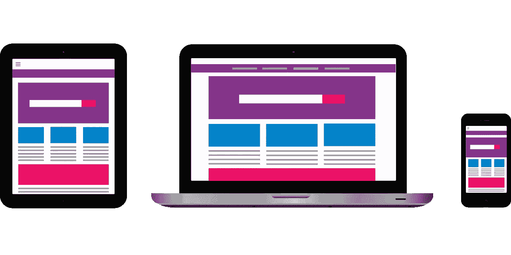

# 你应该收集电子邮件注册的 10 个地方

> 原文：<https://medium.com/swlh/10-places-to-collect-email-signups-for-your-business-7758752562df>

我 80%的收入来自电子邮件营销。

说到从我的产品中谋生，收集电子邮件注册是我的首要任务。我甚至在会议和创业孵化器上做过关于电子邮件营销重要性的报告。

所以很自然地，这些年来我做了一些实验，研究如何从我的流量中获得最多的电子邮件订阅者。我每天有 50-100 个电子邮件订阅者，我会在我的文章中告诉你如何做，如何在电子邮件营销方面表现出色，每天有 100 个订阅者。

今天我想分享你应该收集邮件的十个地方，以便更好地将你的流量转化为潜在客户。

那么那十个地方在哪里呢？

# 主页

如果你想收集注册信息，你首先要把你的选择加入表格放在你的主页上。这是大多数人点击的地方，所以这是一个自然的行动号召。

# 关于页面

如果你是一家企业，你的“关于”页面实际上并不是关于*你。*这是关于*你能给他们什么。如果你给他们一些有价值的东西让他们注册，这些东西应该放在你的“关于”页面的最前面和最中心。*

# 补充报道

我不再有侧边栏注册表单，但我通常会有某种形式的行动号召，让他们订阅电子邮件列表。如果你能让它们看起来更好，那么努力是值得的，但是其他的注册策略通常比我的边栏表单要好。

# 登录页面

如果你运行广告，你应该有一个收集电子邮件的广告专用登陆页面。如果你运行的广告只是进入主页，没有明显的行动号召，那么你就是一个离破产只有两步之遥的业余者。

# 博客页面

一些网站主题允许你在博客页面的文章上方创建一个专用的选择加入区域。如果你是一个博客作者，这是一个选择加入的好地方，因为如果你的读者对你要说的内容感兴趣，他们很可能会点击进入你的博客。

# 低于职位

如果你创作了一篇人人喜爱的杀手级文章，你应该在文章末尾给他们一个订阅你的邮件列表的理由。如果你给他们一些难以置信的信息，他们会马上给你他们的电子邮件地址。

# 在网站“上方”的智能栏中

我喜欢悬浮在你网站顶部的智能栏。有时候，写足够简洁的文案来吸引读者订阅是很有挑战性的，但这本身就是文案写作中很有价值的练习。

# 弹出窗口

可能是最有争议的收集注册的方法。他们讨厌吗？是啊，也许吧。它们有用吗？绝对的。如果你不使用弹出窗口来收集电子邮件订户，你就把钱留在了桌子上。就这么简单。

# 脸书·佩奇

如果你运行脸书广告，那么人们很可能会点击进入你的页面来查看你。创建一个精美的时间轴图片，指向你的注册按钮，然后将其链接到一个有价值的选择加入服务，以收集更多的订户。

# 门口的擦鞋垫

我真的很喜欢 SumoMe 的欢迎垫。SumoMe 提供了大量有用的电子邮件和内容营销工具，而 Welcome Mat 是我的最爱之一。这有点像弹出窗口的友好版本。

# 电子邮件没什么用

我在我的网站上使用这些地方的大部分，[音频问题](http://www.audio-issues.com)，当我建立我的自定义主题时，我把它作为一个优先事项，以便于订阅我的电子邮件列表。

电子邮件营销不会很快消失。这仍然是获得潜在客户许可的最佳方式，让他们联系你的报价。

如果你以任何方式使用电子邮件来赚钱，看看你是否不能使用上面的一些地方来增加你的收入。如果有，请告诉我。

我是一名电子邮件营销专家，帮助您扩大电子邮件列表，产生吸引内容的想法，并通过电子邮件营销推动销售。

## [获取你的精彩电子邮件宣言，学习如何通过 6 个简单的步骤每天获得 100 个电子邮件订户。](https://bbenediktsson.com/)

## 这篇文章发表在 [The Startup](https://medium.com/swlh) 上，这是 Medium 最大的创业刊物，有+ 374，685 人关注。

## 订阅接收[我们的头条新闻](http://growthsupply.com/the-startup-newsletter/)。

