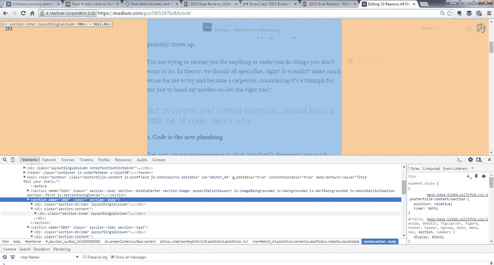

# 我们普通人都应该学习代码的 10 个理由

> 原文：<https://medium.com/swlh/10-reasons-all-us-normal-people-should-learn-code-e78f3287bdbb>

首先，我不是开发者。

我是一个懂一些代码的交流者。坦率地说，如果你看了我在编程中使用的一堆括号和分号，你可能会呕吐。

我不是想招募你做任何事，也不是想让你做你不想做的事。理论上，我们都应该专攻，对吧？对我来说，尝试成为一名木匠没有太大的意义，因为对我来说，只是把合适的工具交给我婆婆就是一种胜利。

## 但是每个人，我是说每个人，都应该学习一点代码。原因如下:

**1。代码是新的管道**

是的，你可以付钱给别人做这件事，但是他们会向你要价太高。当你知道哪个螺栓需要拧紧时，解决问题就简单多了。

**2。代码迫使你进行逻辑思考**

对于一台机器来说，如果不把问题分解成最小的部分，几乎不可能做出任何决定。与生活的相关性是显而易见的。

**3。代码让你对技术有了新的认识**

相信我，当你用头敲打键盘 3 个小时，试图让“Hello World”在你要求的时候出现在屏幕上时，你会对手机上运行的应用程序产生全新的敬意，它目前正在确定你的位置，并可以在几秒钟内推荐一个吃饭的地方。

**4。代码给你力量**

不仅仅是代码中的权力，生活中的权力。我第一次正确地写了一个 for 循环，我的第一个想法是“感谢上帝，现在我可以离开这个类了。”我的第二个想法是“宇宙在我的控制之下。*“我听说其他人也有类似的感觉。

尽管存在刻板印象，学习代码更有可能增强自信，而不是把你变成一群社交笨拙的人

**5。代码让你更有创造力**

想建立一个程序，更新搜索大规模电子表格中的更新，并提取您需要的信息？你能做到的。想黑进你哥的电脑安排接龙每天早上 5:37 开？你能做到的。

最终你的想象闯入了现实世界。

想尝试解决世界饥饿问题吗？你能做到的。想创业？你能做到的。

**6。代码帮助你解决自己的问题**

在我的第一份公司工作中，我被聘为技术作家。我的第一个大项目是重新格式化 32 个州的手册。每本手册有 12000 字。它们也在微软 Word 中。我花了 3 天时间学习 VBA，2 天时间测试一个糟糕透顶的脚本，然后用 3.6 秒时间让电脑为我重新格式化一本 82 页的手册，而不是花两个月时间一行一行地阅读这些东西。

接下来我又做了一次。

然后我又做了 30 次。

然后人们想知道我怎么工作得这么快。

然后我告诉他们我有魔力。

7 .**。代码证明计算机不是魔法**

我周围的许多人似乎相信，要让电脑正常运行需要某种魔法。屏幕冻住了？最好按住这些按钮，直到事情发生。电子邮件被窃听了？我们也许应该点击红色的大 X 100 次。代码告诉你，计算机中发生的所有事情都是有原因的。*

生活中也一样。

**8。代码让人觉得你聪明**

我也不聪明。在我大学上的计算机编程课里，*每个人*都围着我编程。但回到“普通平民”中，不知何故我是个天才。

当人们认为你很聪明时，他们会信任你做更多的事情。由于第 6 和第 9 个原因，你会比其他人做得更好更快。

**9。代码教会你纪律**

学习编程是延迟满足的终极课程。

假设你每天花 30 分钟做管理工作。如果你能花 3 天时间做一个 2 秒钟就能完成的按钮会怎么样？那如果你再花两天时间让那个按钮每天早上自己按下会怎么样呢？是的，你刚刚度过了一年中的一周。是的，可能很糟糕。但是你将**永远永远永远**不得不再次花费那 30 分钟。

一旦你让一台机器按照你的意愿运转，培养一个简单而有用的习惯[就容易多了，比如写日志](http://www.toddbrison.com/microjournaling/)。

**10。代码比你做得好得多**

你也许能在 5000 次中正确重复 4999 次。代码做得更好。

*   **找这些？向上滚动查看我的评论**
*   **编辑:对于那些询问或好奇的人，我在大学里受过一点点正规训练，但从**[**Codecademy**](http://www.codecademy.com)**和**[**Easy Excel VBA**](http://www.easyexcelvba.com/)**中学到了很多。这两个网站都是很好的入门网站:)**
*   **编辑 2:由于可能仍有一些人在阅读，我将添加这些步骤来逆向工程一些 web 开发学习:**

1.  **下载谷歌浏览器。**
2.  前往您喜欢的页面。
3.  **右击并选择“检查元素”**
4.  现在你可以看到页面和运行它的代码。

***警告:有些人运行的脚本在这个视图中显示为重复的 HTML。然而，它对学习基础知识非常有用！***

-结核出来了

*发表于* **创业、旅游癖和生活黑客**

-