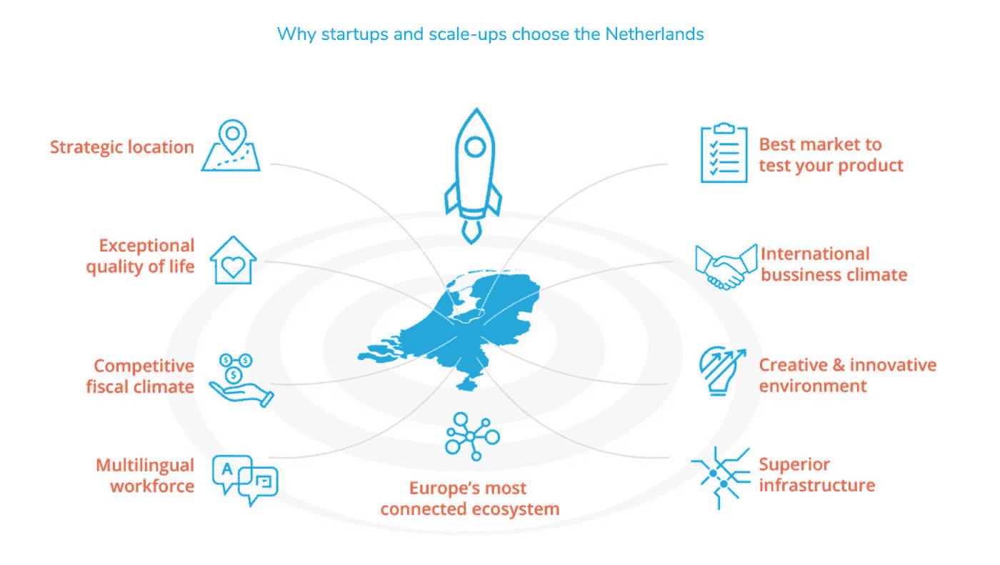
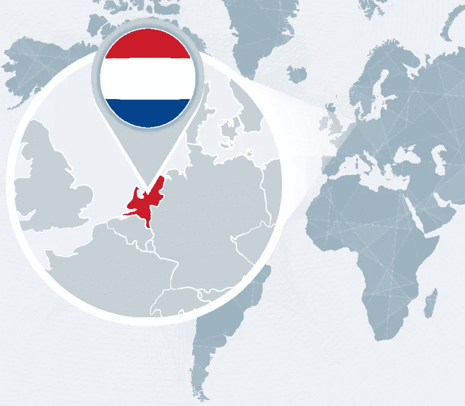
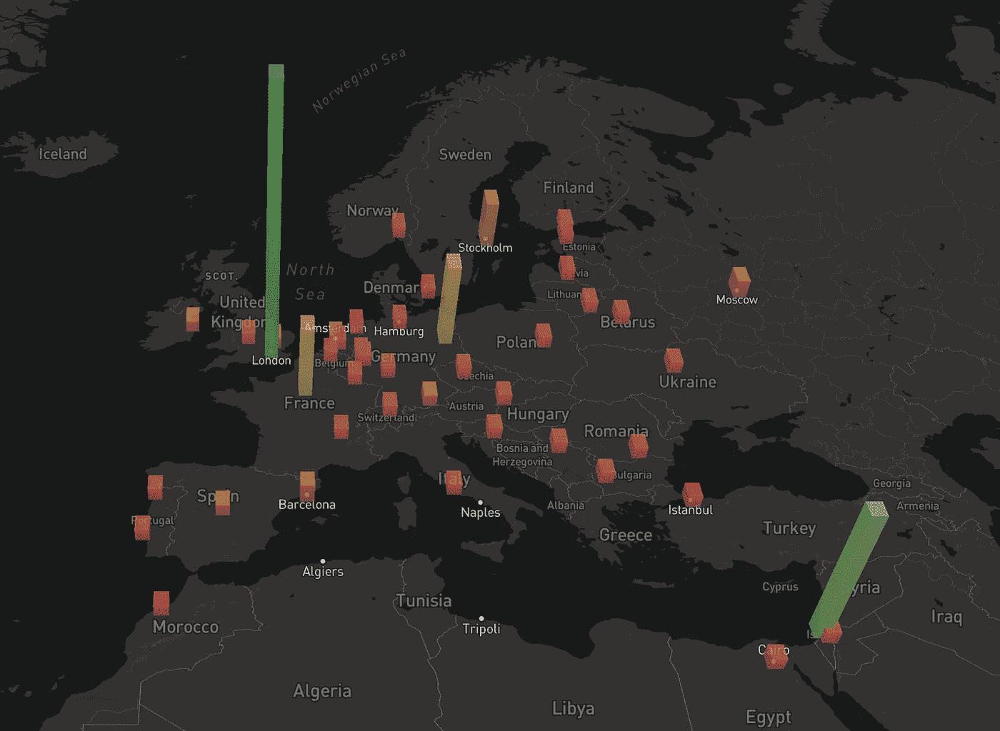

# 荷兰是创业公司理想目的地的 10 个理由

> 原文：<https://medium.com/swlh/10-reasons-the-netherlands-is-a-great-destination-for-startups-6a8f9e93398d>

“硅运河”是下一个硅谷吗？

[Zoku’s](https://livezoku.com/) Innovative Co-Living, Co-Working, and Community Building for business travelers and digital nomads.

荷兰因许多事物而闻名:自行车、平等权利、电子音乐、奶酪、风车、煎饼、雨水、喜力啤酒、大麻……(我可以继续下去)。这是一个很棒的地方，但很少有人知道这个国家也是创业公司的热门中心。这里有许多加速器、孵化器和合作空间——所有这些都为国际企业和公民提供了一个友好的环境。

在我作为外籍人士周游世界的 15 年中，我至少回过荷兰 6 次。请允许我与你们分享是什么让这个国家成为全球企业、企业家和技术工人的竞争目的地。

# 为什么荷兰对企业和创业公司如此有吸引力？

Photo: [StartupDelta](https://www.startupdelta.org/why-the-netherlands/)

荷兰在许多全球指数上一直排名靠前——从最快的网速到生活质量、安全和总体幸福度。无论如何，这都是一个令人愉快的居住地，但有几个因素特别吸引国际科技初创公司和公司。这些帮助它赢得了欧盟[排名第一](http://www.europeandigitalforum.eu/index.php/component/attachments/attachments?id=311&task=view)的创业商业环境。

# 多样化的全球人口

荷兰是一个开放、进步的社会，拥有多元化的劳动力，支持创造力和创新。在荷兰社会，五分之一的人父母出生在国外。阿姆斯特丹市庆祝并认可不同国籍的居民。

# 说英语的

90%的荷兰居民说英语，许多人会多种语言。

# 荷兰创业签证

政府为想要在荷兰创业的非欧盟/欧洲经济区公民创造了荷兰创业签证。它给初露头角的企业家一年时间来启动他们的商业想法，并可以选择再延续一年。雄心勃勃的创业行动计划也支持创业。

# 技术移民签证

这种针对高技能非欧盟移民的快速移民流程对工人和雇主都有好处。

# 启动三角洲任务

由前政治家 Neelie Kroes 创建的[创业公司 Delta](https://www.startupdelta.org/about-startupdelta/startupdelta/) 旨在“将荷兰的创业生态系统合并成一个单一的互联枢纽，消除障碍，并改善人才、资本、网络、知识和市场的准入。”

**通俗地说这是什么意思？**他们想为荷兰的创业公司“铺路”。根据我在阿姆斯特丹 60 多个[合作空间中的一些研究](https://www.travelingwithkristin.com/digital-nomad-blog/2018/11/4/unique-co-working-spaces-to-explore-in-amsterdam)，Startup Delta initiatives 直接负责支持和发展整个国家的创业文化。

# 税收激励

除了提供公司可以长期依赖的明确性和确定性，荷兰政府还提供有竞争力的税收减免、报销和津贴。额外津贴包括研发和创新的有效公司税率低至 5%。

# 基础设施和连接

任何从事国际商业的人都知道，发展中国家的低劳动力和运营成本往往伴随着权衡取舍——尤其是在可靠的基础设施方面。相反，荷兰以其优秀的交通和电信网络而闻名，这使得做生意更快更容易。该国拥有欧洲最高的宽带速度，甚至是蓝牙和 WiFi 的发源地。

# 强劲的经济

荷兰位列全球最具竞争力经济体前五名，这是不言而喻的。

# 稳定的政治局势

荷兰是一个实用、民主、守法的社会，倾向于为商业运营创造一个安全的环境。众所周知，荷兰人努力在重要问题上达成共识，并为其公民提供强大的社会服务，促进了更多的安全。

# 最佳位置

荷兰位于德国、比利时和北海之间，是到达欧洲和全球任何地方的理想之地。鹿特丹港也是世界上最大的港口。

Photo: Adobe Stock

> 荷兰的互联网普及率为 95.5%。从政策角度来看，该国在改善和发展企业家生态系统所需的所有指标方面，都处于欧洲数字创业规模的前列。—Coworker.com

# **荷兰有多少家创业公司？**

Angel.co 的[网站](https://angel.co/netherlands)目前列出了 360 万美元的平均估值和 6.6 万美元的平均薪资，有 3325 家公司、3098 名投资者和 818 个工作机会。

 [## 荷兰创业公司

### 浏览荷兰 3，325 家创业公司，3，098 位荷兰天使投资人，818 个创业职位。

angel.co](https://angel.co/netherlands) 

相比之下，法国的平均估值为 330 万美元，平均薪资为 6 万美元，拥有 5826 家公司、3149 名投资者和 1428 份工作。

Check out [3 of the top co-working spaces in Amsterdam](https://youtu.be/lbfkzhlzyMI), including Zoku Coliving

# 经费呢？

Distribution of VC Funding Throughout Europe — Photo: Pieter Levels of [NomadList](https://nomadlist.com/)

因为荷兰是一个很小的国家，获得足够的资金一直是一个障碍。由于选择有限，众筹或面向个人投资者是两种主要的融资方式。尽管这可能对创业经济不利，但在 2018 年及以后，现在[全球的企业家和独立制作人有很多方法来筹集种子资金](https://www.inc.com/lisa-calhoun/new-ways-to-raise-money-in-2018.html)。总的来说，荷兰仍然是小公司在搬迁到伦敦等中心进行下一步增长模式之前起步的好地方。

值得注意的是，荷兰对另一端的公司也很有吸引力，比如谷歌、优步和亚马逊。英国退出欧盟进一步增强了该国对希望从英国迁走的各种规模公司的吸引力。

# 这对你来说意味着什么？

Photo: Zoku Amsterdam

巴黎和伦敦仍然是欧洲风投资金的主要来源，但荷兰的商业友好型税收政策、说英语的人口、创业计划和高质量的生活对公司、企业家和寻找家园的数字游民来说极具吸引力。

像中国和印度这样的新兴经济体已经众所周知，数百家公司最近在荷兰设立了办事处。

> “荷兰有许多优势，包括它的中心地理位置、优良的基础设施和强大的劳动力。在西欧背景下，员工极具竞争力。”IBM 商业服务部的 Roel Spee

有兴趣将自己或公司搬到荷兰吗？在阿姆斯特丹的“欧洲创业和科技中心”找到更多信息

# 你曾经在荷兰生活或工作过吗？你的体验如何？请在评论中告诉我。

# 您可能还喜欢:

 [## 这个世界需要更多像 Zoku 这样的创新居住空间

### 从外面看，Zoku 就像是阿姆斯特丹市中心郊区的又一座灰色建筑。但是走进去…

medium.com](/@kristinmwilson/the-world-needs-more-innovative-coliving-spaces-like-zoku-4ef98685433e)  [## 在阿姆斯特丹探索独特的合作空间

### 全球数字游民面临的两大挑战包括(1)找到可靠的 WiFi 和(2)工作空间…

www.travelingwithkristin.com](https://www.travelingwithkristin.com/digital-nomad-blog/2018/11/4/unique-co-working-spaces-to-explore-in-amsterdam) 

[***克里斯汀·威尔森***](https://www.travelingwithkristin.com/about-1/) *通过她的两家* [*搬迁公司*](http://www.pokerrefugees.com/) *已经帮助超过 1000 人搬迁到> 25 个国家。*

她现在也是一名作家和演说家，她教人们如何在数字游牧生活方式中获得成功，并帮助公司为其员工准备远程工作任务。了解更多 [*此处*](https://www.travelingwithkristin.com/speaking-workshops/) *。*

## 这篇文章发表在 [The Startup](https://medium.com/swlh) 上，这是 Medium 最大的创业刊物，拥有+388，268 名读者。

## 在这里订阅接收[我们的头条新闻](http://growthsupply.com/the-startup-newsletter/)。

