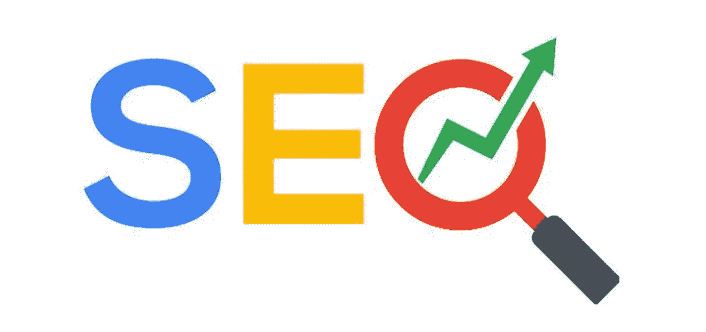
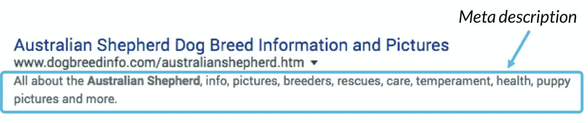

# 2018 年你可能还会相信的 10 个 SEO 童话

> 原文：<https://medium.com/swlh/10-seo-fairy-tales-you-might-still-believe-in-2018-32711ad08268>

SEO 可能是数字营销中最有争议的话题。虽然这个行业在不断发展，但某些观念和坏习惯似乎还在。保持这样的信念会让你的企业付出巨大的代价，同时让你抓耳挠腮，不知道哪里出了问题。以下是你可能仍然相信的 10 大误区:

# **1。有一个灵丹妙药**

伟大的 SEO 应该被认为是一种关系。没有单一的策略、技巧、提示或黑客能保证长期成功。虽然某些事情比其他事情更重要，但没有灵丹妙药。如果你的网站充斥着浅薄无用的内容，拥有世界上最快的网站也不会有多大帮助。

有超过 200 个不同的排名因素和 10，000 个信号，像谷歌这样的搜索引擎用来确定排名。追求所有人通常和追求其中一个人一样糟糕。相反，保持最有影响力和最相关的事情之间的平衡(并把它们做好)通常会让你走完 95%的路程。

# **2。我将因重复内容而受到处罚**

在 SEO 的历史上从来没有过这样的惩罚。如果你花一点时间想想有多少相似的，重复使用的，切割的和回收的内容存在，你会很快理解这样的任务对谷歌来说是多么的无意义。然而，没有因为重复的内容而受到惩罚并不等同于因为重复的内容而受到奖励。虽然从另一个网站复制/粘贴内容不会损害你的搜索引擎优化，但谷歌不会简单地显示相同查询的结果。

# **3。商品广告将有助于有机排名**

这两件事不仅互不相干，而且被谷歌视为两个独立的实体。谷歌通过向用户提供最相关的内容，同时尽可能多地从广告商那里获得收入，从而保持了十亿美元公司的地位。从长远来看，允许一个内容糟糕、排名在第 84 页的广告客户通过购买进入第一页对商业没有好处。大规模重复这样的事情最终会导致谷歌失去大量的市场份额。

# **4。我知道我的产品&不需要做关键词研究**

有这样的心态会导致对用户意图的误解，这是很多人都会陷入的陷阱。例如:如果你是卖牙膏的，你可能想对清洁牙齿和刷牙等术语进行排名。然而，很有可能完全漏掉长尾词，比如“避免蛀牙”和其他几十个你可能忘记的相关查询。犯这样的错误会让你的品牌对许多潜在客户隐藏起来。

# **5。我必须像感恩节火鸡一样塞满我的关键词**

在过去的 SEO 时代，blackhat 的营销人员经常会在页面的页脚插入同一个关键词数百次，以此来欺骗系统。然而，自那以后，谷歌变得聪明多了。今天，它的算法优先考虑有用和自然的人类语言，而不是关键字填充。当然，你应该在文章中多次使用你的目标关键词，但是过度使用只会导致愤怒的读者的跳出率更高。

# **6。拿到反向链接就够了**

来自合法的、非垃圾网站的高质量链接对于伟大的 SEO 仍然非常重要。有一个巨大的可信网站链接回你可以在流量上产生巨大的差异。虽然只有反向链接将提供价值，这是不够的。你必须确保链接回你的任何页面都有与你的页面相似的关键词，以显示与谷歌的相关性。

# **7。我必须向搜索引擎提交我的网站**

虽然这在过去是正确的，但是今天当一个网站被创建时，这个过程是自动的。有些时候，你应该提交链接，例如当你更新内容或当你看到一个入站链接不显示。然而，这些情况是相当率，我从来没有见过他们没有得到解决自己。

# **8。元描述无关紧要**

meta 标签是标题下的一个小广告，允许你在搜索结果中描述你的页面。自 2009 年以来，元标签已经不再是一个技术排名因素，今天谷歌将自动为你生成一个元描述。然而，如果自动生成的描述对搜索者没有吸引力，他们可能会认为你的网站不相关。因此，虽然不是一个技术排名因素，但一个精心制作的元描述绝对是 SEO 要考虑的显示因素。

# **9。社交对 SEO 来说是浪费时间**

虽然在社交媒体上大肆发帖不会给你带来多少反向链接，但这是谷歌肯定会考虑的一个因素。此外，由于流行的社交媒体网站具有极高的权威性，它们会出现在任何搜索你公司的人的搜索结果中(通常在任何竞争对手或其他网站之前)。这给了你更多的房地产，并把注意力从可能排在你旁边的潜在竞争对手身上转移开。

# **10。他们做，我也要做！**

我们喜欢相信，因为一家公司大而成功，所以他们做的每件事都是对的，但事实往往并非如此。他们可能很大，很成功，但是在明目张胆地偷东西之前，他们会问自己以下问题。

A)他们正在进行的是 A/B 测试吗？
b)这对我的业务真的有意义吗？
c)我是否可以访问他们的分析，看看这对他们是否有用？

公司一直都在进行测试。有些有效，有些无效。不要因为有人比你大就放弃你的策略。取而代之的是，找到对你的访问者有效的方法，并进行控制实验来优化你的成功之路。

*如果你在 SEO 方面有任何问题或者需要帮助，* [*给我发消息*](https://www.linkedin.com/in/daniel-elias-09a93550/) *。*

## 这篇文章发表在 [The Startup](https://medium.com/swlh) 上，这是 Medium 最大的创业刊物，拥有+386，297 名读者。

## 在这里订阅接收[我们的头条新闻](http://growthsupply.com/the-startup-newsletter/)。

