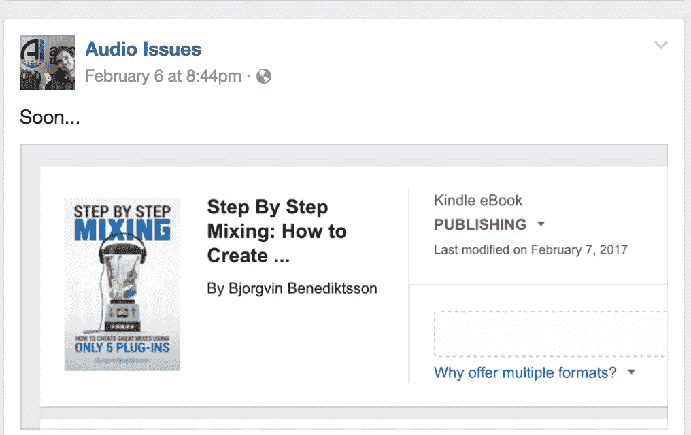
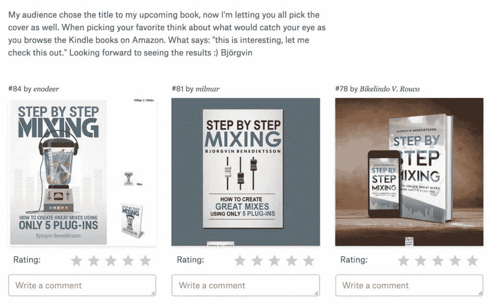
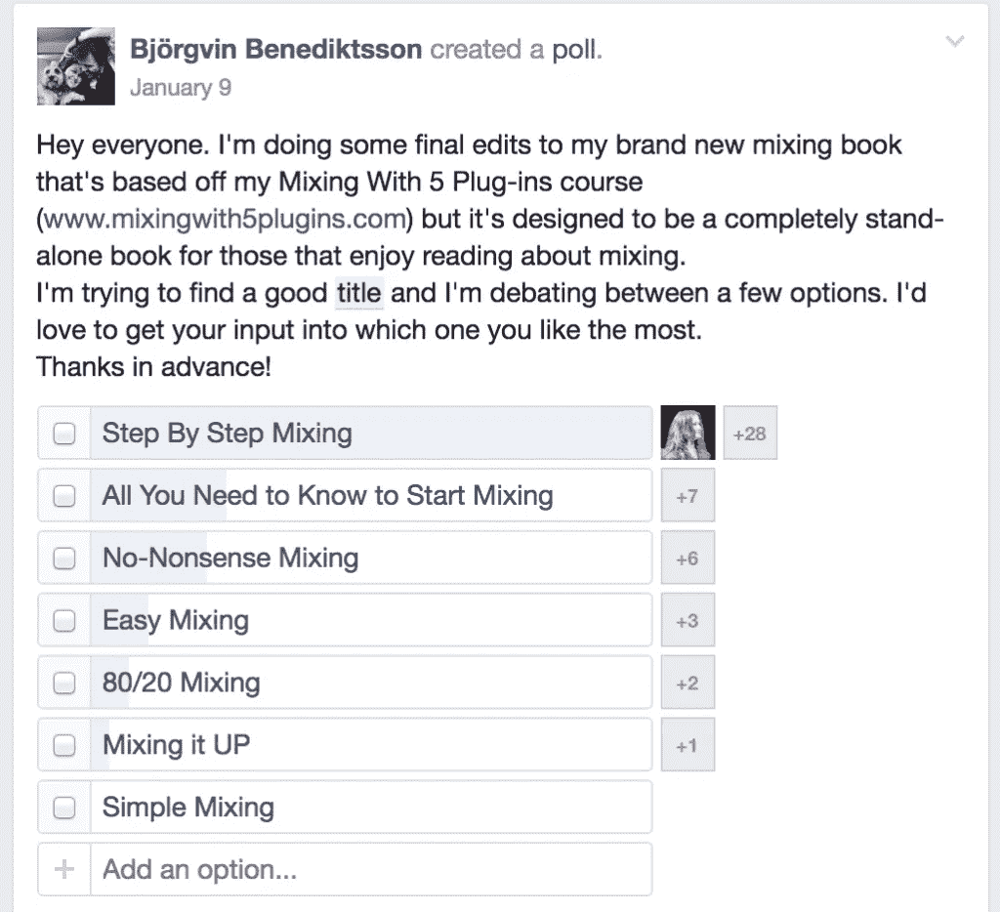
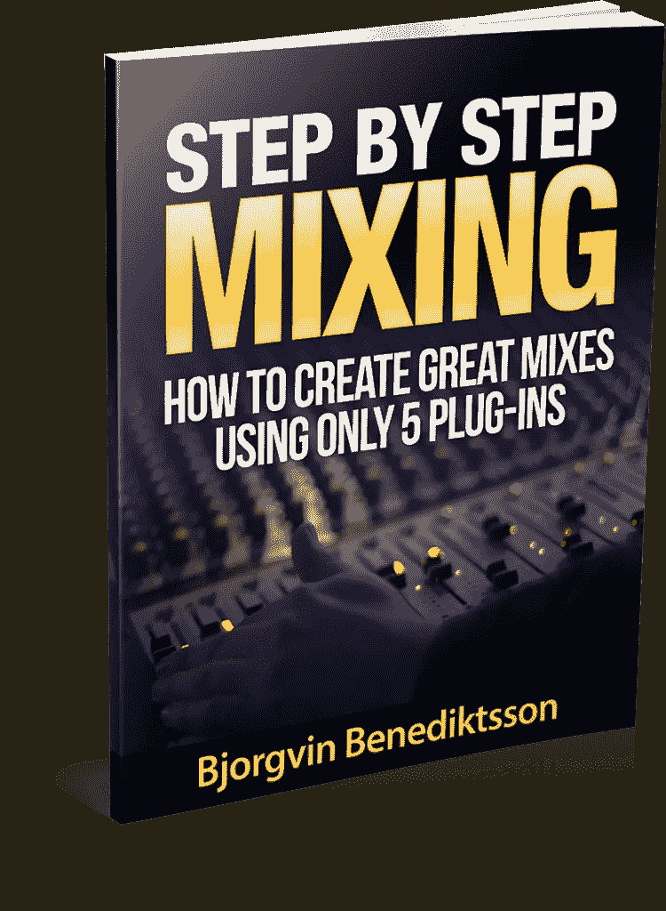
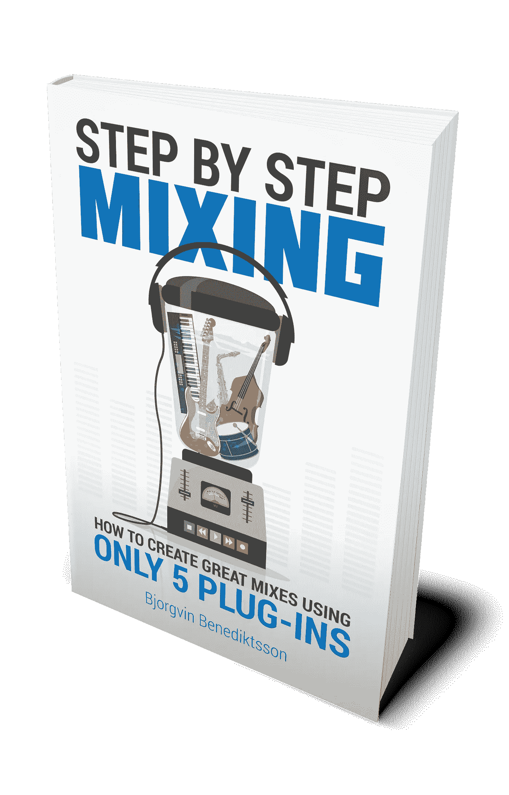

# 我从推出亚马逊“畅销书”中学到的 10 件事

> 原文：<https://medium.com/swlh/10-things-i-learned-from-launching-an-amazon-best-seller-53d79baac732>

事实证明，尽管你会有成就感，但这没什么大不了的。

如果你曾经想过在 Kindle 平台上推出一本书，让我告诉你一点我的经历。

2017 年 2 月，我在亚马逊上发布了我的第二部 Kindle 电子书。在大约 24 小时内，它冲击了该类别的三个畅销书排行榜，这让我很高兴，因为我给自己设定了一个冲击第一的目标，没有什么比达到你为自己设定的[目标的感觉更好了。](http://www.bbenediktsson.com/10-step-process-reaching-big-goals/)

在整个过程中，我学到了很多东西，我相信你可以从中受益，所以这篇文章献给任何想在亚马逊 Kindle 平台上发布一本书的人。

# 1.畅销书并不意味着成千上万的拷贝和名声

成为你所在类别的畅销书并没有你想象的那么难。亚马逊通过类别缩小范围的方式意味着你不是在和亚马逊上的每一本书竞争，而是和你的主题差不多的书。

所以在小池子里竞争有助于你的排名。成为畅销书仅仅意味着你的书在一段时间内的销量超过了该类别中的任何一本书。

但这也是拥有小众观众的好处。

无论如何，你不应该迎合所有人，拥有一个非常特定的、狭窄的、热爱你的作品的观众比迎合大众更重要。

在最初的发行周，我卖出了 300 多本，我觉得这太棒了。它超过了我给自己的预期销售额(基于我的受众规模和我的电子邮件列表)，所以我认为它是成功的。

# 2.在你发布之前创造前期轰动效应

如果你有读者，确保他们知道你要出新书了。制造轰动和期待会让你的读者兴奋起来，并准备好在书最终出版时支持你。

我用几种方法做到了这一点:

*   在博客文章中顺便提到了这个项目。
*   分享给我的听众的电子邮件中的章节摘录。
*   在社交媒体上发布挑逗图片。

Teaser Facebook post as I was getting ready to launch the book.

如果你有一群关注你的观众，确保你对自己在做什么以及如何帮助他们保持透明。

这就引出了我的第三点。

# 3.让你的观众参与进来

我的读者不仅通过投票选择了书名，还选择了封面。

My audience picked between these three covers.

Step By Step Mixing won by a landslide.

让我的读者参与这两件事的决策不仅帮助我更好地理解他们，而且也让他们对这本书的成功拥有一些精神上的所有权。

你的读者也可以通过在亚马逊上评论你的书来帮助你，提高它的可信度，并给它社会证明。幸运的是，我的读者真的很喜欢我的书，所以他们给了我很好的评价；我不建议强迫他们给你任何不带偏见的评论(或者如果他们讨厌你的书，最多希望他们不要评论你的书)。

# 4.获得好的设计

我发行的上一本书《获得更多演出》的封面还不错。这并不惊人，但也远不可怕。我利用我的好友妮莎来设计封面以获得更多的演出机会，他为我设计了所有的铅磁铁封面。

然而，当他为《一步一步的混音》做最初的封面时，我改变了主意，决定花额外的钱买一个由 99 Designs 设计的很棒的封面。

我完全相信这个决定最终得到了回报，因为我不可能从 Fiverr 上的设计师那里得到这样一个原创设计。

Fiverr Cover

Clever 99 Designs Cover

# 5.这个标题非常重要

从营销的角度来看，标题和封面非常重要。这是潜在客户看到的两样东西。如果封面激发了好奇心，标题向他们展示了阅读你的书会给他们带来的好处，你就更有可能得到一个客户。

花时间集思广益出好书名*和*让你的读者参与决策过程绝对有助于我的书的销售。

# 6.使用亚马逊链接获得额外佣金

如果你只在亚马逊上发布电子书，价格在 2.99 美元到 9.99 美元之间，你就有资格在他们的平台上作为作者获得 70%的版税。

然而，如果你使用自己的 Amazon Associates 链接从自己的书籍中获得佣金，你可以将版税提高到 75%。每当我把某人推荐到亚马逊，我就可以创建一个跟踪链接，监控他们买了什么。然后，我可以获得销售额的 4-6 %,无需客户支付额外费用。

在我自己的书上使用这种策略意味着，每次我让我的读者参考我的书，除了版税之外，我还会从我的销售中获得额外的佣金。

要成为亚马逊会员，[只需进入他们的网站](http://amzn.to/2kFG0AW)(会员链接)，滚动到底部，点击成为会员。

# 7.使用 Genius 链接

另一件人们在向人们推荐亚马逊时没有想到的事情是，根据你所在的国家，有多个亚马逊网站。

从技术上讲，加拿大的 Amazon.ca 与美国的 Amazon 是分开的。Amazon.co.uk 和亚马逊意大利也是如此。

因此，如果你通过亚马逊的会员链接推荐人们，而他们在不同的亚马逊平台上购买任何东西，你就不会得到佣金。

除非你的网站上安装了 [Genius links](http://geni.us/) 。Genius 链接根据客户所在的地理区域将他们推荐到正确的亚马逊商店。如果他们购买你的电子书，你仍然会得到佣金。

# 8.获取测试版读者

我问我以前的客户的一个核心小组，他们是否愿意通读这本书的最终手稿给我反馈。

作为交换，一旦这本书出版，他们将得到最终版本。这非常有帮助，因为他们都有一些很好的评论，改善了这本书，他们甚至发现了一些我和我的编辑都没有发现的小错误。

# 9.创建专门的销售页面

尽管你可以用 HTML 广泛地定制你的亚马逊列表，你的亚马逊销售页面看起来仍然像一个亚马逊页面。这意味着它充满了干扰，链接到其他类别和竞争的书籍。

通过拥有一个链接到亚马逊页面的[专用销售页面](http://www.stepbystepmixing.com)，你可以完全定制读者感知你的报价的方式。这是屏幕上唯一的优惠，你可以添加任何你喜欢的设计元素、推荐和图片。

这样，一旦他们最终点击进入亚马逊，我希望他们会承诺购买我的书，而不仅仅是浏览亚马逊。

# 10.发布后继续销售

我尽可能地专注于建立我的邮件列表。我送出一堆免费的东西，我的[自动电子邮件活动](http://www.bbenediktsson.com/10-steps-create-email-product-funnel/)真的帮助我向我的观众传递价值，而不需要我花费不必要的时间。这是一个很好的“一劳永逸”的场景。

因此，为了在我的初始发布期结束后保持销售，我增加了一个小小的行动号召，让每个新订户在亚马逊上查看这本书。对于那些想更多了解这个主题的人来说，这是一个简单、低成本的购买方式，而且亚马逊的列表充满了很好的评论、可信度和社会证明，这也很有帮助。

当我专注于我的其他业务和写我的下一本书时，这有助于保持销售的自动运行。

# 结论

这些是我从最近的新书发布会中学到的十条最重要的经验，我希望在我的下一次发布会上能够借鉴这些经验。

我希望这篇文章对考虑投身自助出版的你有所帮助。如果你在这方面需要帮助，请不要犹豫，马上告诉我。

## 这篇文章发表在 [The Startup](https://medium.com/swlh) 上，这是 Medium 最大的创业刊物，有 344，974+人关注。

## 在这里订阅接收[我们的头条新闻](http://growthsupply.com/the-startup-newsletter/)。

