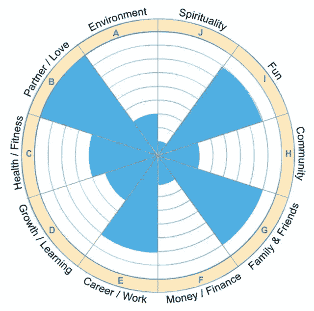
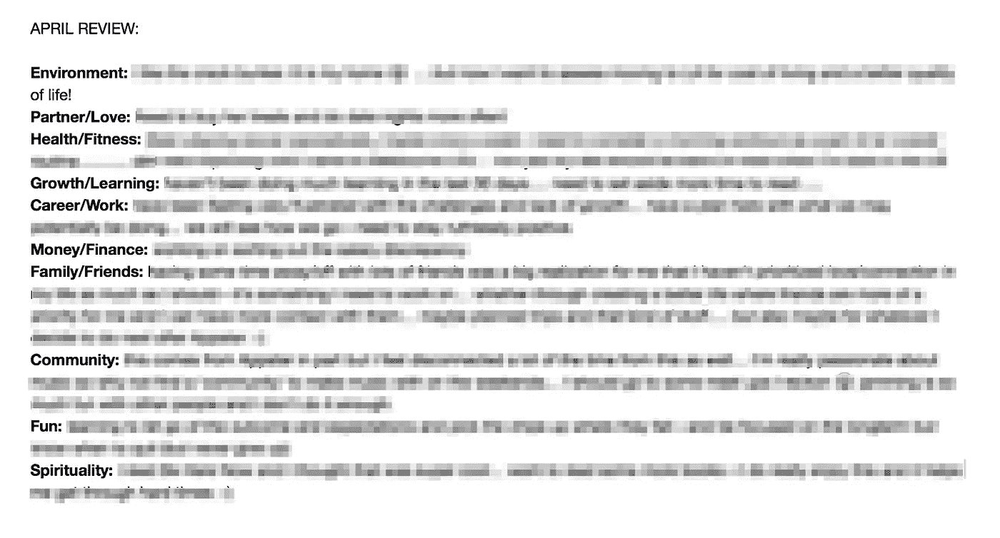

# 10 件能帮助你开始过上令人惊讶的充实生活的事情

> 原文：<https://medium.com/swlh/10-things-that-will-help-you-start-living-a-surprisingly-fulfilling-life-2acd7dd426e7>

## A.又名《如何快乐》

## 生活中真正快乐的条件是什么？

这个问题困扰了我一生，甚至在我还是个孩子的时候。

我花了很多精力追求“满足感”或“快乐感”。

我有过高潮——和我的公司一起取得了巨大的成就。

但我也有过严重的低谷——事情并不总是按照我的预期发展，我陷入了抑郁…

幸运的是，我非常感激我在这一路上学到的东西。

## 那么，怎样才能开始过上令人难以置信的充实生活呢？

钱是答案吗？爱情呢？成就？灵性？家人和朋友？

¯\_(ツ)_/¯

我学到的是没有“一个”的东西。它实际上是会让你快乐的“事物”的组合。没有一件事是足够的。

但是所有这些‘事情’中有一件事(你还在我身边吗？)的共同点是你需要感觉自己在成长。

如果我可以总结一下:

> 成长=幸福

我真的相信，如果你没有成长，你会感到某种程度的不满足。

但事实远不止如此。

# **生命之轮……**

an example Wheel of Life

“生命之轮”是一个非常简单的系统，我用它来有条不紊地提高我的整体生活幸福感。

是的——这有点书呆子气&绝对是各种各样的俗气——但是……它很有效。

每月一次，我在这些方面给自己打满分——然后努力让每个方面都达到 10 分。

# “生命之轮”的 10 个领域:

**环境**:你居住的地方(地点)，你消磨时间的地方(客厅、卧室、火车等)，你工作的地方

伴侣/爱人:你的另一半

**健康/健身:**饮食、锻炼、身材*(这个我真的很烂)*

**成长/学习:**你是如何学习的，读书，看某个话题的视频，向导师学习，上大学等等*(这个我是真的很擅长:p)*

职业/工作:你的工作、职业、项目、你正在努力的事情

**金钱/财务:**你的工资、投资、任何被动收入、任何与财务相关的东西

家人/朋友:T 他的这个很好解释；)

**社区:**你参加了哪些团体/社区？运动队？教堂？兴趣小组？Meetup 非常适合寻找这样的社区。

**乐趣**:有时这与和朋友家人共度时光是一致的，但爱好、电子游戏、去酒吧等*(我有时也不擅长这个)*

**灵性:**你的内心世界。内心的平静，你与上帝的联系。希望，信念，乐观。*(这是一个我时常纠结的问题)*

Meet Bob.

# **固定一个区域的例子:**

也许在你的第一次“生命之轮”回顾中，你给自己的环境评分是 5/10。你有这种感觉是因为你的“环境”(你住的地方)不适合你，而且因为你不收拾干净，感觉不到家的感觉。

解决方法:选择一个新的生活环境，也许对你来说这意味着你需要搬出去。保持地方干净*(很难做到，尤其是对我们这些千禧一代)*。扔掉 90%你从不使用的东西。

*(环境是我 18 岁时要解决的一个问题——我必须搬出父母的房子，这样我才能更专注于实现我的目标——这意味着我要走出舒适区，从郊区搬到城市！)*

## 这是我上个月的《生命之轮》回顾的截图:

*(我用 Evernote，复制粘贴上个月的回顾，改写为当月。这让我可以根据过去几个月的回顾来看看自己是否取得了进步。*

我也用这个工具给自己一个生命之轮的视觉呈现:[https://www.mindtools.com/pages/article/newHTE_93.htm](https://www.mindtools.com/pages/article/newHTE_93.htm)

My April 2017 Review using the ‘Wheel of Life’

坚持每月回顾一次你的“生命之轮”真的很有用。

为什么？

因为很容易陷入常规，变得非常不满意，却不知道为什么。

这个系统帮助你不断回顾你的生活，并且每月明确你需要集中精力改善的地方。

试试看！

只要稍微集中注意力，你就会惊讶于它对你生活的影响。

***—约西亚·汉弗莱***

*P.S. BTW…仅仅因为我使用这个系统并不意味着我在某些方面不完全糟糕*🙌🏼🙌🏼🙌🏼我从未接近过满分，你会发现有些东西会随着你的生活状况逐月下降或上升。

重要的是开始行动，并意识到实现是一段旅程，而且永远都是

> **感谢阅读！如果你喜欢这篇文章，可以随意推荐，帮助别人找到。**

