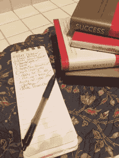
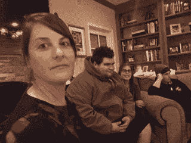
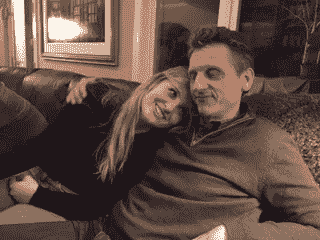
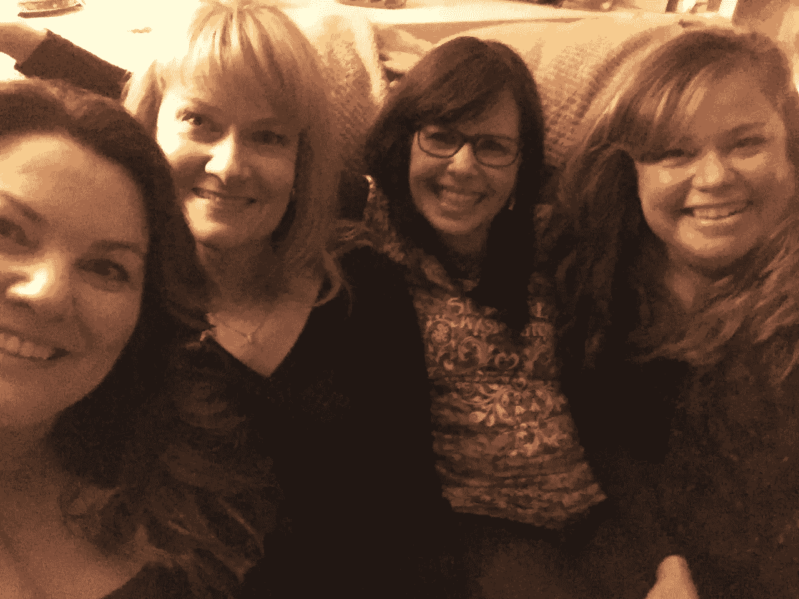

# 成功必须做的 10 件事

> 原文：<https://medium.com/swlh/10-things-you-must-do-for-success-7d751e6a014d>

My To Do List

在过去的两周里，我一直在放寒假，明天我将回到我的教室。今晚，当我回顾过去的几周，我可以说我的假期充满了成功。

我们每个人对成功的定义都不一样。当我审视和思考成功意味着什么时，我经常用我一天或几周内的“胜利”来看待它，就像我上面提到的那样。

在 Jena Pincott 的《成功》一书中，她写道:

> “成功人士——发现自己受到鼓励——强烈鼓励谈论他们的经历，提出建议并知道如何去做。”

我可以谦恭地告诉你，我今天过得很成功，我在生活中也取得了成功，但我不能说我会是那个需要帮助的人，也不能说我是成功专家。但是为了这篇文章，我将分享我是如何定义我的寒假是成功的。

我假期做的第一件事，就是和家人共度圣诞节。没有什么比被我们爱的人包围更让我们感到被认可了。我得到了爱，分享了爱，享受了和他们在一起的时光。

几天后，我在家里设宴招待了三个最要好的朋友。这些女士已经在我的生活中 48 年了。我们共度了一夜，分享了一顿饭，许多回忆充满了笑声。眼泪来的那种笑。我们分享了快乐的时光和痛苦的时光。但最重要的是，我们庆祝了我们的友谊，这种友谊几乎涵盖了我们一生的时间。我确实感到很富有。我对我们年轻时形成的纽带充满感激，这种纽带今天依然存在。

作家、医学博士、乔普拉中心首席执行官狄巴克·乔布拉说:

> “对我来说，成功就是拥有爱和同情的能力。这是一种体验快乐并将其传播给他人的能力。这是知道你的生活有意义和目标的安全感。”

是的，我感受到了这些关系的成功，我庆祝了这个圣诞节。

经过几天的休息，遛狗，阅读，看圣诞电影，和我女儿出去玩，我知道时候到了。是时候学习一些新的东西，面对我的恐惧，做一些我一直想做的事情了。

# ***写！！***

几年前，我发现了 Pinterest 和博客。我想我应该创建自己的博客。我喜欢写作。但我做了我最擅长的。

我屈服于恐惧。我找了借口。最重要的是我拖延了。但是这个假期会不一样。我定下了创建博客的目标，并开始写作。

我研究了如何建立一个博客，我尝试了…

我成功了！！我为自己感到骄傲。

你可以在我的新博客“生命的祝福”上找到我。http://lifesblessings.net/在我的第一篇文章中，我分享了我的写作故事。为了更多的曝光，我也在 Medium 上发表在这里。(我希望得到您的反馈，请订阅我的博客或点击“关注”按钮，在这里关注我。还有如果你喜欢，别忘了鼓掌！)

我不得不告诉你，第一次点击发布按钮的时候很害怕。但是，我也发现了我对写作的热情。当我写作时，我内心的感受是一种充满我灵魂的快乐。

我知道我在出版我的作品方面是新手。然而，我成功了，因为我不再把我写的东西藏在日记里，多年后被人发现。我冒险出版了我的作品。对我来说，这就是成功！它给了我生活的目标。它填补了一个创造性的空白。

是的，我想建立一个读者群，我知道这需要时间。但是今天，我可以说我是成功的，因为我在写作，而你在阅读！

我在休息时间读了很多书。我在媒体上读过作家的书和文章。我已经学会了成功的步骤和技巧。我将与你分享我所学到的，也许你会像我一样受到启发。

1.  为自己定义成功对你意味着什么。对我来说，这意味着在我的生活中有爱和目标。这也意味着解决我的恐惧，一天一天地克服它们。
2.  找到你的激情。对我来说，我的热情一直是教你的孩子。但是对于我的创造力来说，写作是我的激情所在。
3.  开始吧！我一直想成为一名作家。现在我可以说我是。我写作并出版我的作品。
4.  设定目标。现在我已经开始了我的写作生涯，我需要设定目标。我选择每天写作，每周至少发表 4 篇文章。如果不是更多。
5.  宣传你的目标。通过告诉你我所有的意图，我建立了责任感。(*)至少我的家人和朋友正在读这篇文章！)*
6.  好好努力！我会继续努力写作。我每天都致力于此！这将有助于我继续提高。
7.  自我教育。我不知道如何写博客，我还在学习。我在做教程，阅读，并把我学到的东西付诸实践。
8.  保持无畏！对我来说，没有回头路。我已经到了无法回头的地步。每次我发表文章，是的，我都会有点紧张，但我不会因此而停止。
9.  保持决心。坚持到底。战胜挫折。我阅读和观看的关于建立博客的教程应该只花我 10-15 分钟。我不是技术人员。我独自一人，我是新手。但是我坚持了下来，4 个小时后，我的博客就开始运行了，我的第一篇文章也写好并发表了。我还有很多东西要学，但我决心继续下去。
10.  重新定义成功。成功会改变。我今天的目标，明天会有些不同。重新定义每天决定你成功的因素。我已经成为了一个列表制作人。为我的一天设定目标，把它们写下来，想象它们，为它们祈祷，祈求上帝一路帮助我。这些事情都有助于我成功地检查我的“待办事项”清单，并度过成功的一天。

## 这个故事发表在 [The Startup](https://medium.com/swlh) 上，这是 Medium 最大的创业刊物，有 295，232+人关注。

## 订阅接收[我们的头条](http://growthsupply.com/the-startup-newsletter/)。

