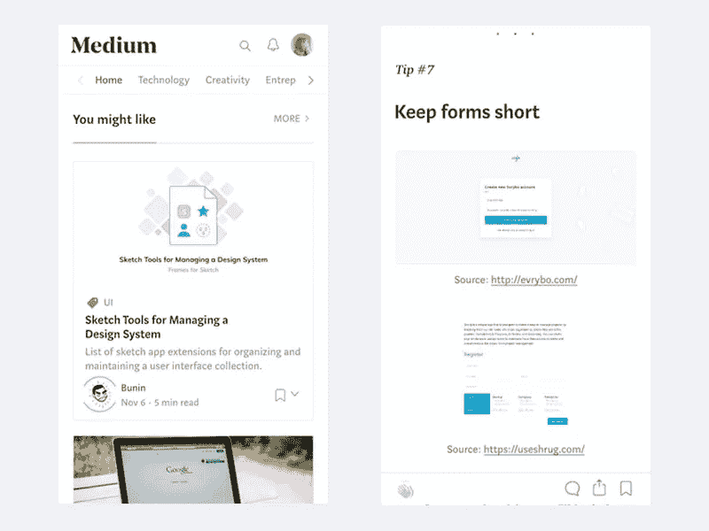

# 10 个有用的提示:如何让用户阅读你的网站

> 原文：<https://medium.com/swlh/10-useful-tips-how-to-make-users-read-your-website-691daaee8d42>

毫无疑问，网站的视觉呈现非常重要。布局、颜色、视觉效果和图标应该与你的视觉身份紧密联系在一起。

但是同样重要的是你的文案如何呈现，以及你的网站写作的语气和声音。

一份成功的拷贝是你的用户阅读的，对吗？如果用户不阅读，精心制作完美的文本又有什么意义呢？

# 用户浏览，他们不阅读。

没错，用户不会阅读你放在网页上的所有内容。实际上，[他们平均只读了 20%](https://www.nngroup.com/articles/how-little-do-users-read/)。用户读入一个 **F 模式**，寻找特定的单词和术语。他们也倾向于阅读条理清晰、短小精悍的文章。

# 让用户阅读在线内容

你现在已经知道用户会阅读你放在网页上的大约 20%的文本，所以你必须确保这一小部分是有价值的。

作为一个网站所有者、设计师或文案，你**应该“欺骗”你的用户阅读你的想法**。这里有一些如何做的建议。

# 使用短句

去掉长复合句。不要让用户阅读你的长期想法，因为你把他们的短期记忆推到了极限。如果你能用更少的字数说出同样的话，那就去做。

来源——截图来自 [Mozilla](https://www.mozilla.org/en-US/firefox/quantum/)

# 把重要信息放在第一位

用户确实会滚动，但这并不意味着他们会阅读。把最重要的信息放在折页上方，因为这是最有可能被阅读的地方。简明扼要的标题可以提供你希望用户阅读和记住的信息。

# 所有重要的东西都应该放在左边

优先考虑你的内容，把所有重要的放在左边。在最近的一项研究中，确定网页上 80%的注视点在页面的左半部分。

来源——截图来自 [Oculus](https://www.oculus.com/)

# 添加项目符号

与其用长篇大论来解释某件事，不如想想用更少的话来表达同样的想法。使用项目符号以简洁明了的方式组织内容。

来源——截图来自[数字海洋](https://www.digitalocean.com/)

# 层次分明

组织清晰者胜。粗体大标题抓住用户的注意力。使用简短的副标题来传达更多信息，使用粗体字来表示你希望用户注意到的内容。

# 在适当的时候使用图标

图标是少花钱多办事的好方法。添加图标以传达更多含义和/或强调特定部分。优秀的图标设计者可以用一个图标来讲述一个故事，所以要利用这一点。如果您需要解释数据，请尝试使用文本内容较少的信息图或图表。

来源——截图来自[亚历山大·卡法@Dribbble](https://dribbble.com/shots/2406438-Daily-UI-challenge-030-Pricing)

# 对比度很高

避免难以阅读的颜色组合。文本和背景之间的高对比度对易读性有积极的影响。避免在文本重要的地方使用纹理背景，以免影响字符识别。

# 移动用户也很重要

一些用户用他们的手机来挖掘和阅读信息。在设计网站时，请记住这个事实。组织标题和其他文本，以便在移动设备上轻松阅读。您可能需要增加字体大小和更大的行高来增强可读性。

# 小心选择字体

选择不会挑战用户的字体。不管你用的是衬线还是无衬线。Helvetica，Helvetica 新，开放桑斯和 Proxima Nova 是网页内容的流行字体选择，因为它们易于阅读，并在不同的屏幕上呈现。

来源——截图来自[传媒](/)

# 使用特定术语

特定的网站应该使用相关的术语。使用用户熟悉的术语。这将有助于理解你的书面内容。

# **总而言之**

所有的因素加起来就是一个网站的可用性。有话要说是不够的。你如何组织你的文本和视觉内容才具有影响力。

用户确实会阅读网页内容，尤其是当他们有兴趣了解更多内容的时候。用户登陆你的网站意味着对你的工作感兴趣。你有责任抓住他们的注意力，让他们对你提供的东西感到好奇。

**所以**:

*   有清晰的标题，允许用户浏览内容；
*   所有重要的东西都在页面的顶部；
*   使用要点来总结好处、特点或想法；
*   越短越好；
*   用图标多说；

**您的网站需要帮助吗？** [**联系我们现在就谈。**](https://webadviser.io/get-started)

*原载于*[*web adviser . io*](https://webadviser.io/services/web-innovation/10-useful-tips-how-to-make-users-read-your-website)*。*

## 这篇文章发表在《创业》上，258，400 多人聚集在一起阅读 Medium 关于创业的主要报道。

## 在这里订阅接收[我们的头条新闻](http://growthsupply.com/the-startup-newsletter/)。

