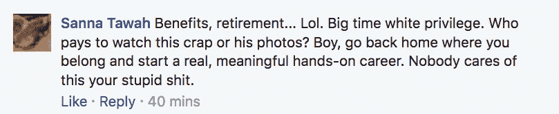
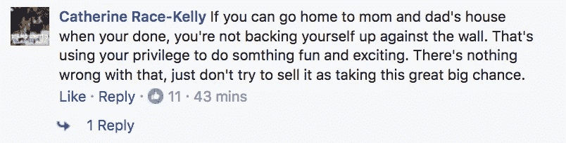

# 知道你会成功的 10 种方法

> 原文：<https://medium.com/swlh/10-ways-to-know-youre-going-to-be-successful-7da25607aa3>

Image via Pexels

“这真的有用吗？”

在过去的几个月里，我多次思考这个问题。我从两年前就想成为一名全职的网络博主，正如你所看到的，我一直坚持到现在。

大多数专家说，你至少需要等 3-4 年才能看到你在创业中的劳动成果。

> 就写博客而言，大多数人说，在你工作一年之前，你不会从你的工作中得到一分钱。在阅读了大量的博客后，我意识到这是一个非常乐观的数字。

但是你怎么知道这一切是否值得呢？除了对我们职业的热爱，全职收入不也是我们从事这项工作的目的吗？

> “我们拍电影不是为了赚钱，我们赚钱是为了拍更多的电影。”
> 
> —华特·迪士尼

在一天结束的时候，我们只想做我们喜欢的事情。此外，我们希望赚钱来专注于我们热爱的事情。

我们怎么知道它是否会成功？

> 成功意味着很多事情。对我来说，它只是意味着打破限制，全职做你喜欢的事情。

显然，帮助他人、照顾家庭、做一个正直的社会成员是其中的一部分，但现在我将严格从职业的角度来看待“成功”。

这里有几个迹象表明你正在走向伟大。

# 1.你已经在做书上告诉你要做的事情了

> “有时，你读了一本书，它让你充满了这种奇怪的福音主义热情，你变得确信，除非所有活着的人都读了这本书，否则破碎的世界永远不会恢复原状。”
> ――约翰·格林

前几天，我在读丹尼尔·迪皮亚扎的《20 多岁的富人》一书。在翻阅这部令人惊叹的作品时，我意识到了一些事情。

> 很明显，我已经做了很多他说年轻人应该做的事情。

我几乎想放下书给他打个电话，说“对吗？第 10 章的那部分在我身上发生了太多次了！”

我知道我还有很长的路要走，但如果我已经明白了一个百万富翁说我应该做的很多事情，那会让我感觉非常好。

很长时间以来，我一直照着他说的做。

> 听着，我们读书是为了找出能让我们变得更好的信息，但如果你已经在做一些出版作者说你应该做的事情，那就意味着你在模仿伟大。

你还需要多久才能实现自己的伟大？

# 2.你的故事和另一个成功人士相似

以丹尼尔为例，他自己曾经也是一名博客写手/自由职业者。在他的书中，他开始谈论他的博客吹嘘的一些数字，以及他花了多长时间达到这些数字。

他说，他的博客每月有大约 13，000 次访问，一度有 5，600 多名电子邮件订户。一年半后，他的电子邮件列表达到 50，000 个，并且每天增加 700-1，000 个新订户。

> 我在[研究生生存指南](https://medium.com/the-post-grad-survival-guide)中的数字非常相似。我们每月有 13，000+的浏览量，我的电子邮件列表接近 [2，000 人](https://findingtom.com/how-to-gain-email-subscribers-on-medium/)。我没有完全达到丹尼尔的数字，但至少已经很接近了。

这给了我很多肯定。

如果你的故事与在你的领域获得成功的其他人完全吻合，你就朝着伟大的目标前进。

> 我知道 10，000 电子邮件订户意味着你有一个 6 位数的业务，我也知道一些顶级博客每月的访问量超过 50，000 次。

一定要研究那些在你的领域获得成功的人。首先，我喜欢阅读来自[杰夫·高因斯](https://medium.com/u/b176436e91b1?source=post_page-----7da25607aa3--------------------------------)的材料。他在采访中对自己的数据非常开放，当我开始接近其中一些数据时，这让我感到很有说服力。

# 3.人们告诉你，你是一个灵感

> “如果你的行动激励其他人多做梦、多学习、多做事、多成才，你就是一个领导者。”
> 
> 约翰·昆西·亚当斯

两周前，一个高中毕业后就没联系过的朋友发短信给我。她说她要辞去工作，在纳什维尔全职专注于音乐(她是一个疯狂的好歌手)，我是她这样做的灵感。

我简直不敢相信。

> 我几乎想告诉她这一定是个误会，她实际上是被我的故事所鼓舞。因为她是如此令人惊叹的歌手，我保持沉默没有问题。我知道她会成功的。

我有很多人在同一时间给我发短信。我主演的《脸书》的一个视频在网上疯传，我的 40-50 个朋友把它分享给了他们的朋友。每个人都认为我“成功了”或什么的。

这是有趣的几天，但狂欢平息了，我又回到了正常的生活中。

尽管如此，短信和评论还是纷至沓来。我一定收到了 35-40 条来自完全陌生的人的信息，告诉我我很鼓舞人心，他们也想辞掉工作去旅行。

> 我简直不敢相信。但与此同时，当很多人告诉你，你是一个灵感，你是！我不是说我是什么大人物，因为灵感可以来自很多地方。

我最好的朋友激励着我。我父亲激励着我。正因为如此，他们凭自己的力量获得了成功。

> 我对我的一个精神错乱的朋友的重大职业决定有一点小小的影响。这是相当的兴奋剂，我很高兴！希望我启发更多！当我开始为期 4 个月的未知之旅时，这就是我要做的。

# 4.你开始吸引批评家

啊，这是剑的另一面。还记得我说过的那个病毒视频吗？以下是我从不认识我的人那里收到的一些评论:

看到这一切真的很糟糕。他们对我有什么不满，让他们如此咄咄逼人？

同时，这让我想起了香农·l·阿尔德的这句话:

> “如果你长得漂亮，他们会讨厌你。如果你成功了，他们会恨你的。如果你是对的，他们会恨你。如果你受欢迎，他们会讨厌你…他们只是讨厌。然而，记住这一点:他们讨厌你是因为你代表了他们觉得自己没有的东西。这真的与你无关。这是关于他们对自己的仇恨。所以，今天微笑吧，因为你做对了一些事，让很多人想起了你。”香农·l·阿尔德

如果我的所作所为吸引了任何形式的“憎恨者”，那就意味着他们一定会以某种形式嫉妒。

# 5.你不能再和你的朋友相处了

> “人们并不懒惰。他们只是有一些无力的目标——也就是说，这些目标不能激励他们。”
> 
> 托尼·罗宾斯

首先，我爱我的朋友。我会一直陪在他们身边，但我的几个朋友真的去不了什么地方。

有一天，我看到我的一个老朋友，他看起来不太好。我为他感到难过。他真的放任了自己，他的房间乱七八糟，一切似乎都不同步。

我只是不能再和他有那么多联系了。

我们有太多的故事要谈，我真的很想尽我所能帮助他，但是我们的眼光不一样。

我想要的比他多得多。

# 6.你在做别人做不到的事情

> "这是一条通向伟大顶峰的崎岖之路。"
> 
> 塞内加

最近我开了一个 YouTube 频道，因为我想。我为此工作了几个月，采访了很多很酷的人，并且自己设计了所有的东西。

我真的不能告诉你为什么——除了我喜欢从事大项目的事实。

我正在做的事情太多了，我要见的人太多了，所以我对自己的未来感觉不错。

> 我敢打赌，我认识的人中没有人会把周六晚上花在写作和策划电子书上。

我们都知道，要想成功，你必须做出艰难的决定，当你一遍又一遍地做着别人不敢做的事情时，这意味着你将到达一个别人也不会做的地方。

# 7.人们向你寻求建议

> “忠告就像雪——下得越轻柔，停留的时间就越长，也就越深地沉入脑海。”
> 
> 塞缪尔·泰勒·柯尔律治

人们说模仿是最真诚的奉承。

> 对我来说，最真诚的奉承是当有人向你寻求关于他们生活的建议时。

很多人问我如何成为数字流浪者，或者开始他们真正喜欢的职业。当他们这样做的时候，这绝对是奉承。

这是你走向正确道路的标志。

人们认为你领先一步——甚至领先 15 步——所以他们会向你咨询如何达到现在的位置。

这意味着你已经走上了他们想要的道路。他们在前面大喊大叫，想知道要注意些什么。

# 8.你睡不着，因为你太兴奋了

> “我努力工作，以确保自己成功。如果你对自己正在做的事情充满积极、兴奋和热情，它就会发生，而且会发生很大的变化。”
> 
> 肖恩·蒙德兹

在我开通 YouTube 频道的前一天，我非常兴奋。我迫不及待地想把它拿出来给大家看。

太糟糕了，我直到凌晨两点才睡着。

我在黑暗中坐得越久，就越意识到在过去的几个月里我有多少个不眠之夜。

> 这很大程度上是因为我的生活最近过得很好。我赢得了追随者、订阅者，更多的人正在阅读我在 Medium 上的内容。

我很兴奋，因为我开始看到希望之乡了。提醒你，我几乎不在郊区，但我快到了。

如果你真的对你正在做的事情感到兴奋，这只是表明你在鞭策自己并全力以赴。这也表明你已经很接近了。

# 9.你开始和大牌合作

> “如果人们喜欢你，他们会听你的，但如果他们信任你，他们会和你做生意。”
> 
> 金克拉

去年七月，我[和今年福布斯 30 岁以下富豪榜的一位成员进行了交谈。](/the-mission/this-guy-made-the-forbes-30-under-30-from-the-middle-of-nowhere-b30a09851210)

尽管那次经历很疯狂，但我很快意识到，为了回报他(我杂志上的一个位置)，我所付出的一切都是值得的。

我创造了一些有价值的东西，其他人也同意参与其中。这并不是说 Ben 没有成为最大的功能，但同时我也不会贬低我创造的东西。

如果你开始与大牌合作，或者那些让你感到极度恐惧的人合作，这意味着他们在你身上看到了某种价值，对吗？

# 10.人们想突出你

可能是我最大的*圣 sh*t！NowThis 的一名代表告诉我，他们想通过脸书的视频讲述我的故事。*

现在，这在社交网站上有数百万粉丝，在千禧一代中是一件大事。

因为我为特派团写的一篇文章，他们联系了我。

> 但不仅仅如此。我在那篇文章中谈到了我的故事。我讲述了我在一次穿越全国的旅行中经历的挣扎，一路上我搞砸了很多次。

我的故事本身就足以让某些人想以我为主角。这是我第一次遇到这种情况，在我朝着最终目标努力的过程中，它确实让我感觉到自己被认可了。

我最终会“成功”吗？我想只有时间能告诉我答案，但是我很确定如果我提到的十件事一直发生，我会很好的走下去。

> 想开始网上写作吗？事实上，我有一个为期 5 天的免费电子邮件课程，名为“**你的第一批 1000 名媒体追随者**”，它将教你如何在媒体上建立受众！[在这里报名](https://app.convertkit.com/landing_pages/290945)。我很乐意教你一些东西。

## 这篇文章发表在《T4》杂志《创业》(The Startup)上，这是 Medium 最大的创业刊物，有 316，028 人关注。

## 在这里订阅接收[我们的头条新闻](http://growthsupply.com/the-startup-newsletter/)。

