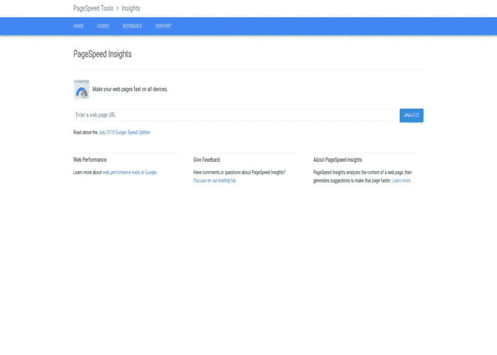
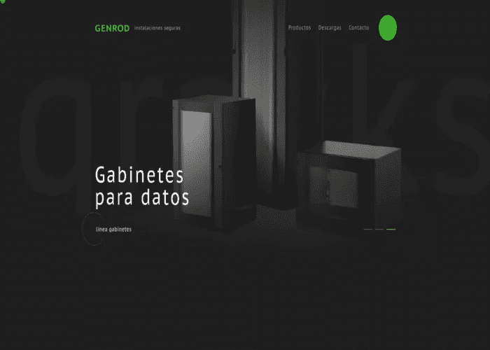
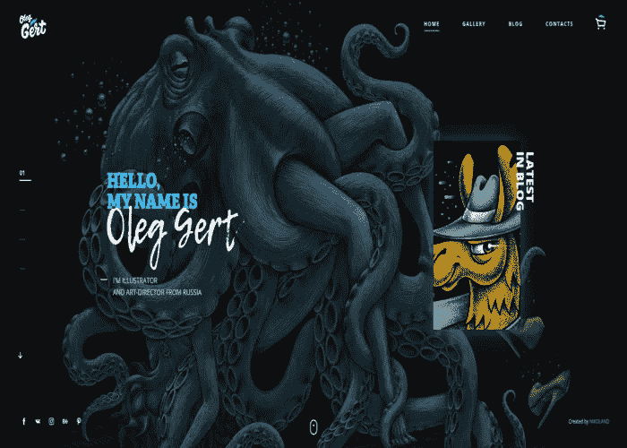
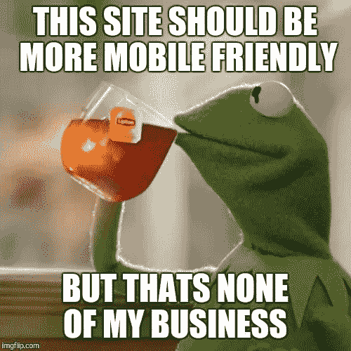
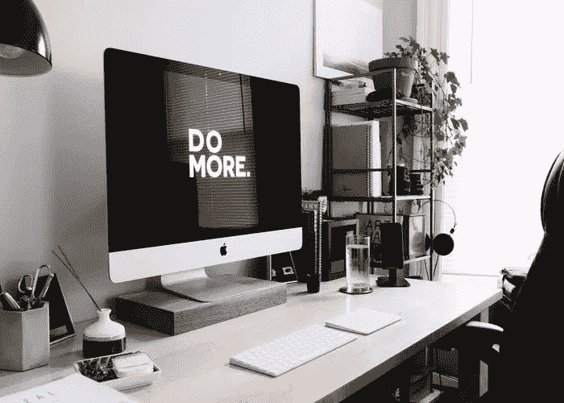
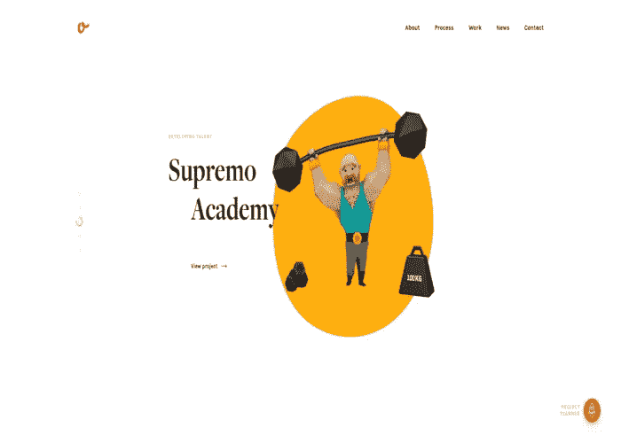
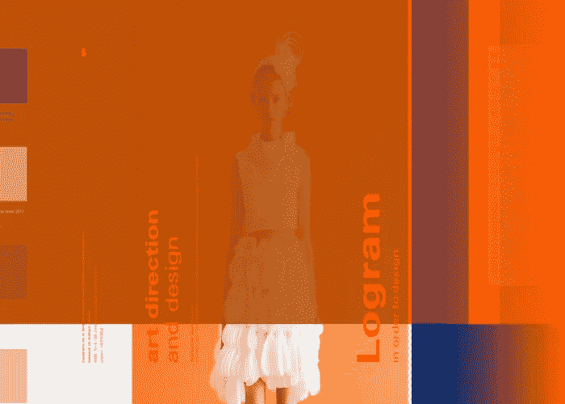
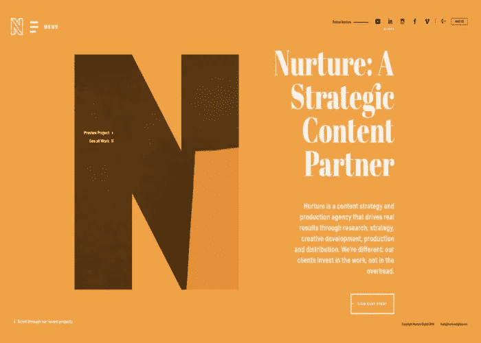
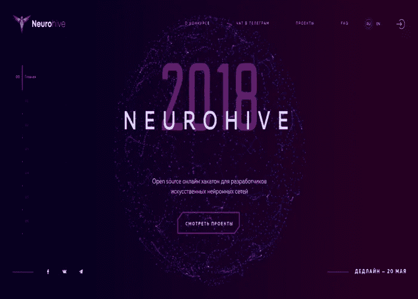

# 2018 年 10 个网站重新设计技巧

> 原文：<https://medium.com/swlh/10-website-redesign-tips-for-2018-93fc62fa1cb6>

2018 年，一个网站是你的企业最重要的表征之一。它提供可见性、24/7 可访问性，并被证明是一个有效的销售渠道。

然而，如果你想让你的网站带来可观的投资回报(ROI ),就需要针对用户的眼光和偏好进行精心设计和构建。这是为什么呢？让我们看看。

想象一下下面的情况:你，作为公司的 CEO，明天早上 9 点应该首先召开一个会议。现在，你会毫无准备地穿着连帽衫去参加会议吗？大概不会。你会为这个场合穿上礼服。所以，就像你需要穿**的衣服来给**留下深刻印象一样，你也需要重新设计来在网上大放异彩。

你需要给人留下良好的第一印象。不，不好。最好的！

现在，我希望你有最好的“套件”，这就是为什么我决定写今年的网站重新设计技巧。

现在你可能在想:*我为什么不买套新西装呢？*准确地说，你为什么不能从头再来，建立一个新的网站呢？

嗯，首先，你必须意识到重建一个网站意味着创建新的数据库，处理服务器，代码和后端的每一部分。相反，重新设计通常需要改进网站的视觉元素，而不需要改变所用的技术。此外，重建是一个耗费太多时间和资源的过程。因此，如果你的商业网站运行正常，但在设计上需要一点点改进，那就没有必要做一个新网站。此外，通过重新设计，您将**最大限度地降低成本**，同时仍能获得**“全新外观”**。

如果你仍然对重新设计中的改变犹豫不决，看看下面的[事实](https://www.invisionapp.com/blog/statistics-on-user-experience/):

*   ESPN.com 的收入在他们将社区建议纳入主页设计后增加了 35%。
*   88%的在线消费者如果有不好的体验，就不会再回到网站。
*   正如 Invision 进一步指出的，第一印象 94%与设计有关。

如你所见，**第一印象至关重要。**

什么能给人留下好的第一(网上)印象？嗯，一个手机友好的网站，有良好的导航和可见的联系信息。这些只是一些基本的网站重新设计技巧。

但是，从哪里开始呢？如何确保你的新设计让你获得更多的用户和线索？很有计划的 simpleーstart。我将在其他文章中讨论规划部分。现在，你需要知道的是，如果没有计划，成本会很容易上升，项目的发布会被推迟。

现在，让我们来看看实际的网站重新设计技巧，这些技巧将帮助您更容易被用户/潜在客户看到和联系到:

# 提示 1:降低页面加载时间

我在文章中提到了拥有一个快速页面的重要性，这篇文章涵盖了改善网站设计的 10 种方法。现在，让我们再深入一点。

众所周知，[人不喜欢等待什么](http://www.startribune.com/why-we-hate-to-wait/272037631/)。不幸的是，在数字世界里，人们更加强调不耐烦。所以，记住你的用户没有时间等待网页加载。

让我们检查一下实际情况。你知道吗[页面加载变慢会直接影响你的收入](https://www.section.io/blog/page-load-time-bounce-rate/)？更准确地说，您知道这会导致收入大幅下降吗？在某些情况下，每 100 毫秒的延迟会导致 1%的损失？如果这个信息没有让你想到也许这个会:当页面速度为 7 秒长时，几乎 33%的访问者会反弹。

*有趣的事实:页面速度和页面加载时间没有区别。*

这些陈述证明了降低页面加载时间是你应该记住的最重要的网站重新设计技巧之一。

想改善吗？从[检查你当前的页面速度](https://developers.google.com/speed/pagespeed/insights/)开始。

# 提示 2:包含一个网络动画

这是最新的网站重新设计技巧之一。网页动画与降低页面加载时间密切相关。为什么？因为这两个元素都会受到不耐烦的用户的影响。

这些提示是如何联系起来的？

嗯，正如《每日电讯报》曾经指出的那样，如今人们的注意力持续时间比金鱼还短。也就是说，一个访问者没有时间等待页面加载或阅读长 contentーif 花了很多时间来阅读它，有一个很好的机会，其他东西会抓住访问者的注意力。如果你的网站不够有趣或速度不够快，你很可能只剩下少数用户。

*那么，在哪里包含一个网页动画呢？*嗯，根据[创意博客](https://www.creativebloq.com/features/web-design-trends)的说法，你可以把它包含在网站的几乎每个部分。最受欢迎的包含在徽标中，或者作为背景视频出现在登录页面上。此外，记住[在按钮上添加悬停](http://www.weebly.com/blog/website-animation/)也是一个好习惯。

如果你需要一些灵感，请务必查看 [GENROD](https://www.genrod.com.ar/home) 、 [Oleg Gert](http://oleggert.ru/en/) 或[Mathis-biabia biany . fr](http://www.mathis-biabiany.fr/)。

# 提示 3:让网站移动友好

如果你想不出任何好的理由让你的网站对移动设备友好，记住这个:**谷歌喜欢这些类型的网站**。

这是为什么呢？

好吧，让我们看看谷歌怎么说。今年 3 月，谷歌正式宣布[移动首索引](https://webmasters.googleblog.com/2018/03/rolling-out-mobile-first-indexing.html)。这意味着你的网站的移动版本是一个起点，谷歌把它包括在索引中(这就是排名是如何确定的)。但是，不要担心，如果你的网站没有一个移动友好的版本，桌面版是最重要的。然而，一个有移动体验的网站会比没有移动体验的网站排名更高。

> *通过让网站移动响应，你得到了什么？对于新手来说，***的信誉和声望。此外，你的企业在社区中会被认为是现代和重要的。**

*让你的网站移动友好是我能给你的最好的网站重新设计技巧之一。*

**

# *提示№4:不要忘记 SEO*

*永远不要低估 SEO 在创建内容中的作用。*

*你可能会认为优质内容有办法找到通往用户内心的道路。虽然是 trueーquality 的内容能吸引更多的 usersーit 还远远不够。内容必须针对浏览器和阅读器进行优化。它必须是谷歌友好的，同时仍然易于阅读。*

*如果你是怀疑论者，检查事实！根据 Hubspot 的数据，61%的营销人员关注搜索引擎优化来增加他们的有机存在。此外，40%的营销人员认为 SEO 中最艰难的任务是**适应搜索算法的变化**。*

*为了让这个过程变得简单一点，你应该知道，2018 年，最大的网站(重新)设计技巧之一是添加 [**机器人元标签**](https://developers.google.com/search/reference/robots_meta_tag) ，这些标签为搜索引擎提供如何索引和在结果中呈现内容的指示。网站访问者看不到任何 Meta Robots 标签，但它们可以创造奇迹。*

**

# *技巧 5:添加更多的优化*

*这次我说的是转化率优化。*

*什么是转化率优化？根据 Moz.com 的说法，这种优化包括增加愿意采取行动的访问者数量的方法。创建您的登录页面，以便用户可以轻松地联系您，进行购买或任何其他举动。简而言之:这是网站重新设计的技巧之一，它将帮助**用户迅速找到你的 CTA。***

> **与搜索引擎优化需要时间让谷歌识别不同，转化优化* ***不需要那么多时间就能让你得到结果*** *。请记住，它可以很快带来结果，但它需要测试和一点时间来找到真正的工作。**

*那么，为了拥有合适的 CRO，你需要做些什么呢？分析用户如何浏览网站，以及他们采取了哪些行动。有什么阻止他们改变信仰的吗？*

**

# *技巧№6:扁平化设计 2.0*

*是啊！扁平化设计 2.0 有一些额外的酷功能。*

*Let’s back up a bit. What is a flat design? This is a **minimalistic graphics style** that uses features in a two-dimensional space. If you can remember, 2000s were full of graphic website elements. Suddenly, the times changed 一 a minimalistic, 1.0 approach to design was supposed to offer the best user experience. However, it didn’t manage to deliver. Although it was created as an approach that will lead a user to call-to-action, somehow users missed CTAs and were even more confused.*

*然后我们和 2.0 版本打了个招呼。*

*现在，平面设计的第二个版本充满了**渐变、高光和阴影**。平面设计 2.0 是关于制造深度和获得这种设计的 3D 真实感觉。*

*我能给你的最好的网站重新设计技巧之一是:一定要包括它。你不会后悔的。*

*查看这些网站寻找灵感: [Supremo](https://www.supremo.co.uk/) 和 [Logram](http://logram.jp/) 。*

****

*如今，社交媒体按钮或链接是必需品。你知道吗，提高页面和域名权威的方法之一就是在社交媒体上分享内容。然而，社交媒体的作用不仅仅是增加流量。这些链接在你的社区中建立了**可见性**和**可信度**。*

*那么，你应该把社交媒体链接放在哪里呢？嗯，你可以决定你是想放在网页的顶部、中间还是底部。然而，重要的是让那些**链接在一个新窗口**中打开，这样你的访问者就不会离开网站。*

# *技巧 8:颜色和排版*

*颜色和排版是网页设计中的两个基本元素，所以一定要跟随所有涉及这两个元素的趋势。*

*Currently, one of the major web design trends is **a gradient**. In 2018, [gradient moved towards typography](https://www.webdesignerdepot.com/2018/03/3-essential-design-trends-march-2018/). If this sounds too plain to you, consider adding a gradient highlight. On the other hand, if you are not feeling this gradient trend don’t worry 一 there’s a backup plan. Try adding **image-filled typography** to your landing page. You’ll see, it can make quite a difference and a modern feel to your website.*

*如果这些趋势没有打动你，或者只是不符合你的想法，一定要查看 [Design 的 Hack](https://designshack.net/articles/typography/typography-trends-2018/) 文章，找到最适合你的趋势。*

*说到选择颜色，没有你应该遵循的网站重新设计技巧。说到这里，我不得不提到 yearー **紫外线(18–3838)**的一个颜色。紫色的好处是你可以用它静音，saturatedーit 很容易适应任何行业。*

*看看这些图片填充排版([培育数字](http://www.nurturedigital.com/))和在设计中使用紫色( [Neurohive.io](https://neurohive.io/) )的例子。*

****

# *技巧 9:渐进式网络应用(PWA)*

*我相信你听说过这个术语。如果你不熟悉它，加入这个潮流，因为这是你绝对不应该跳过的网站重新设计技巧之一。2018 年，PWAs 将接管数字世界。这是为什么呢？因为这些类型的应用程序，提供了 worldsー最好的网站和应用程序。*

*让我们检查一下统计数据。根据 AppInstitute 的数据，当你在网页设计中加入 PWA 时，用户参与度可以提高 136%，转化率可以提高 52%。*

*那么，PWA 中应该包括哪些内容呢？你应该添加**推送通知**还是**动画页面转换**？或者两者都有？嗯，我的建议是:试着把网站和应用程序的优点结合起来，以获得最佳效果。其实不用想太多。让设计师来处理。他/她应该知道如何包含这些元素，创造一个完美的用户体验(UX)。*

# *提示 10:不断改进*

*当你完成了前面提到的所有提示，还有一件事你应该 knowーthose 提示是一个很好的起点。所以，如果你真的想让网站重新设计有回报，你需要不断地更新和改进 UX。*

*没有网页设计的不断改进，就没有成功。*

*就是这样！这是你应该记住的 10 个网站重新设计技巧。*

*那么，接下来是什么？测试和启动项目。*

# *测试和发射*

*一旦网站重新设计完成，你可能会迫不及待地启动它。然而，在正式发布之前还有一个步骤可以确保你所有的努力都有回报。这个步骤就是测试。*

*测试时，您应该问自己以下几个问题:*

*   **网站的功能/外观是否符合计划？**
*   **旧页面会重定向到新页面吗？**
*   *如果网站崩溃，是否有备用计划？*

*如果你对所有这些问题都有肯定的答案(还有更多),你就可以开始发布了。*

*一旦你启动了网站，请确保永远不要停止测试和改进。你打算怎么做？在你的网站上添加一个关于新设计的调查，直接获得用户的意见。*

**

# *最后…这些工作都应该你一个人做吗？*

*肯定不是！有一整个行业致力于改善用户在网页设计中的体验。所以，不要试图自己做所有的事情，把它留给专业人士。*

*无论你决定去开发公司还是自由职业者，请确保你找到了正确的选择。一个好的[网页设计师](https://kolosek.com/web-developer-vs-web-designer/)知道网页设计的所有原则，以及如何达到之前定义的目标。*

**你重新设计网站的经验是什么？这些建议你都落实了吗？你有什么要补充的吗？**

**原载于 2018 年 6 月 29 日*[*kolosek.com*](https://kolosek.com/website-redesign-tips-2018/?utm_source=me)*。**

**

## *这个故事发表在 [The Startup](https://medium.com/swlh) 上，这是 Medium 最大的企业家出版物，拥有 343，876+人。*

## *在这里订阅接收[我们的头条新闻](http://growthsupply.com/the-startup-newsletter/)。*

**