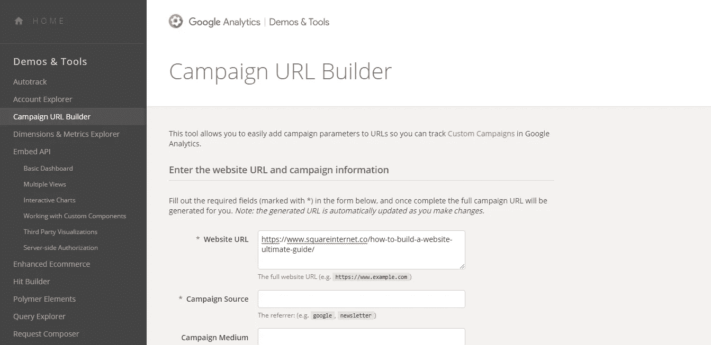
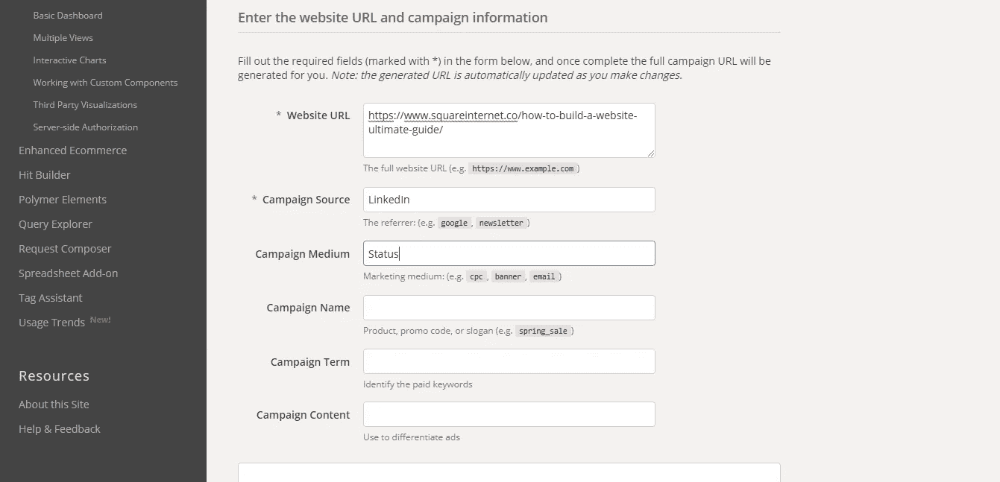
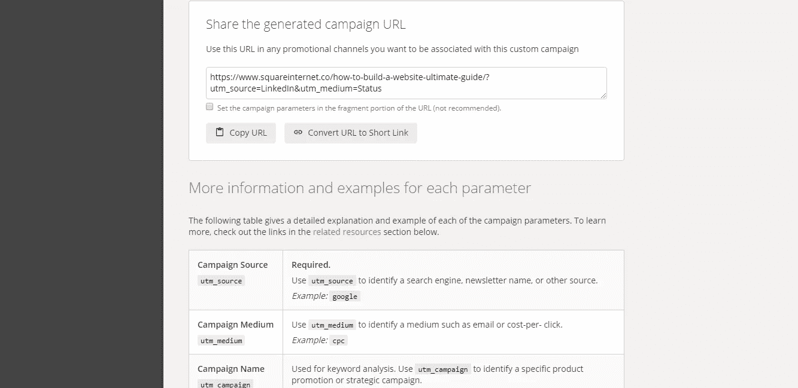

# 10.什么是 Google URL Builder，为什么要使用它？— 30 天的中等

> 原文：<https://medium.com/swlh/10-what-is-google-url-builder-and-why-should-you-use-it-30-days-of-medium-402eb778e394>

欢迎回到 **30 天介质。**

在我的清单上，下一个要和**谈的**是**的谷歌网址构建器。**

如果你错过了下面的我的中等挑战**的前 9 天，你可以补上:**

## [0。30 天的培养基](/swlh/30-days-of-medium-c7ab34953c6c)

## [1。建立自己的网站需要什么？— 30 天中值](/swlh/1-what-do-you-need-to-build-your-own-website-30-days-of-medium-1ed1ad4e505c)

## [2。如何找到你热爱的事业——30 天的媒介](/swlh/2-how-to-find-a-business-you-love-30-days-of-medium-cb7a4a702d1b)

## [3。如何建立自己的网站—媒体 30 天](/swlh/3-how-to-build-your-own-website-30-days-of-medium-587f994672ec)

## [4。如何衡量你网站的表现——30 天媒体](/swlh/4-how-to-measure-your-websites-performance-30-days-of-medium-75e650969695)

## [5。如何通过回答他们的问题获得更多的客户-30 天的媒介](/swlh/5-how-to-get-more-customers-by-answering-their-questions-30-days-of-medium-b462d237533e)

## 6。成功的商业网站备忘单——30 天的媒介

## 7。如何衡量成功——30 天介质

## 8。了解在线销售漏斗——30 天媒介

## 9。什么是流量，为什么流量很重要？— 30 天的培养基

## 10。什么是 Google URL Builder，为什么要使用它？— 30 天的培养基

## [11。通过自动化您的社交媒体日程，让您的流量翻倍——30 天中等](/swlh/11-double-your-traffic-by-automating-your-social-media-schedule-30-days-of-medium-ac9aa74f7927)

## [12。如何辨别什么好卖— 30 天介质](/swlh/12-how-to-tell-what-sells-30-days-of-medium-ba3291d029d2)

## [13。我如何在 6，500% — 30 天的培养基中培养我的培养基](/swlh/13-how-i-grew-my-medium-following-6500-30-days-of-medium-c9d2d6f80b51)

## [14。你如何看待事情很重要——30 天中期](/swlh/14-how-you-look-at-things-matters-30-days-of-medium-f641b9733b90)

## [15。如何向小型企业销售服务— 30 天中等](/swlh/15-how-to-sell-services-to-small-businesses-30-days-of-medium-d6604c63b3b7)

## [16。如何通过有效的提案赢得更多交易— 30 天的媒介](/swlh/16-how-to-win-more-deals-with-effective-proposals-30-days-of-medium-481f16bbc86f)

## 17。如何在 10 分钟内建立一个网上商店——30 天的媒介

## [18。如何在任何地方工作— 30 天介质](/swlh/18-how-to-work-from-anywhere-30-days-of-medium-1c9cfa2d662f)

## [19。为什么你的网站会破坏你的销售——30 天媒体](/swlh/19-is-your-website-sabotaging-your-sales-30-days-of-medium-f63bdbdb350)

## [二十。你的流量从哪里来？— 30 天中值](/swlh/20-where-does-your-traffic-come-from-30-days-of-medium-a9b2d2c088bb)

## [21。如何真正识别倦怠——30 天中等水平](/swlh/21-how-to-actually-recognise-burnout-30-days-of-medium-7972a7a7a89e)

## [22。如何修改你的时间表并完成两倍的工作——30 天中等时间](/swlh/how-to-hack-your-schedule-and-get-twice-as-much-done-30-days-of-medium-441a509dc9be)

## [23。不要模仿你的竞争对手——30 天的媒介](/swlh/23-dont-copy-your-competitors-30-days-of-medium-56382b7ba8ed)

## 24。如何 SEO 优化一篇博文——30 天的媒介

## 25。独特或被遗忘——30 天的媒介

## 26。跟着感觉走——30 天中等水平

## 27。人们不支付平均 30 天的中等费用

## 28。如何做关键词研究— 30 天介质

## [29。为什么帕累托原则是世界上最大的诀窍——30 天中期](/swlh/29-why-the-pareto-principle-is-the-worlds-biggest-hack-30-days-of-medium-1c225f5c8aa1)

## 三十岁。你的内容比你的电话更有利可图——30 天的媒介

# 什么是谷歌网址生成器？

[谷歌将谷歌网址构建器描述为](https://ga-dev-tools.appspot.com/campaign-url-builder/):

> “此工具允许您轻松地将活动参数添加到 URL，以便您可以在 Google Analytics 中跟踪自定义活动”。

简而言之，Google URL Builder 帮助你衡量哪些**的营销活动表现良好，哪些**表现不佳。

用一个**的具体例子。**

如果你想跟踪某篇博客文章的流量、线索和转化率，Google URL Builder 就是你的工具。

在之前的帖子中，我写了关于**了解你的流量来自哪里。**

我们发现有可能看到**你的流量来自哪些渠道，包括社交媒体流量、直接流量和来自谷歌的流量。**

Google URL Builder 让我们**钻得更深**。

我们现在是专业营销人员了。

我们不只是知道我们从社交网站或 LinkedIn 获得了 100 名访客，我们还想知道我们是如何从 LinkedIn 获得这些访客的。因为 LinkedIn 的范围很广。

他们是来自一个帖子、一个小组还是一个公司页面？在哪里？

# 谷歌网址生成器如何工作

Google URL Builder 看起来像这样:

URL Builder

它的工作原理是**将跟踪参数**附加到现有的 **URL** 上，将它变成一个**超级 URL。**

我们可用的参数有:

*   活动来源
*   活动媒介
*   活动名称
*   活动期限
*   活动内容

**源和介质**是两个最重要的参数。

**来源定义平台**，如 Google 或 LinkedIn

**媒介**定义了分享的方式，比如通过**状态、帖子、推文或群组活动。**

所以你只需要输入你的**源**和**介质**，工具会自动**把它们附加到屏幕底部的**修改后的 URL** 。**

Appending parameters

Appended URL

最后点击**将 URL 转换成短链接**来获得你的**可追踪链接。**

您现在可以在您的 Google Analytics 仪表板中看到点击此链接的任何人的详细**报告信息。**

一个**超级有用的工具**来了解特定平台的哪些部分对您来说性能最好。

为了让这个工具有效地工作，你需要确保你的谷歌分析设置和配置正确。如果你正在使用一个好的[托管 WordPress hosting](https://wpstaged.com/managed-wordpress-hosting/) 提供者，你不需要担心导航 cPanel，你只需要安装一个像[插入页眉和页脚](https://wordpress.org/plugins/insert-headers-and-footers/)这样的插件。

这应该足以让你开始设置谷歌分析。

关于这个话题有什么问题吗？请在评论中告诉我。

## 你可能也喜欢这个:

## [为什么 WordPress 是在](/swlh/why-wordpress-is-the-best-platform-to-build-your-business-or-startup-website-on-df3fe932fad7)上建立业务或创业网站的最佳平台

## 如果你喜欢这个故事，请点击👏按钮并分享，帮助其他人找到它！欢迎在下方留言评论。

## 这篇文章发表在 [The Startup](https://medium.com/swlh) 上，这是 Medium 最大的创业刊物，有 319，931+人关注。

## 订阅接收[我们的头条新闻](http://growthsupply.com/the-startup-newsletter/)。

