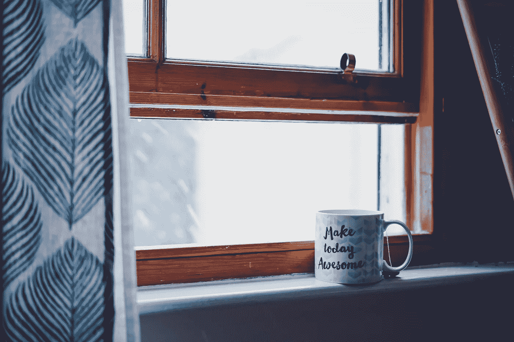

# 100 个剪纸还是 100 个拍拍背？

> 原文：<https://medium.com/swlh/100-papercuts-or-100-pats-on-the-back-27e339189fe7>

## **为什么小事也重要**

Photo by [Toa Heftiba](https://unsplash.com/photos/yWyS3lM6K-E?utm_source=unsplash&utm_medium=referral&utm_content=creditCopyText) on [Unsplash](https://unsplash.com/search/photos/encouragement?utm_source=unsplash&utm_medium=referral&utm_content=creditCopyText)

生活中的小事很重要；不把小事钉死，成不了大事。同样的道理也适用于微小而短暂的想法，也适用于微小而看似无关紧要的行为。

健美的身材代表了每一次锻炼和每一口食物的复合效果。