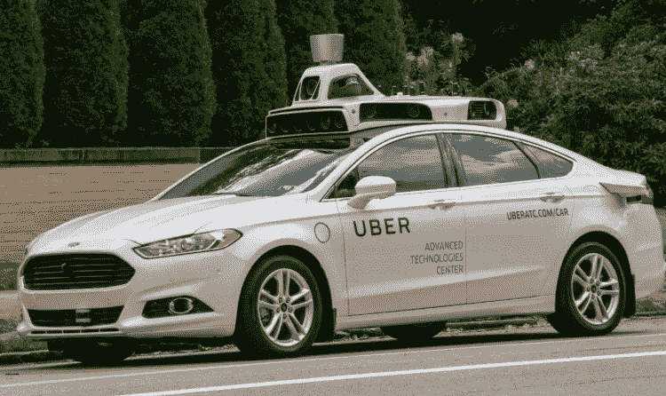

# 100 年后，我们会认为哪种技术是荒谬的？

> 原文：<https://medium.com/swlh/100-years-from-now-which-tech-will-we-think-was-ridiculous-50c7e203d75>

过去的这个周末——一个有趣的话题出现了——我们今天使用的技术在 100 年后会被认为是荒谬的。

这里有几个例子:

## 1.开车——考虑到死亡率和我们生活中压力的原因，这是没有意义的

谢天谢地，无人驾驶汽车比以往任何时候都更接近现实。

credit: [https://concreteplayground.com/content/uploads/2016/09/uber-self-driving-car.jpeg](https://concreteplayground.com/content/uploads/2016/09/uber-self-driving-car.jpeg)

## 2.智能手机——你整天弓着脖子盯着屏幕获取信息？！

增强现实眼镜和脑机接口正在成为新的道路——然而在舒适度和易用性方面还有很长的路要走

credit: [https://www.ebuyer.com/blog/wp-content/uploads/2014/12/shutterstock_218249854.jpg](https://www.ebuyer.com/blog/wp-content/uploads/2014/12/shutterstock_218249854.jpg)

## 3.机场/飞机——我们坐在一个自循环空气的铁罐里，这让我们感到不舒服并生病

这一个将很难克服——也许高速铁路或隧道运输将成为喷射 1000 英里的主要方式。困难的是有限的空间将会存在。

credit: [http://media2.intoday.in/indiatoday/images/stories/air-pressure-story_647_072516012931.jpg](http://media2.intoday.in/indiatoday/images/stories/air-pressure-story_647_072516012931.jpg)

## 4.社交媒体——担心点赞并拍照向人们展示你有一段美好时光来感受被认可的想法——希望我们能克服这一点

已经有迹象表明，社交媒体的目的以及我们通过隐私、成本和目的连接互联网的方式将发生根本性转变——GDPR 只是第一步——还需要发生更多重大转变

credit: [http://i.huffpost.com/gen/4905866/original.jpg](http://i.huffpost.com/gen/4905866/original.jpg)

> 你认为 100 年后会过时的东西是什么？

喜欢这篇文章吗？点击“掌声”推荐给其他感兴趣的读者！感谢👍

## 这个故事发表在[的创业](https://medium.com/swlh)上，这是 Medium 最大的创业刊物，有 325，962+人关注。

## 订阅接收[我们的头条新闻](http://growthsupply.com/the-startup-newsletter/)。

