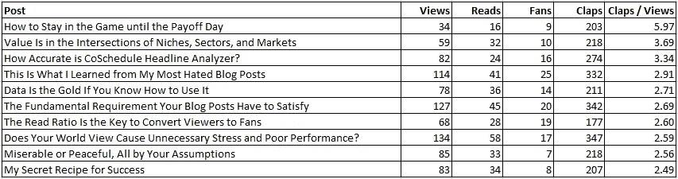
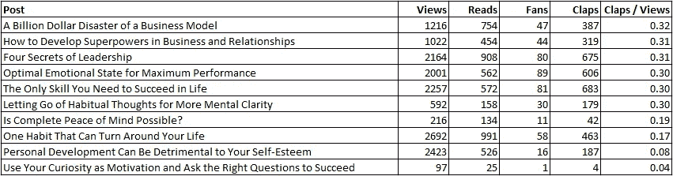

# 1000 个真粉丝就足够以创意为生了

> 原文：<https://medium.com/swlh/1000-true-fans-is-enough-to-make-a-living-as-a-creative-b3c72bae75f8>

*创造 1000 个真粉丝需要什么？*

[stux/pixabay](https://pixabay.com/en/live-concert-dance-club-disco-laser-388160/)

当我报告 [**我的中等统计**](https://ideavisionaction.com/blogging/i-analyzed-seven-factors-that-affect-my-medium-stats-this-is-what-i-found/) 的分析时，我的一些读者建议也分析一下鼓掌的次数。当时我没有听从那个建议。与浏览量、阅读量和粉丝量不同，拍手不能下载。

几天前我收到了一条评论，这让我重新考虑分析掌声。我的读者写道，她的一篇帖子获得了较低的粉丝阅读率，但较高的粉丝鼓掌率。

**参与的观众人数少，受欢迎程度高**

她问我，她是应该培养一小群喜欢她风格的观众，还是追求更广泛的人气。我对这个问题的本能反应是坚持那一小部分观众。

在解释我的观点之前，让我提一下，我是凭直觉写作的。对此我没有做全面的统计分析。

**文案、博客和营销人员的目标**

文案、博客和营销人员试图让他们的读者采取某些行动。在我的情况下，这是关注我的媒体和 [**注册我的电子邮件简讯**](http://eepurl.com/c_1Mw5) 。

这是一个中型作家的例子:

*   查看帖子
*   阅读帖子
*   尽可能地为这个职位鼓掌
*   回复帖子
*   跟随作者的媒介叙述
*   注册他们的电子邮件简讯
*   购买他们的产品和服务

每个级别上的人数少于更高一级别的人数。这就是为什么我们称这个序列为漏斗。

**顶层的人越多，底层的人越多？**

我们可能会认为，漏斗顶端的人越多，漏斗底端的人也会越多。情况可能并非如此。

一个博主可能在帖子浏览量上非常受欢迎，但他们可能很难卖出自己的书。

另一个博客可能有适度的帖子浏览量，但他们可以成功地将这些浏览量转化为付费节目的购买量。

你想成为谁？销量平平的人气博主？还是一个有着高溢价节目销量的谦虚博主？说实话，我想成为第二个博主。

**如何获得更高的转化率**

为了成为第二个博主，我们可能需要牺牲人气。我们需要做自己，加倍努力让自己与众不同，而不是试图吸引广大公众。如果这是一种奇怪的幽默感，我们需要培养它。

这个想法是为了分化公众。这样一来，一部分公众根本就不想消费我们的内容，但其余的人会喜欢。

这个讨论让我想起了“ [**1000 名真正的粉丝**](https://www.google.com/search?q=1000+true+fans) ”，他们准备购买一个创意推出的任何产品。我不认为我们可以通过取悦每个人来创造 1000 个真正的粉丝。

这些数字说明了什么？

为了用数据支持我的观点，我分析了我最近的 111 篇中型文章。我计算了这些帖子的点击率。然后，我计算了观看次数和鼓掌观看率之间的相关性。这种相关性为-40%。

这并不意味着我们有一个负相关，但它也没有显示出正相关。我的读者所建议的可能是真的。

> 最吸引人的帖子不一定是最受欢迎的。

在我最吸引人和最不吸引人的十个帖子中，我可以清楚地看到这种关系。最吸引人，我指的是点击量最高的帖子。最不吸引人的帖子是每次点击次数最少的帖子。

**Table. 1.** My most engaging posts

我最吸引人的帖子并不是那些广受欢迎的。另一方面，大多数我最不感兴趣的帖子的浏览量都高于平均水平。

**Table. 2.** My least engaging posts

当我查看我最不喜欢的帖子时，我发现其中一些是我最讨厌的帖子**。”我已经写了[一篇关于为什么这些帖子的粉丝与浏览量比率低的帖子](https://ideavisionaction.com/blogging/this-is-what-i-learned-from-my-most-hated-blog-posts/)。**

****是什么让一篇文章吸引人？****

**我对最吸引人的帖子很感兴趣。即使我分析了各种统计数据，这些帖子也没有出现在我的雷达上。**

**我怀疑高 [**阅读率**](https://ideavisionaction.com/blogging/the-read-ratio-is-the-key-to-convert-viewers-to-fans/) 有助于从事岗位工作。我将分析是什么让这些帖子如此吸引人，并在未来的帖子中报告。**

**如果你不想错过我写的关于写作的帖子， [**注册我的电子邮件简讯**](http://eepurl.com/c_1Mw5) 。每周一次，我会发送一封电子邮件，其中包含我在写作、博客、营销、创业、生产力和个人发展方面的最新帖子。**

****致谢****

**我感谢[迈克尔·k·斯潘塞](https://medium.com/u/e35242ed86ee?source=post_page-----b3c72bae75f8--------------------------------)推荐我查看每篇文章的平均点击率，感谢[凯瑟琳·特纳](https://medium.com/u/9a6e5fcd38a8?source=post_page-----b3c72bae75f8--------------------------------)的问题启发我写这篇文章。**

****结论****

**作为文案、博客和营销人员，我们的目标不一定是广受欢迎。我们的目的是让我们的读者在我们的漏斗底部采取行动。这可以是在社交媒体上关注我们，订阅我们的电子邮件简讯，以及购买我们的产品。**

**如果你想创造 1000 个真正的粉丝，你可能不想取悦每个人。你可能想以自己的方式独一无二。**

**因此，你可能不太受大众欢迎，但你可能最终会拥有 1000 名真正的粉丝，他们热爱你的工作，愿意以各种可能的方式支持你。**

*****报名参加我的*** [***每周邮件简讯***](http://eepurl.com/c_1Mw5) ***关于创业、创业、博客、营销、人生的课程。*****

****

## **这篇文章发表在 [The Startup](https://medium.com/swlh) 上，这是 Medium 最大的创业刊物，有 320，131+人关注。**

## **在这里订阅接收[我们的头条新闻](http://growthsupply.com/the-startup-newsletter/)。**

****