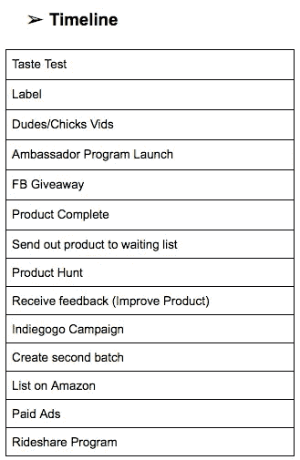
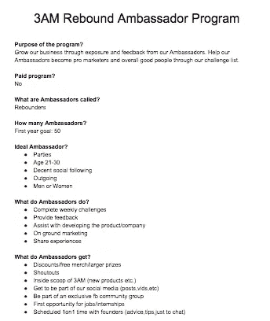
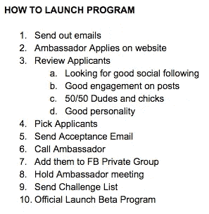

# 生产力提高 10 倍

> 原文：<https://medium.com/swlh/10x-your-productivity-d988eb9c8e06>

Photo by [rawpixel](https://unsplash.com/photos/-xJAb5-NJSQ?utm_source=unsplash&utm_medium=referral&utm_content=creditCopyText) on [Unsplash](https://unsplash.com/search/photos/work?utm_source=unsplash&utm_medium=referral&utm_content=creditCopyText)

我终于破解了成为多产企业家的密码。作为企业家，你身兼数职。这意味着你有很多事情要做。你要给这个人打电话，给那个人发邮件，设计这个东西，开发那个东西，等等。我喜欢它，但是我发现很难把注意力集中在所有需要完成的事情上。高效不是科学，只是更有条理一点。当我有很多事情要做的时候，我倾向于每件事都做一点，但最终什么也没完成。听起来熟悉吗？

我的突破。

我目前正在开展一项新业务。如果你好奇，这是一个[恢复镜头](http://3amrebound.com)帮助那些可能喝多了一点的人。我被所有需要完成的任务压垮了。我在电子表格上创建待办事项列表，我再也没有看过。我甚至试着把所有的事情都写在纸上，写完后就划掉。我喜欢从清单上划掉一项任务的感觉。但是，你猜怎么着？我经常把报纸放错地方。我决定下载一个任务管理器。我和[神童](https://www.wunderlist.com/)一起去的。我过去用过它，很喜欢它的操作简单。下一个挑战是让我的整个团队使用它。仅仅在应用上添加任务是不够的。我仍然会发现自己不知所措。一天晚上，我坐下来想出了完成工作的完美方法。我想到的是一种帮助我多完成 10 倍工作的方法。

遵循这些步骤来提高你的工作效率。

第一步)我列出了我需要完成的所有事情。

第二步)我为需要完成的事情制定了时间表。

第三步)然后我会专注于最紧迫的任务。

第四步)我总是研究我到底需要做什么来完成这个项目。

第五步)我创建一个文档，并将我的所有研究添加到其中。

EXAMPLE

第 6 步)我为项目创建任务。

EXAMPLE

第 7 步)我将每个任务添加到 [Wunderlist](https://www.wunderlist.com/) 中。

EXAMPLE

第八步)我为每项任务添加一个截止日期。

第九步)我完成了当天分配的每项任务。

第 10 步)当我完成一项任务时，我会在应用程序中打勾。

第 11 步)我会在每天晚上或早上重新安排我的任务。

*注意有时会出现问题。当我工作的时候，我经常在我的清单上增加更多的任务。如果你不能在设定的截止日期完成任务，那就把它挪一挪。一旦你完成了一个项目，继续下一个项目，遵循同样的步骤。

**这个为什么有效？**

你会更有条理，更有成就感。较大的项目将被分解成小块。当准备启动或有截止日期时，项目将 100%完成。我一直在压榨它！调整它，让它成为你自己的。我希望这能帮助那些努力提高工作效率的人。请分享！

在 Instagram 上关注我 [@thedon_iii](https://www.instagram.com/thedon_iii/)

在 Instagram 上关注我的生意 [@3amrebound](https://www.instagram.com/3amrebound/)

## 这篇文章发表在《T4》杂志《创业》(The Startup)上，这是 Medium 最大的创业刊物，有 360，974 人关注。

## 在这里订阅接收[我们的头条新闻](http://growthsupply.com/the-startup-newsletter/)。

