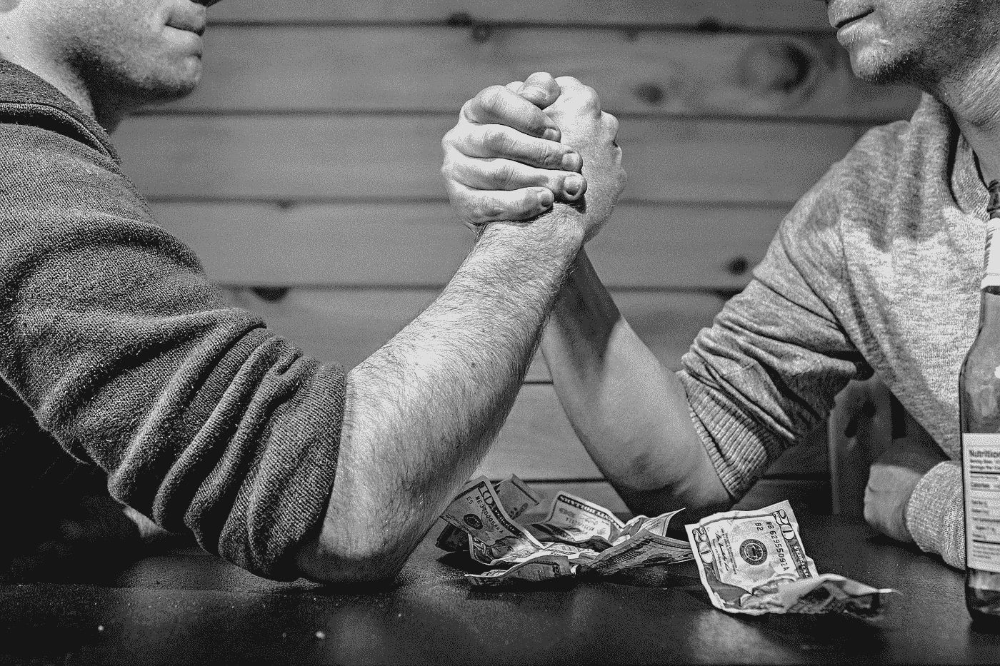

# 11 种生活方式的改变将帮助你省钱，挣脱消费主义的金手铐

> 原文：<https://medium.com/swlh/11-lifestyle-changes-that-will-help-you-save-money-and-break-free-from-the-golden-cuffs-of-59df8b02f497>

两年半前，在一个安静的周日早晨，我悄悄地清点了一下我所累积的所有债务。总额不到 5 万美元。我年轻，对金融事务没有经验。我知道，如果我不把自己的事情处理好，我的生活就会变得悲惨和贫困。

在过去的一段时间里，我已经慢慢改变了我的消费和储蓄习惯。这并不容易，在漫长的旅途中，我经常变得不耐烦和沮丧。但是如果你从小处着手，也许一次结合一两个行动，你会慢慢地开始看到月底你的银行账户里剩余越来越多的钱。

**[*]带咖啡上班。如果你像我一样是咖啡爱好者，你可能有每天购买一两杯咖啡的坏习惯。每天点一杯拿铁不会要你的命，但这是我们如何不眨眼地自动化消费的一个症状。改变一下，开始一周几次带咖啡去上班。我保证，它仍然会给你你需要的咖啡因。**

**[*]尽量乘坐公共交通。我很幸运，我住在一个城市，有电车、地铁和公交车。大约一年前，我算了一下，发现我的车主要停在停车场的成本并没有超过周末使用它的便利性。我也不再使用优步或出租车。相反，我在上下班的时候会带一本书或者听听播客，或者乘坐公交或者步行去任何我想去的地方。**

选择你短暂的快乐。我并不同等重视所有短暂的快乐:比起衣服，我更喜欢书，比起酒，我更喜欢咖啡，比起去酒吧/俱乐部，我更喜欢在餐馆吃饭。我不能把钱花在我喜欢的所有东西上，但是我可以把钱花在我真正喜欢的东西上。当你缩小了让你真正快乐的前 3 或 4 件东西的范围时，毫不掩饰地购买它们。

**[*]预算。预算。预算。直到你知道你花了多少钱，你才能存下你的钱。预算不应该限制你；它会让你自由。它允许你花一定数量的钱买任何你想要的东西。预算是你要设计的一张地图。有无数种方法可以实现你的财务目标，选择哪条路是你自己的事。**

**[*]跳过昂贵的健身房会员资格，转而在户外和家里锻炼。我锻炼是因为这对我的身心健康有好处，而不是因为我想看起来像某个人。当你有这种心态时，锻炼并不需要特别复杂。我花 50 美元买了一套砝码，每隔一天用一次。我也每周至少在户外跑步 3-4 次。**

**[*]摆脱事物。**拥有的东西越少，你越会意识到，为了过上好日子，你不需要很多物质上的东西。我捐出了 80%的衣服，扔掉了旧的电子产品，还捐出了我不再阅读、也不够好到可以留在书架上的书。我还回收旧的生日贺卡，粉碎我不再需要的文件，丢弃我所有的 CD 和 DVD。这也适用于无形资产:删除笔记本电脑上的旧文件，删除手机上所有你不用的应用程序，扔掉钱包里所有无用的垃圾(如积分卡)。少即是多。

**[*]批量烹制你的午餐。**我尽可能在周日做好下周的午餐。我不准备任何花哨的东西:通常是豆腐炒菜。但关键是要在预算内吃得健康，而不是想花一大笔钱买工作午餐。

**[*]与此相关——早餐吃同样的东西。我的早餐是两种食物中的一种:菠菜煎蛋卷或燕麦片(通常有花生酱、枫糖浆和一些水果)。通过简化我早餐吃的东西，我确切地知道我需要在杂货店买什么，我不会每天早上哼哼唧唧。两者都是简单、便宜、相对饱腹的膳食。**

**[*]活的小。仅仅因为你付得起两居室公寓的租金，并不意味着你就应该住在那里。在过去的两年里，我和我的伴侣住在一个简单的一居室公寓里，尽管我们可以负担更大(更好)的空间。令人惊讶的是，一旦事情成为常态，你能适应什么。**

**[*]先想到*为什么*再想到*如何。*** 美国梦是与配偶和几个孩子一起住在一栋有白色尖桩围墙包裹的双门车库的大房子里，但这是你的梦吗？根据你的目标，你可能不需要你想象的那么多钱。

**[*]将你的身份与你所拥有的东西分离。作为一名律师，我对同事们做出的所有糟糕的支出决定都有切身体会。仅仅因为他们收入可观，他们就认为自己有权花 600 美元买一双鞋。结果是，虽然他们赚了很多钱，但他们最终花得更多。受困于债务和昂贵的品味，他们永远无法离开自己的工作——不管他们有多讨厌它。挣脱金手铐的唯一方法是拒绝那种认为你穿的衣服和开的车决定了你的价值的观念。那只不过是一场愚蠢的游戏，我们注定会输。**

## 这篇文章发表在 [The Startup](https://medium.com/swlh) 上，这是 Medium 最大的创业刊物，拥有 338，320 多名读者。

## 在这里订阅接收[我们的头条新闻](http://growthsupply.com/the-startup-newsletter/)。

