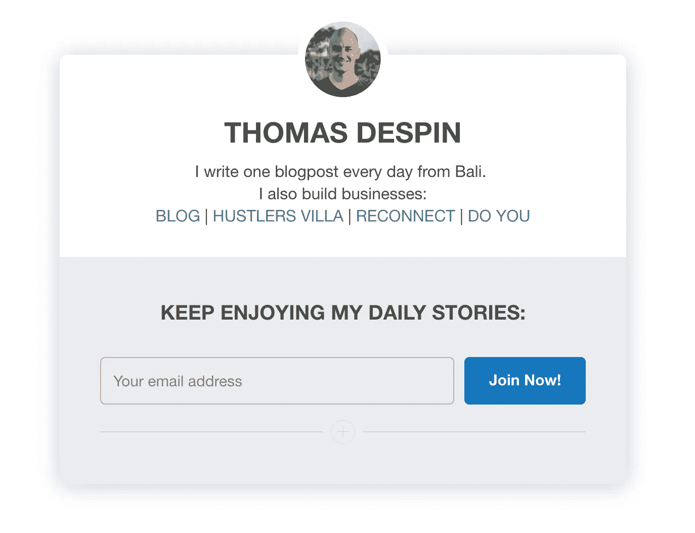

# 11 个月& 75 万美元之后，我决定关闭我的直运业务。原因如下

> 原文：<https://medium.com/swlh/11-months-and-750-000-later-i-decided-to-close-my-drop-shipping-business-heres-why-e4d96eb5cb83>

## 艰难但必要的决定

几周前，我和我的搭档分手了。我们有不同的愿景、抱负和动机。我认为这不符合我们的经营方式。

3 天前，我的商店经理辞职了。我意识到他基本上处理好了一切。我想我没有时间替换他或者训练其他人来代替他。

真相是:数字下降，更多有趣的机会出现，我的动力下降，我认为我对自己的公司完全失去了兴趣。

*我写这篇博客是为了反省发生了什么。*

# 到底什么是直运？

让我们简单点。以下是 Shopify (此类业务使用最多的 CMS)提供的[定义:](https://www.shopify.com/guides/dropshipping/understanding-dropshipping)

> 直运是一种零售履行方式，商店不会库存销售的产品。相反，当商店销售产品时，它从第三方购买商品，并直接运送给顾客。结果，商家永远看不到或摸不到产品。

最常见的方法(我使用的方法)是去[全球速卖通](http://www.aliexpress.com)，在那里找到供应商，将产品整合到你的商店，并直接在社交媒体(主要是 facebook 和 instagram)上推广产品页面。

Shopify、速卖通和脸书广告。这一点，以及一堆直接集成在 Shopify 中的应用程序，就让你的业务“起步”了。

如果你认为在 2017 年不需要任何技术技能就能在网上开展自己的业务是一件很棒很疯狂的事情，那么你说对了，的确如此。

如果你想深入了解什么是直运以及如何开始，请查看[这个](https://www.shopify.com/guides/dropshipping)，还有[这个。](https://ecomempires.co/access)100%免费。请不要支付任何课程的费用*(如果你正要这样做，请在下面的评论中问我为什么你不应该这样做)。*

# 为什么我开始我的直运业务？

基本上，我身无分文，负债累累，只能在巴厘岛生存。当我真的需要找到一种方法时，我听说了电子商务，以及更多关于直运的事情。

当时，我决定辞去在巴厘岛仅工作了一个月的工作，与当时住在巴黎的朋友尼克一起专注于建立自己的网上商店。

这个模型中我最喜欢的是:

*   远程管理一切
*   学习以后总是有用的东西
*   能够退出我当时所处的激烈竞争

我在下面两个帖子中分享了完整的故事，所以如果你想看的话，请随意阅读:

 [## 6 个月，从负债无家可归到每天 1100 美元。

### “不要放弃不好的结果，放弃不好的习惯。”

thomasdespin.com](https://thomasdespin.com/6-months-from-homeless-in-debt-to-1-100-a-day-158aabe19423)  [## 每月 10 万美元+我们搞砸的 3 件事

### (别担心，我们仍在为一年内的第一个一百万而努力)

thomasdespin.com](https://thomasdespin.com/100k-per-month-3-things-we-fucked-up-bd9356255922) 

# 我在路上学到的最有价值的三件事

赚钱是一件事，但我们通过赚钱学到了什么以及成为了什么样的人更重要。就这样，在开始的时候，开始这项业务是相当激烈和陡峭的。

然而，我学到的最有价值的 3 件事不是关于这个行业本身，而是关于我形成的思维方式。

## # 1——我能赚钱，我对此很满意

你知道，当你花了几个月/几年的时间去做一件事，最后你终于成功了。下一次你再试一次，你做它只是几天/几周的事，对吗？

这里也一样。我发现，以我从未体验过的规模靠自己赚钱是可能的。我也发现这样做的人和我没什么不同。他们只是做能给他们带来结果的事情。

无论你在做什么，当你从零开始，在一年内达到 75 万美元的销售额，做一些你在谷歌上搜索并开始采取行动之前毫无头绪的事情，你在大脑中解锁了一些东西，让你意识到:*“他妈的，这实际上是可能的！”。*

此外，你的思维更加开阔，你会与做同样数量(甚至更多)的人联系，你会考虑更多的机会，你会意识到无论你取得了什么成就，你都可以再做一次，而且你也可以在未来做得更好。

## # 2——拉皮条被高估了

我是[在这种行业里，测试是最重要的。你测试产品，测试观众，测试新方法。](https://medium.com/u/c4ec9163657c# 3——犯错并不“好”,而是一种必然</h2>

<p id=)

## 这篇文章发表在 [The Startup](https://medium.com/swlh) 上，这是 Medium 最大的创业刊物，拥有+384，072 名读者。

## 订阅接收[我们的头条](http://growthsupply.com/the-startup-newsletter/)。

